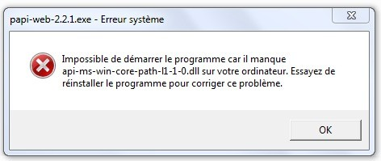
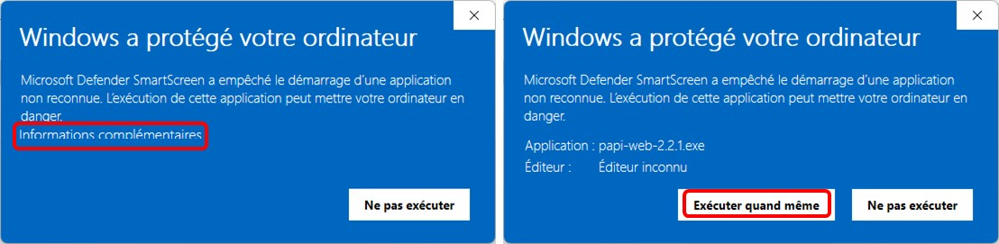
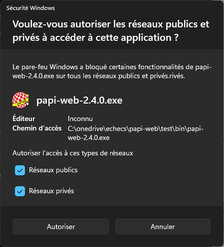
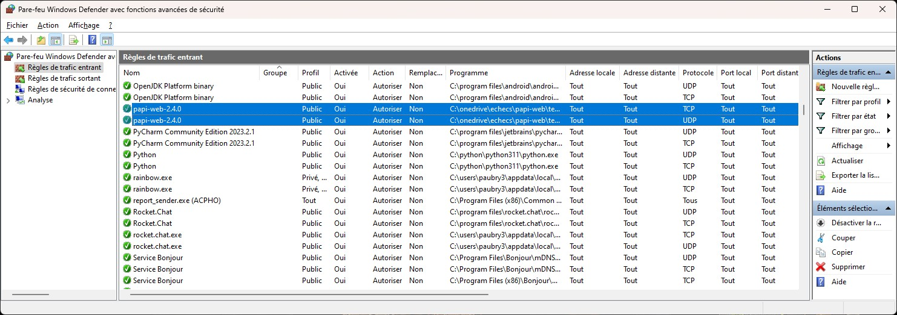
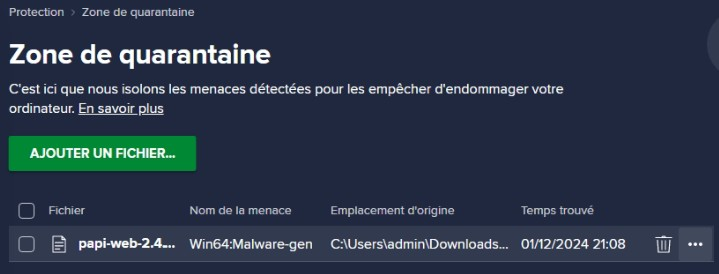
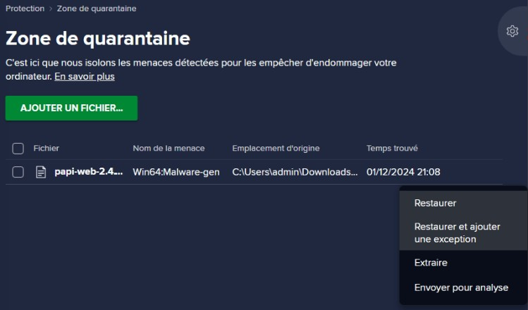
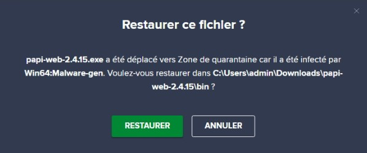
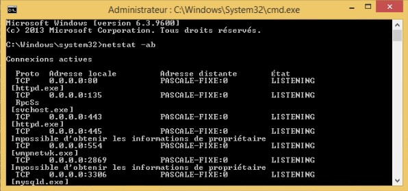

**[Retour au sommaire de la documentation](../README.md)**

# Papi-web - Foire Aux Questions - Système

## La bibliothèque `api-ms-win-core-path-l1-1.0.dll` est manquante

Il s'agit d'une incompatibilité entre Windows 7 et la version de Python utilisée (3.9+), il faut mettre à jour la version de Windows utilisée (Windows 7 n'est plus supporté depuis janvier 2020).

## Microsoft Defender Smartscreen a empêché le démarrage d'une application non reconnue

Dans la version actuelle de Papi-web, Microsoft Defender SmartScreen affiche l'erreur ci-dessus.

Le seul moyen de contourner cette erreur est de cliquer sur **Informations complémentaires** puis **Exécuter quand même**.

## Blocage du serveur web par le pare-feu du serveur

Par défaut, il est possible que le serveur web ne soit pas autorisé par le pare-feu du serveur, comme par exemple ici avec Microsoft Defender :

Selon votre pare-feu, le message pourra être différent et la méthode d'ouverture des ports nécessaires pourra également différer ;
si nécessaire, contactez votre administrateur réseau pour ouvrir les flux entrants du serveur (par défaut le port 80 en tcp/udp, ci-dessous l'autorisation ).

## Avast refuse l'installation de Papi-web

Lors de l'extraction de l'archive `papi-web-<x.y.z>.zip`, Avast refuse d'installer l'exécutable `papi-web-<x.y.z>.exe` dans le répertoire `bin` avec le message suivant :

Il s'agit d'un faux positif, que vous pouvez signaler à la société Avast en cliquant sur le lien **Signaler en tant que faux positif** .

En cliquant sur le lien **Ouvrir la quarantaine**, vous devez voir le fichier exécutable :

Cliquez sur le menu contextuel (`···`) puis sur **Restaurer et ajouter une exception** :

Vérifiez que le fichier a bien été restauré dans le répertoire `bin`.

Rappel : ne pas lancez l'exécutable restauré, vous devez utiliser les scripts situés à la racine.

## Tous les ports candidats [80, 81, 8080, 8081] sont déjà utilisés, impossible de démarrer le serveur web

La serveur de Papi-web utilise plusieurs ports prédéfinis pour répondre aux requêtes des clients (affichage des écrans, saisie des scores...).

Si le serveur Papi-web vous indique au démarrage que tous les ports sont utilisés, vous devez essayer de trouver les applications qui utilisent les ports sur votre serveur et les arrêter avant de relancer le serveur Papi-web.

Pour trouver l'application qui utilise déjà un port sur votre serveur, vous pouvez ouvrir un interpréteur de commande en mode administrateur et lancer la commande `netstat -ab` :

(ici le port 80 est utilisé par un autre serveur web `httpd.exe`)
