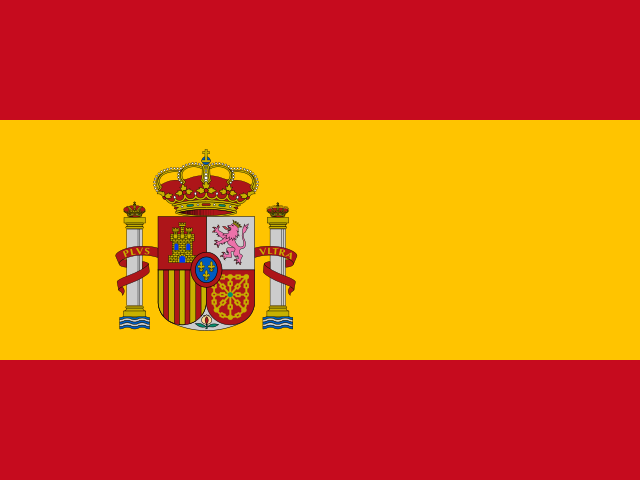

<!--
    WARNING: DO NOT EDIT!
    This file has been generated by script i18n_update.
-->

**[Volver al resumen de la documentación](../README.md)**

# Papi-web - Traducción al inglés

- [Ver archivo locale/es/LC_MESSAGES/messages.po](../locale/es/LC_MESSAGES/messages.po)

## Resumen

| locale=`es` | Español  |
|--|:--:|
|Mensajes obligatorios vacíos|0/59|
|Mensajes vacíos|0/1049|
|Message flagged [ai_translation]|1048/1049|
|Message flagged [fuzzy]|129/1049|

## Mensajes obligatorios vacíos (-)

## Mensajes vacíos (-)

## Mensajes marcados (1177)

### Mensaje marcado [ai_translation] (1048)

|id de mensaje|Traducción|Ubicaciones|
|--|--|--|
|This program should not be launched directly, use the scripts server.bat, ffe.bat and chessevent.bat.|Este programa no debe ser lanzado directamente, utilizar scripts server.bat, ffe.bat y chessevent.bat.|src/papi_web.py:32|
|The ChessEvent connection is not defined for tournament [{tournament_uniq_id}].|Conexión ChessEvent no establecida para torneo [{tournament_uniq_id}].|src/chessevent/action_selector.py:42|
|The Papi file is not defined for tournament [{tournament_uniq_id}].|Archivo Papi no definido para torneo [{tournament_uniq_id}].|src/chessevent/action_selector.py:46|
|Tournament [{tournament_uniq_id}] has started.|El torneo [{tournament_uniq_id}] ha comenzado.|src/chessevent/action_selector.py:50|
|Event: {event_name}|Evento: {event_name}|src/chessevent/action_selector.py:63 src/ffe/action_selector.py:83|
|Unable to create Papi files since no tournaments are defined.|No se pueden crear archivos Papi ya que no se definen torneos.|src/chessevent/action_selector.py:66|
|Tournaments: {tournament_names}|Torneos: {tournament_names}|src/chessevent/action_selector.py:68|
|C \*\*\* THE LETTER TO ANSWER CREATE|C|src/chessevent/action_selector.py:70|
|U \*\*\* THE LETTER TO ANSWER UPLOAD|U|src/chessevent/action_selector.py:71 src/ffe/action_selector.py:95|
|Q \*\*\* THE LETTER TO ANSWER QUIT|Q|src/chessevent/action_selector.py:72 src/chessevent/action_selector.py:92 src/chessevent/action_selector.py:113 src/chessevent/event_selector.py:29 src/common/engine.py:125 src/ffe/action_selector.py:96 src/ffe/event_selector.py:25|
|Create the Papi files|Crear los archivos Papi|src/chessevent/action_selector.py:75|
|Create the Papi files and send them to the FFE website|Crear los archivos Papi y enviarlos al sitio web de la FFE|src/chessevent/action_selector.py:76|
|Quit|Salir|src/chessevent/action_selector.py:77 src/chessevent/action_selector.py:97 src/chessevent/action_selector.py:117 src/chessevent/event_selector.py:39 src/ffe/action_selector.py:103 src/ffe/event_selector.py:35|
|Your choice (by default {default}): |Su elección (por defecto {default}):|src/chessevent/action_selector.py:85 src/chessevent/action_selector.py:105 src/chessevent/action_selector.py:125|
|Action: {action}|Acción: {action}|src/chessevent/action_selector.py:86 src/ffe/action_selector.py:110|
|1 \*\*\* THE LETTER TO ANSWER ONCE|1|src/chessevent/action_selector.py:90|
|C \*\*\* THE LETTER TO ANSWER CONTINUOUSLY|C|src/chessevent/action_selector.py:91|
|Once|Una vez|src/chessevent/action_selector.py:95|
|Continuously|Continuamente|src/chessevent/action_selector.py:96|
|Frequency: {frequency}|Frecuencia: {frequency}|src/chessevent/action_selector.py:108|
|Please choose the Papi version:|Por favor, elija la versión Papi:|src/chessevent/action_selector.py:112|
|Papi version: {version}|Versión papi: {version}|src/chessevent/action_selector.py:132|
|This action can not be applied to the tournaments of this event.|Esta acción se puede hacer en los torneos de este evento.|src/chessevent/action_selector.py:142 src/ffe/action_selector.py:116 src/ffe/action_selector.py:125 src/ffe/action_selector.py:133 src/ffe/action_selector.py:142 src/ffe/action_selector.py:162|
|Data for tournament [{tournament_uniq_id}] could not be decoded (encoding: [{encoding}]), saved in file [{file}] (error line [{line}], column [{column}], position [{position}]).|Los datos del torneo [{tournament_uniq_id}] no pudieron ser decodificados (codificación: [{encoding}]), guardados en el archivo [{file}] (línea de error [{line}], columna [{column}], posición [{position}]).|src/chessevent/action_selector.py:166|
|Data for tournament [{tournament_name}] on ChessEvent are unchanged.|Los datos del torneo [{tournament_name}] en ChessEvent no cambian.|src/chessevent/action_selector.py:173|
|Papi file [{file}] has been created (players: {num}).|Se ha creado el archivo Papi [{file}] (jugadores: {num}).|src/chessevent/action_selector.py:184|
|FFE ID and password are not correctly set for tournament [{tournament_name}], data can not be sent to the FFE website.|La identificación y contraseña de FFE no están correctamente configuradas para el torneo [{tournament_name}], los datos no se pueden enviar al sitio web de FFE.|src/chessevent/action_selector.py:190|
|Authentication error (code: [{code}]) for [{user_id}] ([{chessevent_string}]).|Error de autenticación (código: [{code}]) para [{user_id}] ([{chessevent_string}]).|src/chessevent/chessevent_session.py:54|
|Access denied (code: [{code}]) for [{user_id}] on tournament [{tournament_name}] ([{chessevent_string}]).|Acceso denegado (código: [{code}]) para [{user_id}] en el torneo [{tournament_name}] ([{chessevent_string}]).|src/chessevent/chessevent_session.py:58|
|Missing parameter (code: [{code}]): [{error}].|Parámetro faltante (código: [{code}]: [{error}].|src/chessevent/chessevent_session.py:63|
|ID [{user_id}] not found (code: [{code}]): [{error}].|Id [{user_id}] no encontrado (código: [{code}]: [{error}].|src/chessevent/chessevent_session.py:67|
|Tournament [{tournament_name}] not found (code: [{code}]): [{error}].|Torneo [{tournament_name}] no encontrado (código: [{code}]: [{error}].|src/chessevent/chessevent_session.py:71|
|Event [{event_id}] not found (code: [{code}]): [{error}].|Evento [{event_id}] no encontrado (código: [{code}]: [{error}].|src/chessevent/chessevent_session.py:76|
|Unknown response code: [{code}] ([{chessevent_string}]).|Código de respuesta desconocido: [{code}] ([{chessevent_string})].|src/chessevent/chessevent_session.py:81|
|Failed to read [{url}] (connection error): [{ex}].|Fallo al leer [{url}] (error de conexión): [{ex}].|src/chessevent/chessevent_session.py:85 src/common/engine.py:283 src/common/engine.py:413 src/common/engine.py:459 src/ffe/ffe_session.py:99|
|Failed to read [{url}] (timeout): [{ex}].|Fallo al leer [{url}] (tiempo de espera): [{ex}].|src/chessevent/chessevent_session.py:88 src/common/engine.py:285 src/common/engine.py:416 src/common/engine.py:462 src/ffe/ffe_session.py:101|
|Failed to read [{url}] (error code [{errno}]): [{strerror}].|Fallo al leer [{url}] (código de error [{errno}]: [{strerror}].|src/chessevent/chessevent_session.py:91 src/common/engine.py:287 src/common/engine.py:419 src/common/engine.py:465 src/ffe/ffe_session.py:103|
|Failed to read [{url}]: [{ex}].|Fallo al leer [{url}]: [{ex}].|src/chessevent/chessevent_session.py:95 src/common/engine.py:290 src/common/engine.py:423 src/common/engine.py:469 src/ffe/ffe_session.py:106|
|No events found.|No se encontraron eventos.|src/chessevent/event_selector.py:26 src/ffe/event_selector.py:22|
|One event found, press Enter (Q to quit): |Un evento encontrado, escriba Enter (Q para salir):|src/chessevent/event_selector.py:32 src/ffe/event_selector.py:28|
|Please choose the event:|Por favor, elija el evento:|src/chessevent/event_selector.py:35 src/ffe/event_selector.py:31|
|Your choice: |Su elección:|src/chessevent/event_selector.py:44 src/common/papi_web_config.py:112 src/ffe/event_selector.py:40|
|Configuration file [{file}] not found.|Archivo de configuración [{file}] no encontrado.|src/common/config_reader.py:28|
|Configuration file [{file}] is not a file.|El archivo de configuración [{file}] no es un archivo.|src/common/config_reader.py:31|
|Could not read file [{file}].|No se pudo leer el archivo [{file}].|src/common/config_reader.py:50|
|Duplicated section at line [{lineno}].|Sección duplicada en línea [{lineno}].|src/common/config_reader.py:53|
|Duplicated option at line [{lineno}].|Opción duplicada en línea [{lineno}].|src/common/config_reader.py:57|
|Parsing error: [{ex}].|Error de análisis: [{ex}].|src/common/config_reader.py:62|
|Error: [{ex}].|Error: [{ex}].|src/common/config_reader.py:66|
|Checking Papi-web version...|Comprobando la versión de Papi-web...|src/common/engine.py:40|
|Y \*\*\* THE LETTER TO ANSWER YES|Y|src/common/engine.py:45 src/common/engine.py:106 src/common/engine.py:147 src/common/engine.py:212|
|N \*\*\* THE LETTER TO ANSWER NO|N|src/common/engine.py:46 src/common/engine.py:107 src/common/engine.py:148 src/common/engine.py:213|
|Do you want to upgrade from [{old_version}] to [{new_version}] [{y_lc}/{n_uc}}]? |¿Desea actualizar de [{old_version}] a [{new_version}] [{y_lc}/{n_uc}}]?|src/common/engine.py:49|
|The installation of version [{version}] failed.|La instalación de la versión [{version}] falló.|src/common/engine.py:57|
|- Version {version} ({events})|- Versión {version} ({events})|src/common/engine.py:90|
|- Version {version}: no events|- Versión {version}: no hay eventos|src/common/engine.py:94|
|No event found in previously installed versions.|No se ha encontrado ningún evento en versiones previamente instaladas.|src/common/engine.py:96|
|No previously installed version found.|No se ha encontrado ninguna versión instalada previamente.|src/common/engine.py:98|
|Do you want to recover the configuration of version [{version}] [{y_uc}/{n_lc}]?|¿Desea recuperar la configuración de la versión [{version}] [{y_uc}/{n_lc}]?|src/common/engine.py:110|
|Please choose the version to recover:|Por favor, elija la versión para recuperar:|src/common/engine.py:119|
|  - [{q_uc}] Do not recover|- [{q_uc}] No recuperar|src/common/engine.py:126|
|Please enter the number of the version to recover [{default}]: |Por favor entre el número de la versión para recuperar [{default}]:|src/common/engine.py:129|
|Do you want to install example event databases [{y_uc}/{n_lc}]?|¿Desea instalar bases de datos de eventos de ejemplo [{y_uc}/{n_lc}]?|src/common/engine.py:151|
|Recovering events from version {version}...|Recuperando eventos de la versión {version}...|src/common/engine.py:167|
|Recovering event [{event_uniq_id}]...|Recuperando evento [{event_uniq_id}]...|src/common/engine.py:172|
|Event [{event_uniq_id}]: recovering tournament [{tournament_uniq_id}]...|Evento [{event_uniq_id}]: torneo de recuperación [{tournament_uniq_id}]...|src/common/engine.py:183|
|Recovering custom files...|Recuperando archivos personalizados...|src/common/engine.py:188|
|Events recovered: {num} (from directory [{dir}]).|Eventos recuperados: {num} (del directorio [{dir}]).|src/common/engine.py:202|
|Tournaments recovered: {num} (from directory [{dir}]).|Torneos recuperados: {num} (del directorio [{dir}]).|src/common/engine.py:204|
|Custom files recovered: {num} (from directory [{dir}]).|Archivos personalizados recuperados: {num} (del directorio [{dir}]).|src/common/engine.py:208|
|Do you want to send these custom files to the Papi-web developers to enhance futures versions [{y_uc}/{n_lc}]?|¿Desea enviar estos archivos personalizados a los desarrolladores de Papi-web para mejorar las versiones de futuros [{y_uc}/{n_lc}]?|src/common/engine.py:216|
|Sending the files to a server...|Enviar los archivos a un servidor...|src/common/engine.py:306|
|Files have been sent to bin {bin_name}.|Los archivos han sido enviados a bin {bin_name}.|src/common/engine.py:312|
|- View the files on filebin.net: {bin_url}|- Ver los archivos en filebin.net: {bin_url}|src/common/engine.py:313|
|- Download the files (ZIP archive): {bin_zip_url}|- Descargar los archivos (archivo ZIP): {bin_zip_url}|src/common/engine.py:314|
|[Papi-web {version}] Request for the integration of custom files|[Papi-web {version}] Solicitud de integración de archivos personalizados|src/common/engine.py:316|
|A window will open to send an email to the Papi-web project; If the window does not open, please click on the link below or manually send an email to {email}.|Se abrirá una ventana para enviar un correo electrónico al proyecto Papi-web; Si la ventana no se abre, por favor haga clic en el enlace de abajo o envíe un correo electrónico manualmente a {email}.|src/common/engine.py:333|
|Checking the version failed.|Falló la comprobación de la versión.|src/common/engine.py:345|
|Your Papi-web version is up to date.|Tu versión de Papi-web está actualizada.|src/common/engine.py:348|
|A more recent version is available ([{version}]).|Una versión más reciente está disponible ([{version}]).|src/common/engine.py:356|
|You are using a version newer than the latest stable version available ([{version}]), are you a developer? ;-)|Está utilizando una versión más reciente que la última versión estable disponible ([{version}]), ¿es usted un desarrollador? ;-)|src/common/engine.py:359|
|A stable and more recent version is available ([{new_version}]) but upgrading unstable versions (like the one you are currently using: [{old_version}]) must be done manually (upgrade from the last stable version installed on your server).|Una versión estable y más reciente está disponible ([{new_version}]) pero la actualización de versiones inestables (como la que está usando actualmente: [{old_version}] debe hacerse manualmente (actualizar desde la última versión estable instalada en su servidor).|src/common/engine.py:367|
|You are using un unstable version more recent than the last stable version available ({version}).|Está utilizando una versión inestable más reciente que la última versión estable disponible ({version}).|src/common/engine.py:371|
|Looking for a more recent version on GitHub ([{url}])...|Buscando una versión más reciente en GitHub ([{url}])...|src/common/engine.py:383|
|No response from GitHub.|No hay respuesta de GitHub.|src/common/engine.py:387 src/common/engine.py:443|
|Invalid response from GitHub: {ex}.|Respuesta no válida de GitHub: {ex}.|src/common/engine.py:394|
|No stable version found.|No se encontró ninguna versión estable.|src/common/engine.py:406|
|Version [{version}] is already installed in directory [{dir}], please manually delete this folder before installing.|La versión [{version}] ya está instalada en el directorio [{dir}], por favor elimine manualmente esta carpeta antes de instalarla.|src/common/engine.py:434|
|Downloading version {version} from GitHub ([{url}])...|Descargando la versión {version} desde GitHub ([{url}])...|src/common/engine.py:439|
|Downloading failed with code [{code}].|La descarga falló con el código [{code}].|src/common/engine.py:447|
|File downloaded: [{zip_file}].|Archivo descargado: [{zip_file}].|src/common/engine.py:451|
|New version [{version}] has been installed in [{dir}].|Nueva versión [{version}] se ha instalado en [{dir}].|src/common/engine.py:454|
|Option not set, by default [{default}].|Opción no definida, por defecto [{default}].|src/common/papi_web_config.py:78 src/common/papi_web_config.py:154 src/common/papi_web_config.py:184 src/common/papi_web_config.py:196 src/common/papi_web_config.py:211|
|Invalid value [{value}].|Valor no válido [{value}].|src/common/papi_web_config.py:84 src/common/papi_web_config.py:203 src/web/controllers/admin/index_admin_controller.py:164|
|Locale [{locale}] not found.|Locale [{locale}] no encontrado.|src/common/papi_web_config.py:96|
|Option not set.|Opción no establecida.|src/common/papi_web_config.py:98 src/common/papi_web_config.py:166|
|Section not found.|Sección no encontrada.|src/common/papi_web_config.py:100 src/common/papi_web_config.py:158 src/common/papi_web_config.py:161|
|The following languages are available:|Los idiomas disponibles son los siguientes:|src/common/papi_web_config.py:105|
|Invalid log level [{level}], by default [{default}].|Nivel de registro no válido [{level}], por defecto [{default}].|src/common/papi_web_config.py:149|
|Invalid host configuration [{host}], by default [{default}].|Configuración del host no válida [{host}], por defecto [{default}].|src/common/papi_web_config.py:178|
|Invalid port [{port}], by default [{default}].|Puerto no válido [{port}], por defecto [{default}].|src/common/papi_web_config.py:190|
|Invalid delay [{delay}], by default [{default}]|Retraso no válido [{delay}], por defecto [{default}]|src/common/papi_web_config.py:218|
|Section not found, default configuration set.|Sección no encontrada, configuración predeterminada.|src/common/papi_web_config.py:222|
|Your file {ini_file} has been saved as {ini_file_org}.|Su archivo {ini_file} ha sido guardado como {ini_file_org}.|src/common/papi_web_config.py:233|
|Could not save {ini_file} to {ini_file_org}: {ex}.|No se pudo guardar {ini_file} a {ini_file_org}: {ex}.|src/common/papi_web_config.py:236|
|Adding lines to {file}...|Añadir líneas a {file}...|src/common/papi_web_config.py:242|
|[i18n] # Added by Papi-web {version}|[i18n] # Añadido por Papi-web {version}|src/common/papi_web_config.py:244|
|# The line below has been commented by Papi-web {version}|# La siguiente línea ha sido comentada por Papi-web {version}|src/common/papi_web_config.py:255|
|Your file {ini_file} has been modified.|Su archivo {ini_file} ha sido modificado.|src/common/papi_web_config.py:260|
|Could not write to {ini_file}: {ex}.|No se pudo escribir a {ini_file}: {ex}.|src/common/papi_web_config.py:262|
|Papi-web project|Proyecto Papi-web|src/common/papi_web_config.py:305|
|Tournament [{tournament_uniq_id}]: {text}|Torneo [{tournament_uniq_id}]: {text}|src/data/event.py:55|
|ChessEvent connection [{chessevent_uniq_id}]: {text}|Conexión ChessEvent [{chessevent_uniq_id}]: {text}|src/data/event.py:58|
|Family [{family_uniq_id}]: {text}|Familia [{family_uniq_id}]: {text}|src/data/event.py:61|
|Timer [{timer_uniq_id}], hour [{hour_order}]: {text}|Temporizador [{timer_uniq_id}], hora [{hour_order}]: {text}|src/data/event.py:64|
|Timer [{timer_uniq_id}]: {text}|Temporizador [{timer_uniq_id}]: {text}|src/data/event.py:67|
|Screen [{screen_uniq_id}], screen set [{screen_set_order}]: {text}|Pantalla [{screen_uniq_id}], conjunto de pantalla [{screen_set_order}]: {text}|src/data/event.py:70|
|Screen [{screen_uniq_id}]: {text}|Pantalla [{screen_uniq_id}]: {text}|src/data/event.py:73|
|Rotator [{rotator_uniq_id}]: {text}|Rotador [{rotator_uniq_id}]: {text}|src/data/event.py:75|
|Errors have been found on the event; ChessEvent connections, timers, tournaments, screens, families and rotators will not be loaded.|Se han encontrado errores en el evento; no se cargarán las conexiones ChessEvent, temporizadores, torneos, pantallas, familias y rotadores.|src/data/event.py:91|
|No name set, by default [{name}]|Sin nombre, por defecto [{name}]|src/data/event.py:139|
|No directory set for Papi files, by default [{path}].|No se ha establecido ningún directorio para los archivos Papi, por defecto [{path}].|src/data/event.py:240|
|Directory [{path}] not found.|Directorio [{path}] no encontrado.|src/data/event.py:244 src/data/tournament.py:42|
|[{path}] is not a directory.|[{path}] no es un directorio.|src/data/event.py:246 src/data/tournament.py:44|
|No background image set, by default [{background_image}]|No hay conjunto de imágenes de fondo, por defecto [{background_image}]|src/data/event.py:255|
|No background colour set, by default [{background_color}]|No hay conjunto de color de fondo, por defecto [{background_color}]|src/data/event.py:269|
|No password set for the results entry|No se ha establecido contraseña para la entrada de resultados|src/data/event.py:279|
|Maximum number of illegal moves not set, by default [{record_illegal_moves}]|Número máximo de movimientos ilegales no establecidos, por defecto [{record_illegal_moves}]|src/data/event.py:286|
|Errors have been found on ChessEvent connections; timers, tournaments, screens, families and rotators will not be loaded.|Se han encontrado errores en las conexiones ChessEvent; no se cargarán temporizadores, torneos, pantallas, familias y rotadores.|src/data/event.py:421|
|Errors have been found on timers; tournaments, screens, families and rotators will not be loaded.|Se han encontrado errores en temporizadores; no se cargarán torneos, pantallas, familias y rotadores.|src/data/event.py:446|
|Errors have been found on tournaments; screens, families and rotators will not be loaded.|Se han encontrado errores en los torneos; las pantallas, las familias y los rotadores no se cargarán.|src/data/event.py:471|
|Errors have been found on screens; families and rotators will not be loaded.|Se han encontrado errores en las pantallas; las familias y los rotadores no se cargarán.|src/data/event.py:501|
|Errors have been found on families; rotators will not be loaded.|Se han encontrado errores en las familias; los rotadores no se cargarán.|src/data/event.py:530|
|Errors have been found on rotators.|Se han encontrado errores en los rotadores.|src/data/event.py:573|
|%t (%f to %l)|%t (%f a %l)|src/data/family.py:49|
|Tournament [{tournament_uniq_id}] can not be read, family ignored.|Torneo [{tournament_uniq_id}] no se puede leer, familia ignorada.|src/data/family.py:157|
|Tournament [{tournament_uniq_id}] has only [{boards_number}] boards (< [{first}]), family ignored.|Torneo [{tournament_uniq_id}] sólo tiene [{boards_number}] tablas (< [{first}]), familia ignorada.|src/data/family.py:169|
|Tournament [{tournament_uniq_id}] has only [{players_number}] players (< [{first}]), family ignored.|Torneo [{tournament_uniq_id}] sólo tiene [{players_number}] jugadores (< [{first}]), familia ignorada.|src/data/family.py:198|
|Nothing to display for tournament [{tournament_uniq_id}], family ignored.|Nada que mostrar para el torneo [{tournament_uniq_id}], familia ignorada.|src/data/family.py:214|
|all the boards|todos los tableros|src/data/family.py:274 src/data/screen_set.py:287|
|boards from #{first} to end|tableros desde #{first} hasta el final|src/data/family.py:276 src/data/screen_set.py:289|
|boards from start to #{last}|desde el principio hasta #{last}|src/data/family.py:278 src/data/screen_set.py:293|
|boards from #{first} to #{last}|tableros de #{first} a #{last}|src/data/family.py:280 src/data/screen_set.py:291|
|screens of {number} boards|Pantallas de tableros {number}|src/data/family.py:282|
|screens of {number} boards from #{first} to end|Pantallas de {number} desde #{first} hasta el final|src/data/family.py:284|
|screens of {number} boards from start to #{last}|Pantallas de {number} desde el principio hasta #{last}|src/data/family.py:286|
|screens of {number} boards from #{first} to #{last}|Pantallas de {number} de #{first} a #{last}|src/data/family.py:288|
|boards on {parts} screens|tableros en las pantallas {parts}|src/data/family.py:291|
|boards from #{first} to end, on {parts} screens|tableros desde #{first} hasta el final, en pantallas {parts}|src/data/family.py:293|
|boards from start to #{last}, on {parts} screens|tableros de inicio a #{last}, en {parts} pantallas|src/data/family.py:295|
|boards from #{first} to #{last}, on {parts} screens|tableros de #{first} a #{last}, en {parts} pantallas|src/data/family.py:297|
|all the players|todos los jugadores|src/data/family.py:305 src/data/screen_set.py:300|
|players from #{first} to end|jugadores desde #{first} hasta el final|src/data/family.py:307 src/data/screen_set.py:302|
|players from start to #{last}|jugadores de inicio a #{last}|src/data/family.py:309 src/data/screen_set.py:306|
|players from #{first} to #{last}|jugadores de #{first} a #{last}|src/data/family.py:311 src/data/screen_set.py:304|
|screens of {number} players|Pantallas de reproductores {number}|src/data/family.py:313|
|screens of {number} players from #{first} to end|pantallas de {number} reproductores desde #{first} hasta el final|src/data/family.py:315|
|screens of {number} players from start to #{last}|pantallas de {number} reproductores desde el principio hasta #{last}|src/data/family.py:317|
|screens of {number} players from #{first} to #{last}|pantallas de {number} reproductores de #{first} a #{last}|src/data/family.py:319|
|players on {parts} screens|reproductores en las pantallas {parts}|src/data/family.py:322|
|players from #{first} to end, on {parts} screens|reproductores desde #{first} hasta el final, en pantallas {parts}|src/data/family.py:324|
|players from start to #{last}, on {parts} screens|reproductores de inicio a #{last}, en pantallas {parts}|src/data/family.py:326|
|players from #{first} to #{last}, on {parts} screens|reproductores de #{first} a #{last}, en pantallas {parts}|src/data/family.py:328|
|Unpaired \*\*\* FEMALE|Sin emparejar|src/data/player.py:272|
|Unpaired \*\*\* MALE|Sin emparejar|src/data/player.py:272|
|Exempt \*\*\* FEMALE|Exento|src/data/player.py:276|
|Exempt \*\*\* MALE|Exento|src/data/player.py:276|
|Last results|Últimos resultados|src/data/screen.py:97 src/data/screen.py:178 src/data/util.py:846 src/web/controllers/admin/index_admin_controller.py:108 src/web/controllers/admin/screen_admin_controller.py:360 src/web/templates/admin_screens.html:79 src/web/templates/admin_screens.html:117|
|Image|Imagen|src/data/screen.py:99 src/data/util.py:848 src/web/controllers/admin/index_admin_controller.py:109 src/web/controllers/admin/screen_admin_controller.py:362 src/web/templates/admin_screens.html:80 src/web/templates/admin_screens.html:122|
|Boards %f-%l|Tablas %f-%l|src/data/screen.py:125 src/data/screen_set.py:124|
|By board|Por tablero|src/data/screen.py:127|
|%t [Boards %f-%l]|%t [Boards %f-%l]|src/data/screen.py:130|
|%t (by board)|%t (por tablero)|src/data/screen.py:132|
|By player|Por jugador|src/data/screen.py:140|
|%t (by player)|%t (por jugador)|src/data/screen.py:145|
|No screen of type [{screen_type}] for the menu of screen [{screen_uniq_id}].|No hay pantalla de tipo [{screen_type}] para el menú de pantalla [{screen_uniq_id}].|src/data/screen.py:193 src/data/screen.py:203 src/data/screen.py:213 src/data/screen.py:223|
|Pattern [{pattern}] can be used by screen families.|El patrón [{pattern}] puede ser utilizado por las familias de pantalla.|src/data/screen.py:231|
|Pattern [{pattern}] matches no screen.|El patrón [{pattern}] no coincide con ninguna pantalla.|src/data/screen.py:239|
|Screen [{pattern}] not found for the menu of screen [{screen_uniq_id}].|Pantalla [{pattern}] no encontrada para el menú de pantalla [{screen_uniq_id}].|src/data/screen.py:249|
|Maximum number of results set to [{results_limit}] to fit on [{columns}] columns.|Número máximo de resultados establecido en [{results_limit}] para encajar en [{columns}].|src/data/screen.py:326|
|Invalid board number [{fixed_board_str}].|Número de placa no válido [{fixed_board_str}].|src/data/screen_set.py:60 src/web/controllers/admin/screen_admin_controller.py:287|
|Numbers {first} and {last} are not compatible ({first} > {last}).|Números {first} y {last} no son compatibles ({first} > {last}).|src/data/screen_set.py:78 src/web/controllers/admin/family_admin_controller.py:162 src/web/controllers/admin/screen_admin_controller.py:274|
|%f to %l|%f a %l|src/data/screen_set.py:142|
|boards {board_numbers}|tableros {board_numbers}|src/data/screen_set.py:283|
|Tournament {tournament_uniq_id} ({numbers_str})|Torneo {tournament_uniq_id} ({numbers_str})|src/data/screen_set.py:312|
|Time is not defined.|El tiempo no está definido.|src/data/timer.py:152|
|Invalid time [{time_str}].|Hora no válida [{time_str}].|src/data/timer.py:157|
|The date of the first hour is not defined (mandatory).|La fecha de la primera hora no está definida (obligatoria).|src/data/timer.py:160|
|Invalid date [{date_str}].|Fecha no válida [{date_str}].|src/data/timer.py:167|
|Invalid hour [{hour}] (before previous hour [{previous_hour}]).|Hora inválida [{hour}] (antes de la hora anterior [{previous_hour}]).|src/data/timer.py:179 src/web/controllers/admin/timer_admin_controller.py:159|
|Invalid date and time [{datetime_str}].|Fecha y hora inválidas [{datetime_str}].|src/data/timer.py:185|
|No valid hour defined.|No hay hora válida definida.|src/data/timer.py:196|
|No directory set for the Papi file, by default [{path}].|No hay directorio establecido para el archivo Papi, por defecto [{path}].|src/data/tournament.py:40|
|The name of the Papi file is not set, by default [{filename}]|El nombre del archivo Papi no está establecido, por defecto [{filename}]|src/data/tournament.py:47|
|Qualification number and FFE password not set, operations on the FFE website will not be available.|Número de calificación y contraseña FFE no establecida, las operaciones en el sitio web de FFE no estarán disponibles.|src/data/tournament.py:51|
|ChessEvent connection not defined.|Conexión ChessEvent no definida.|src/data/tournament.py:54|
|ChessEvent tournament name not set.|ChessEvent nombre del torneo no establecido.|src/data/tournament.py:56|
|Standard rating|Calificación estándar|src/data/util.py:245|
|Rapid rating|Calificación rápida|src/data/util.py:247|
|Blitz rating|Calificación Blitz|src/data/util.py:249|
|- \*\*\* NAME FOR GENDER NONE|- ¡No! - ¡No!|src/data/util.py:460|
|Female \*\*\* NAME FOR GENDER FEMALE|Mujeres|src/data/util.py:462|
|Male \*\*\* NAME FOR GENDER MALE|Hombres|src/data/util.py:464|
|- \*\*\* SHORT NAME FOR GENDER NONE|- ¡No! - ¡No!|src/data/util.py:472 src/web/templates/admin_players/admin_players_filter_genders.html:28|
|F \*\*\* SHORT NAME FOR GENDER FEMALE|F|src/data/util.py:474 src/web/templates/admin_players/admin_players_filter_genders.html:32|
|M \*\*\* SHORT NAME FOR GENDER MALE|M|src/data/util.py:476 src/web/templates/admin_players/admin_players_filter_genders.html:36|
|No FFE Licence|No hay licencia FFE|src/data/util.py:519|
|Expired FFE licence|Expiración de la licencia FFE|src/data/util.py:521|
|FFE licence B (leisure)|Licencia FFE B (ocio)|src/data/util.py:523|
|FFE licence A (competition)|Licencia FFE A (competencia)|src/data/util.py:525|
|Estimated \*\*\* NAME FOR RATING TYPE ESTIMATED|Hombres|src/data/util.py:675|
|National \*\*\* NAME FOR RATING TYPE NATIONAL|Nacional|src/data/util.py:677|
|FIDE \*\*\* NAME FOR RATING TYPE FIDE|Hombres|src/data/util.py:679|
|E \*\*\* SHORT NAME FOR RATING TYPE ESTIMATED|M|src/data/util.py:687|
|N \*\*\* SHORT NAME FOR RATING TYPE NATIONAL|- ¡No! - ¡No!|src/data/util.py:689|
|F \*\*\* SHORT NAME FOR RATING TYPE FIDE|F|src/data/util.py:691|
|No title|Sin temporizadores.|src/data/util.py:755|
|Woman Fide Master|Mujer Fide Master|src/data/util.py:757|
|Fide Master|Fide Master|src/data/util.py:759|
|Woman International Master|Master Internacional de la Mujer|src/data/util.py:761|
|International Master|Master Internacional|src/data/util.py:763|
|Woman Grand Master|Mujer Gran Maestra|src/data/util.py:765|
|Grand Master|Gran Maestro|src/data/util.py:767|
|WFM \*\*\* SHORT NAME FOR Woman Fide Master|M|src/data/util.py:777|
|FM \*\*\* SHORT NAME FOR Fide Master|M|src/data/util.py:779|
|WIM \*\*\* SHORT NAME FOR Woman International Master|- ¡No! - ¡No!|src/data/util.py:781|
|IM \*\*\* SHORT NAME FOR International Master|- ¡No! - ¡No!|src/data/util.py:783|
|WGM \*\*\* SHORT NAME FOR Woman Grand Master|M|src/data/util.py:785|
|GM \*\*\* SHORT NAME FOR Grand Master|M|src/data/util.py:787|
|Pairings by board|Maridajes a bordo|src/data/util.py:840 src/web/controllers/admin/index_admin_controller.py:104 src/web/controllers/admin/tournament_admin_controller.py:339 src/web/templates/admin_families.html:61 src/web/templates/admin_screens.html:77 src/web/templates/admin_screens.html:107|
|Results entry|Entrada de los resultados|src/data/util.py:842 src/web/controllers/admin/family_admin_controller.py:270 src/web/controllers/admin/index_admin_controller.py:103 src/web/controllers/admin/screen_admin_controller.py:354 src/web/controllers/admin/tournament_admin_controller.py:338 src/web/templates/admin_event_modal.html:190 src/web/templates/admin_families.html:60 src/web/templates/admin_screens.html:76 src/web/templates/admin_screens.html:102|
|Parings by player|emparejamientos por jugador|src/data/util.py:844|
|FFE ID not defined for tournament [{tournament_uniq_id}].|FFE ID no definido para torneo [{tournament_uniq_id}].|src/ffe/action_selector.py:30 src/ffe/action_selector.py:43 src/ffe/action_selector.py:63|
|Papi file not defined for tournament [{tournament_uniq_id}].|Archivo Papi no definido para torneo [{tournament_uniq_id}].|src/ffe/action_selector.py:46|
|Papi file not found [{file}] for tournament [{tournament_uniq_id}].|Archivo Papi no encontrado [{file}] para torneo [{tournament_uniq_id}].|src/ffe/action_selector.py:50|
|Rules file not defined for tournament [{tournament_uniq_id}].|Archivo de reglas no definido para torneo [{tournament_uniq_id}].|src/ffe/action_selector.py:66|
|Rules file defined by a URL for tournament [{tournament_uniq_id}].|Archivo de reglas definido por una URL para torneo [{tournament_uniq_id}].|src/ffe/action_selector.py:70|
|Rules file [{file}] not found for tournament [{tournament_uniq_id}].|Archivo de reglas [{file}] no encontrado para torneo [{tournament_uniq_id}].|src/ffe/action_selector.py:74|
|No FFE operations can be done on the tournaments of this event.|No se pueden realizar operaciones FFE en los torneos de este evento.|src/ffe/action_selector.py:86|
|Tournaments: {tournament_ffe_ids}|Torneos: {tournament_ffe_ids}|src/ffe/action_selector.py:89|
|T \*\*\* THE LETTER TO ANSWER TEST|T|src/ffe/action_selector.py:91|
|V \*\*\* THE LETTER TO ANSWER VISIBLE|V|src/ffe/action_selector.py:92|
|F \*\*\* THE LETTER TO ANSWER FEES|F|src/ffe/action_selector.py:93|
|R \*\*\* THE LETTER TO ANSWER RULES|R|src/ffe/action_selector.py:94|
|Test the tournament passwords on the FFE website|Pruebe las contraseñas del torneo en el sitio web de la FFE|src/ffe/action_selector.py:98|
|Make the tournaments visible on the FFE website|Hacer visibles los torneos en el sitio web de la FFE|src/ffe/action_selector.py:99|
|Download fees invoices|Descargar facturas de tasas|src/ffe/action_selector.py:100|
|Upload the rules of the tournaments|Subir las reglas de los torneos|src/ffe/action_selector.py:101|
|Upload the results of the tournaments|Subir los resultados de los torneos|src/ffe/action_selector.py:102|
|Actions:|Acciones:|src/ffe/action_selector.py:105|
|No need to upload the rules to the FFE website (up to date).|No es necesario subir las reglas al sitio web de la FFE (hasta la fecha).|src/ffe/action_selector.py:151|
|No need to upload the results to the FFE website (up to date).|No es necesario subir los resultados al sitio web de la FFE (hasta la fecha).|src/ffe/action_selector.py:177|
|**Singular:** {recent_updates} tournament has been updated less than {ffe_upload_delay} seconds ago, waiting. **Plural:** {recent_updates} tournaments have been updated less than {ffe_upload_delay} seconds ago, waiting.|**Singular:** El torneo {recent_updates} ha sido actualizado menos de {ffe_upload_delay} hace un segundo, esperando. **Plural:** Los torneos {recent_updates} han sido actualizados menos que {ffe_upload_delay} hace un segundo, esperando.|src/ffe/action_selector.py:179|
|End of upload (Ctrl-C)|Fin de la carga (Ctrl-C)|src/ffe/action_selector.py:188|
|Content of URL [{url}] is not valid (input[id=[{id]] not found).|El contenido de URL [{url}] no es válido (no se ha encontrado entrada[id=[{id]].|src/ffe/ffe_session.py:142|
|Initializing a session to [{url}]...|Iniciando una sesión a [{url}]...|src/ffe/ffe_session.py:156|
|OK|OK|src/ffe/ffe_session.py:164 src/ffe/ffe_session.py:205 src/web/templates/admin_players/admin_players_filter_check_ins.html:22 src/web/templates/admin_players/admin_players_filter_clubs.html:21 src/web/templates/admin_players/admin_players_filter_columns.html:20 src/web/templates/admin_players/admin_players_filter_federations.html:21 src/web/templates/admin_players/admin_players_filter_ffe_licences.html:22 src/web/templates/admin_players/admin_players_filter_genders.html:22 src/web/templates/admin_players/admin_players_filter_leagues.html:21 src/web/templates/admin_players/admin_players_filter_tournaments.html:23|
|Authenticating...|Autenticando...|src/ffe/ffe_session.py:170|
|Authentication failed.|Falló la autenticación.|src/ffe/ffe_session.py:200|
|Tournament [{ffe_id}]:|Torneo [{ffe_id}]:|src/ffe/ffe_session.py:210|
|Getting fees for tournament [{ffe_id}]...|Obtener comisiones por torneo [{ffe_id}]...|src/ffe/ffe_session.py:218|
|Fees link not found, check that a Papi file has already been sent and that the tournament has not been archived on the FFE website.|Cargos enlace no encontrado, comprobar que un archivo Papi ya se ha enviado y que el torneo no se ha archivado en el sitio web de la FFE.|src/ffe/ffe_session.py:228|
|Tournament exempt from registration fees.|Torneo exento de tasas de inscripción.|src/ffe/ffe_session.py:231|
|Invalid fees link text [{text}].|Texto de enlace de tarifas no válido [{text}].|src/ffe/ffe_session.py:234|
|Invoice saved to [{file}].|Factura guardada en [{file}].|src/ffe/ffe_session.py:259|
|Sending tournament [{ffe_id}] ({file}) to the FFE website...|Torneo de envío [{ffe_id}] ({file}) al sitio web de la FFE...|src/ffe/ffe_session.py:264|
|Upload link not found, check that the tournament is not marked as finished on the FFE website.|Cargar enlace no encontrado, comprobar que el torneo no ha terminado en el sitio web de la FFE.|src/ffe/ffe_session.py:274|
|Results upload OK|Los resultados se cargan OK|src/ffe/ffe_session.py:307 src/ffe/ffe_session.py:334|
|Making the tournament visible on the FFE website...|Hacer visible el torneo en el sitio web de la FFE...|src/ffe/ffe_session.py:310|
|Display link not found, check that a Papi file has already been sent.|Mostrar enlace no encontrado, compruebe que un archivo Papi ya ha sido enviado.|src/ffe/ffe_session.py:314|
|Data is already displayed on the FFE website.|Los datos ya se muestran en el sitio web de la FFE.|src/ffe/ffe_session.py:317|
|Invalid display link text [{text}]|Texto de enlace de visualización no válido [{text}]|src/ffe/ffe_session.py:321|
|Sending the rules of tournament [{ffe_id}] ({file}) to the FFE website...|Envío de las reglas del torneo [{ffe_id}] ({file}) al sitio web de la FFE...|src/ffe/ffe_session.py:338|
|Rules upload link not found, check that the tournament is not marked as finished on the FFE website.|Reglas subir enlace no encontrado, comprobar que el torneo no ha terminado en el sitio web de la FFE.|src/ffe/ffe_session.py:348|
|Opening the welcome page [{url}] in a browser...|Abrir la página de bienvenida [{url}] en un navegador...|src/web/server_engine.py:24|
|Web server not started yet ({ex}), waiting...|El servidor web aún no ha comenzado ({ex}), esperando...|src/web/server_engine.py:30|
|Starting Papi-web server, please wait...|Iniciando el servidor Papi-web, por favor espere...|src/web/server_engine.py:40|
|Logging level: {log_level}|Nivel de registro: {log_level}|src/web/server_engine.py:42|
|Port: {port}|Puerto: {port}|src/web/server_engine.py:43|
|Local URL: {local_url}|URL local: {local_url}|src/web/server_engine.py:44|
|LAN/WAN URL: {lan_url}|URL LAN/WAN: {lan_url}|src/web/server_engine.py:46|
|Port [{port}] already in use, can not start Papi-web server.|Puerto [{port}] ya en uso, no puede iniciar el servidor Papi-web.|src/web/server_engine.py:49|
|USE AT YOUR OWN RISKS|USO EN SUS PROPIOS RIESGOS|src/web/controllers/index_controller.py:285|
|Please enter the ID of ChessEvent connection.|Por favor, introduzca el id de la conexión ChessEvent.|src/web/controllers/admin/chessevent_admin_controller.py:69|
|ChessEvent connection [{uniq_id}] already exists.|ChessEvent connection [{uniq_id}] ya existe.|src/web/controllers/admin/chessevent_admin_controller.py:74 src/web/controllers/admin/chessevent_admin_controller.py:79|
|Please enter the ID used to connect to the ChessEvent platform.|Por favor, introduzca el identificador utilizado para conectarse a la plataforma ChessEvent.|src/web/controllers/admin/chessevent_admin_controller.py:88|
|Please enter the password used to connect to the ChessEvent platform.|Introduzca la contraseña utilizada para conectarse a la plataforma ChessEvent.|src/web/controllers/admin/chessevent_admin_controller.py:92|
|Please enter the ID of the event on the ChessEvent platform.|Por favor, introduzca el id del evento en la plataforma ChessEvent.|src/web/controllers/admin/chessevent_admin_controller.py:96|
|ChessEvent connection [{chessevent_uniq_id}] has been created.|Conexión ChessEvent [{chessevent_uniq_id}] ha sido creada.|src/web/controllers/admin/chessevent_admin_controller.py:232|
|ChessEvent connection [{chessevent_uniq_id}] has been updated.|Conexión ChessEvent [{chessevent_uniq_id}] ha sido actualizado.|src/web/controllers/admin/chessevent_admin_controller.py:238|
|ChessEvent connection [{chessevent_uniq_id}] has been deleted.|Conexión ChessEvent [{chessevent_uniq_id}] ha sido eliminado.|src/web/controllers/admin/chessevent_admin_controller.py:244|
|Tournaments ({num})|Torneos ({num})|src/web/controllers/admin/event_admin_controller.py:117|
|Players ({num})|Cronómetros ({num})|src/web/controllers/admin/event_admin_controller.py:121|
|Screens ({num})|Pantallas ({num})|src/web/controllers/admin/event_admin_controller.py:125|
|Families ({num})|Familias ({num})|src/web/controllers/admin/event_admin_controller.py:129|
|Rotators ({num})|Rotadores ({num})|src/web/controllers/admin/event_admin_controller.py:133 src/web/controllers/user/event_user_controller.py:125|
|Timers ({num})|Cronómetros ({num})|src/web/controllers/admin/event_admin_controller.py:137|
|ChessEvent ({num})|ChessEvent ({num})|src/web/controllers/admin/event_admin_controller.py:141|
|Messages ({num})|Mensajes ({num})|src/web/controllers/admin/event_admin_controller.py:145|
|Renaming the database failed: {ex}.|Falló el cambio de nombre de la base de datos: {ex}.|src/web/controllers/admin/event_admin_controller.py:593|
|Event [{old_uniq_id}] has been renamed ([{new_uniq_id}]) and updated.|Evento [{old_uniq_id}] ha sido renombrado ([{new_uniq_id}]) y actualizado.|src/web/controllers/admin/event_admin_controller.py:600|
|Event [{uniq_id}] has been updated.|El evento [{uniq_id}] ha sido actualizado.|src/web/controllers/admin/event_admin_controller.py:603|
|Event [{uniq_id}] has been created.|Evento [{uniq_id}] ha sido creado.|src/web/controllers/admin/event_admin_controller.py:611 src/web/controllers/admin/index_admin_controller.py:676|
|Event [{uniq_id}] has been deleted, the database has been archived ({arch}).|Evento [{uniq_id}] ha sido eliminado, la base de datos ha sido archivada ({arch}).|src/web/controllers/admin/event_admin_controller.py:621|
|Please enter the family ID.|Por favor, introduzca la identificación de la familia.|src/web/controllers/admin/family_admin_controller.py:102|
|Character [{char}] is not allowed.|El carácter [{char}] no está permitido.|src/web/controllers/admin/family_admin_controller.py:104 src/web/controllers/admin/index_admin_controller.py:233 src/web/controllers/admin/screen_admin_controller.py:123 src/web/controllers/admin/tournament_admin_controller.py:76|
|Family [{uniq_id}] already exists.|La familia [{uniq_id}] ya existe.|src/web/controllers/admin/family_admin_controller.py:109 src/web/controllers/admin/family_admin_controller.py:113|
|Please choose the tournament.|Por favor, elija el torneo.|src/web/controllers/admin/family_admin_controller.py:130 src/web/controllers/admin/screen_admin_controller.py:90 src/web/controllers/admin/screen_admin_controller.py:258|
|Tournament [{tournament_id}] not found.|Torneo [{tournament_id}] no encontrado.|src/web/controllers/admin/family_admin_controller.py:132 src/web/controllers/admin/screen_admin_controller.py:260|
|A positive integer is expected.|Se espera un número entero positivo.|src/web/controllers/admin/family_admin_controller.py:135 src/web/controllers/admin/family_admin_controller.py:140 src/web/controllers/admin/family_admin_controller.py:150 src/web/controllers/admin/family_admin_controller.py:155 src/web/controllers/admin/family_admin_controller.py:160 src/web/controllers/admin/family_admin_controller.py:179 src/web/controllers/admin/family_admin_controller.py:184 src/web/controllers/admin/rotator_admin_controller.py:94 src/web/controllers/admin/screen_admin_controller.py:143 src/web/controllers/admin/screen_admin_controller.py:154 src/web/controllers/admin/screen_admin_controller.py:167 src/web/controllers/admin/screen_admin_controller.py:172 src/web/controllers/admin/screen_admin_controller.py:262 src/web/controllers/admin/screen_admin_controller.py:267 src/web/controllers/admin/screen_admin_controller.py:272|
|Timer [{timer_id}] not found.|Temporizador [{timer_id}] no encontrado.|src/web/controllers/admin/family_admin_controller.py:148 src/web/controllers/admin/screen_admin_controller.py:152|
|Specifying the number of parts and the number of items per part is not possible.|No es posible especificar el número de piezas y el número de elementos por pieza.|src/web/controllers/admin/family_admin_controller.py:186|
|pairings by board|emparejamientos a bordo|src/web/controllers/admin/family_admin_controller.py:272 src/web/controllers/admin/screen_admin_controller.py:356 src/web/templates/admin_rotator_modal.html:121|
|Pairings by player|Maridajes por jugador|src/web/controllers/admin/family_admin_controller.py:274 src/web/controllers/admin/index_admin_controller.py:105 src/web/controllers/admin/screen_admin_controller.py:358 src/web/controllers/admin/tournament_admin_controller.py:340 src/web/templates/admin_families.html:62 src/web/templates/admin_screens.html:78 src/web/templates/admin_screens.html:112|
|No recording|Sin grabación|src/web/controllers/admin/index_admin_controller.py:77 src/web/templates/admin_event_config.html:108|
|**Singular:** {num} illegal move max **Plural:** {num} illegal moves max|**Singular:** {num} movimiento ilegal max **Plural:** {num} movimientos ilegales max|src/web/controllers/admin/index_admin_controller.py:79|
|By default - {option}|Por defecto - {option}|src/web/controllers/admin/index_admin_controller.py:82 src/web/controllers/admin/index_admin_controller.py:128 src/web/controllers/admin/index_admin_controller.py:139|
|Colour #1 is used until {delay_1} minutes before the start of the rounds (delay #1), the color then changes gradually until colour #2 ({delay_2} minutes before the start of the rounds).|El colour #1 se utiliza hasta que {delay_1} minutos antes del inicio de las rondas (retraso #1), el color cambia gradualmente hasta el colour #2 ({delay_2} minutos antes del inicio de las rondas).|src/web/controllers/admin/index_admin_controller.py:88|
|Colour #2 is used {delay_2} minutes before the start of the rounds (delay #2), the color then changes gradually until colour #3 (at the start of the rounds).|Colour #2 se utiliza {delay_2} minutos antes del inicio de las rondas (retraso #2), el color cambia gradualmente hasta el colour #3 (al comienzo de las rondas).|src/web/controllers/admin/index_admin_controller.py:91|
|Colour #3 is used from the start of the rounds and for {delay_3} minutes after (delay #3).|El colour #3 se utiliza desde el inicio de las rondas y para {delay_3} minutos después (retraso #3).|src/web/controllers/admin/index_admin_controller.py:94|
|Use no timer|Usar sin temporizador|src/web/controllers/admin/index_admin_controller.py:115|
|No timer defined|No se ha definido ningún temporizador|src/web/controllers/admin/index_admin_controller.py:115|
|Timer {timer_uniq_id}|Cronómetro {timer_uniq_id}|src/web/controllers/admin/index_admin_controller.py:118|
|Display the exit button|Mostrar el botón de salida|src/web/controllers/admin/index_admin_controller.py:125|
|Hide the exit button|Ocultar el botón de salida|src/web/controllers/admin/index_admin_controller.py:126|
|Display only paired players|Mostrar sólo jugadores emparejados|src/web/controllers/admin/index_admin_controller.py:136|
|Display all the players, paired and unpaired|Mostrar todos los jugadores, emparejados y sin emparejar|src/web/controllers/admin/index_admin_controller.py:137|
|URL [{url}] responded code [{code}].|URL [{url}] respondió código [{code}].|src/web/controllers/admin/index_admin_controller.py:179 src/web/controllers/admin/index_admin_controller.py:289 src/web/controllers/admin/screen_admin_controller.py:190|
|URL [{url}] did not respond (error: [{error}]).|URL [{url}] no respondió (error: [{error})].|src/web/controllers/admin/index_admin_controller.py:182 src/web/controllers/admin/index_admin_controller.py:293 src/web/controllers/admin/screen_admin_controller.py:194|
|Incorrect path [{path}].|Ruta incorrecta [{path}].|src/web/controllers/admin/index_admin_controller.py:186 src/web/controllers/admin/index_admin_controller.py:301|
|File [{file}] not found.|Archivo [{file}] no encontrado.|src/web/controllers/admin/index_admin_controller.py:191 src/web/controllers/admin/index_admin_controller.py:305|
|Wrong file extension [{ext}] ([pdf] expected).|Extensión de archivo incorrecta [{ext}] ([pdf] esperado).|src/web/controllers/admin/index_admin_controller.py:193|
|Invalid color [{color}] ([#RRGGBB] expected).|Color no válido [{color}] ([#RRGGBB] esperado).|src/web/controllers/admin/index_admin_controller.py:208 src/web/controllers/admin/index_admin_controller.py:315 src/web/controllers/admin/index_admin_controller.py:330 src/web/controllers/admin/index_admin_controller.py:336 src/web/controllers/admin/timer_admin_controller.py:104|
|Please enter the event ID.|Por favor, introduzca la identificación del evento.|src/web/controllers/admin/index_admin_controller.py:226 src/web/controllers/admin/index_admin_controller.py:231|
|event ID does not match.|El id de evento no coincide.|src/web/controllers/admin/index_admin_controller.py:228|
|Event [{uniq_id}] already exists.|Evento [{uniq_id}] ya existe.|src/web/controllers/admin/index_admin_controller.py:239 src/web/controllers/admin/index_admin_controller.py:242|
|Please enter the name of the event.|Por favor, introduzca el nombre del evento.|src/web/controllers/admin/index_admin_controller.py:265|
|Please enter the start date of the event.|Por favor, introduzca la fecha de inicio del evento.|src/web/controllers/admin/index_admin_controller.py:268|
|Please enter the end date of the event.|Por favor, introduzca la fecha de finalización del evento.|src/web/controllers/admin/index_admin_controller.py:273|
|Please enter a date after the start date.|Introduzca una fecha después de la fecha de inicio.|src/web/controllers/admin/index_admin_controller.py:277|
|Please enter a URL or select an image on the right hand side.|Introduzca una URL o seleccione una imagen en el lado derecho.|src/web/controllers/admin/index_admin_controller.py:297|
|Invalid delay [{delay}] (positive integer expected).|Retardo no válido [{delay}] (se espera un entero positivo).|src/web/controllers/admin/index_admin_controller.py:321 src/web/controllers/admin/timer_admin_controller.py:110|
|New event|Nuevo evento|src/web/controllers/admin/index_admin_controller.py:428|
|event|evento|src/web/controllers/admin/index_admin_controller.py:429|
|Current events ({num})|Acontecimientos actuales ({num})|src/web/controllers/admin/index_admin_controller.py:526 src/web/controllers/user/index_user_controller.py:84|
|No current events.|No hay eventos actuales.|src/web/controllers/admin/index_admin_controller.py:530 src/web/controllers/user/index_user_controller.py:86|
|Upcoming events ({num})|Acontecimientos venideros ({num})|src/web/controllers/admin/index_admin_controller.py:534 src/web/controllers/user/index_user_controller.py:92|
|No upcoming events.|Nada de eventos venideros.|src/web/controllers/admin/index_admin_controller.py:538 src/web/controllers/user/index_user_controller.py:94|
|Passed events ({num})|Actos aprobados ({num})|src/web/controllers/admin/index_admin_controller.py:542 src/web/controllers/user/index_user_controller.py:100|
|No passed events.|No hay eventos pasados.|src/web/controllers/admin/index_admin_controller.py:546 src/web/controllers/user/index_user_controller.py:102|
|Archived events ({num})|Eventos archivados ({num})|src/web/controllers/admin/index_admin_controller.py:550|
|No archived events.|No hay eventos archivados.|src/web/controllers/admin/index_admin_controller.py:554|
|Papi-web configuration|Configuración de Papi-web|src/web/controllers/admin/index_admin_controller.py:558 src/web/templates/admin_config.html:4|
|Please enter the last name.|Por favor, introduzca la hora.|src/web/controllers/admin/player_admin_controller.py:78|
|Please enter the first name.|Por favor, introduzca la hora.|src/web/controllers/admin/player_admin_controller.py:84|
|Please enter the date of birth.|Por favor, introduzca la fecha de finalización del evento.|src/web/controllers/admin/player_admin_controller.py:90|
|Invalid FIDE ID [{fide_id}].|ID FIDE no válido [{fide_id}].|src/web/controllers/admin/player_admin_controller.py:136|
|Invalid FFE ID [{ffe_id}].|Identificación FFE no válida [{ffe_id}].|src/web/controllers/admin/player_admin_controller.py:142|
|Invalid mail [{mail}].|Correo no válido [{mail}].|src/web/controllers/admin/player_admin_controller.py:158|
|Invalid phone number [{phone}].|Número de teléfono no válido [{phone}].|src/web/controllers/admin/player_admin_controller.py:164|
|Standard:|Inicio:|src/web/controllers/admin/player_admin_controller.py:314|
|The rating used when the time control is at least 60 minutes.|La calificación utilizada cuando el control de tiempo es de al menos 60 minutos.|src/web/controllers/admin/player_admin_controller.py:315|
|Rapid:|Rápido:|src/web/controllers/admin/player_admin_controller.py:318|
|The rating used when the time control is more than 10 minutes and less than 60 minutes.|La calificación utilizada cuando el control de tiempo es de más de 10 minutos y menos de 60 minutos.|src/web/controllers/admin/player_admin_controller.py:319|
|Blitz:|Blitz:|src/web/controllers/admin/player_admin_controller.py:322|
|The rating used when the time control is at most 10 minutes.|La calificación utilizada cuando el control de tiempo es como máximo 10 minutos.|src/web/controllers/admin/player_admin_controller.py:323|
|Player [{last_name} {first_name}] has pairings in tournament [{tournament_uniq_id}].|Jugador [{last_name} {first_name}] tiene emparejamientos en torneo [{tournament_uniq_id}].|src/web/controllers/admin/player_admin_controller.py:429 src/web/controllers/admin/player_admin_controller.py:500|
|Papi file [{tournament_file}] not found.|Archivo Papi [{tournament_file}] no encontrado.|src/web/controllers/admin/player_admin_controller.py:437|
|FFE licence [{ffe_licence_number}] already present in tournament [{tournament_uniq_id}].|Licencia FFE [{ffe_licence_number}] ya presente en el torneo [{tournament_uniq_id}].|src/web/controllers/admin/player_admin_controller.py:441|
|Fide ID [{fide_id}] already present in tournament [{tournament_uniq_id}].|Fide ID [{fide_id}] ya presente en el torneo [{tournament_uniq_id}].|src/web/controllers/admin/player_admin_controller.py:446|
|Player [{last_name} {first_name}] has been moved from tournament [{src_tournament_uniq_id}] to tournament [{dst_tournament_uniq_id}].|Jugador [{last_name} {first_name}] ha sido trasladado del torneo [{src_tournament_uniq_id}] al torneo [{dst_tournament_uniq_id}].|src/web/controllers/admin/player_admin_controller.py:459|
|Player [{last_name} {first_name}] has been removed from tournament [{tournament_uniq_id}].|Jugador [{last_name} {first_name}] ha sido eliminado del torneo [{tournament_uniq_id}].|src/web/controllers/admin/player_admin_controller.py:507|
|Check-in is open for tournament [{tournament_uniq_id}].|FFE ID no definido para torneo [{tournament_uniq_id}].|src/web/controllers/admin/player_admin_controller.py:532|
|Check-in is closed for tournament [{tournament_uniq_id}].|FFE ID no definido para torneo [{tournament_uniq_id}].|src/web/controllers/admin/player_admin_controller.py:567|
|Please enter the rotator ID.|Por favor, introduzca la identificación del rotador.|src/web/controllers/admin/rotator_admin_controller.py:74|
|Rotator [{uniq_id}] already exists.|El rotador [{uniq_id}] ya existe.|src/web/controllers/admin/rotator_admin_controller.py:79 src/web/controllers/admin/rotator_admin_controller.py:83|
|Rotator [{rotator_uniq_id}] has been created.|Se ha creado el rotador [{rotator_uniq_id}].|src/web/controllers/admin/rotator_admin_controller.py:268|
|Rotator [{rotator_uniq_id}] has been updated.|Se ha actualizado el rotador [{rotator_uniq_id}].|src/web/controllers/admin/rotator_admin_controller.py:274|
|Rotator [{rotator_uniq_id}] has been deleted.|Se ha eliminado el rotador [{rotator_uniq_id}].|src/web/controllers/admin/rotator_admin_controller.py:280|
|Please enter the screen ID.|Por favor, introduzca la identificación de pantalla.|src/web/controllers/admin/screen_admin_controller.py:121|
|Screen [{uniq_id}] already exists.|Pantalla [{uniq_id}] ya existe.|src/web/controllers/admin/screen_admin_controller.py:128 src/web/controllers/admin/screen_admin_controller.py:132|
|Please enter the image URL.|Introduzca la URL de la imagen.|src/web/controllers/admin/screen_admin_controller.py:182|
|Invalid URL [{background_image}].|URL no válida [{background_image}].|src/web/controllers/admin/screen_admin_controller.py:184|
|{screen_type}-screen|{screen_type}-pantalla|src/web/controllers/admin/screen_admin_controller.py:350|
|Screen [{screen_uniq_id}] has been created.|Pantalla [{screen_uniq_id}] ha sido creada.|src/web/controllers/admin/screen_admin_controller.py:563 src/web/controllers/admin/screen_admin_controller.py:572|
|Screen [{screen_uniq_id}] has been updated.|Se ha actualizado la pantalla [{screen_uniq_id}].|src/web/controllers/admin/screen_admin_controller.py:578|
|Screen [{screen_uniq_id}] has been deleted.|Se ha eliminado la pantalla [{screen_uniq_id}].|src/web/controllers/admin/screen_admin_controller.py:584|
|The last set of a screen can not be deleted.|El último conjunto de una pantalla no puede ser eliminado.|src/web/controllers/admin/screen_admin_controller.py:692|
|Please enter the timer ID.|Por favor, introduzca la identificación del temporizador.|src/web/controllers/admin/timer_admin_controller.py:83|
|Timer [{uniq_id}] already exists.|El temporizador [{uniq_id}] ya existe.|src/web/controllers/admin/timer_admin_controller.py:88 src/web/controllers/admin/timer_admin_controller.py:92|
|Please enter the round number or the hour ID.|Por favor, introduzca el número de ronda o la identificación de la hora.|src/web/controllers/admin/timer_admin_controller.py:135|
|Please enter the time.|Por favor, introduzca la hora.|src/web/controllers/admin/timer_admin_controller.py:139|
|Please enter a valid time.|Por favor, introduzca una hora válida.|src/web/controllers/admin/timer_admin_controller.py:143|
|Please enter the date of the first hour.|Introduzca la fecha de la primera hora.|src/web/controllers/admin/timer_admin_controller.py:145|
|Please enter a valid date.|Introduzca una fecha válida.|src/web/controllers/admin/timer_admin_controller.py:148|
|Please enter valid date and time.|Introduzca la fecha y hora válidas.|src/web/controllers/admin/timer_admin_controller.py:165|
|Hour [{uniq_id}] already exists.|Hora [{uniq_id}] ya existe.|src/web/controllers/admin/timer_admin_controller.py:169|
|Round numbers must be positive integers.|Los números redondos deben ser enteros positivos.|src/web/controllers/admin/timer_admin_controller.py:175|
|Please enter the text to display before the hour (mandatory except for rounds).|Por favor, introduzca el texto para mostrar antes de la hora (obligatorio excepto para las rondas).|src/web/controllers/admin/timer_admin_controller.py:178|
|Please enter the text to display after the hour (mandatory except for rounds).|Por favor, introduzca el texto para mostrar después de la hora (obligatorio excepto para las rondas).|src/web/controllers/admin/timer_admin_controller.py:181|
|Timer [{timer_uniq_id}] has been created.|Se ha creado el temporizador [{timer_uniq_id}].|src/web/controllers/admin/timer_admin_controller.py:349 src/web/controllers/admin/timer_admin_controller.py:392|
|Timer [{timer_uniq_id}] has been updated.|El temporizador [{timer_uniq_id}] ha sido actualizado.|src/web/controllers/admin/timer_admin_controller.py:358|
|Timer [{timer_uniq_id}] has been deleted.|Se ha eliminado el temporizador [{timer_uniq_id}].|src/web/controllers/admin/timer_admin_controller.py:381|
|Please enter the tournament ID.|Por favor, introduzca la identificación del torneo.|src/web/controllers/admin/tournament_admin_controller.py:69 src/web/controllers/admin/tournament_admin_controller.py:74|
|tournament ID does not match.|La identificación del torneo no coincide.|src/web/controllers/admin/tournament_admin_controller.py:71|
|Tournament [{uniq_id}] already exists.|Torneo [{uniq_id}] ya existe.|src/web/controllers/admin/tournament_admin_controller.py:81 src/web/controllers/admin/tournament_admin_controller.py:85|
|Please enter the tournament name.|Por favor, introduzca el nombre del torneo.|src/web/controllers/admin/tournament_admin_controller.py:107|
|The FFE ID is a positive integer.|El id FFE es un entero positivo.|src/web/controllers/admin/tournament_admin_controller.py:113|
|The password of the tournament on the FFE website is made of 10 uppercase letters.|La contraseña del torneo en el sitio web de la FFE está hecha de 10 letras mayúsculas.|src/web/controllers/admin/tournament_admin_controller.py:116|
|No ChessEvent connection|Sin conexiones ChessEvent.|src/web/controllers/admin/tournament_admin_controller.py:158|
|tournament|torneo|src/web/controllers/admin/tournament_admin_controller.py:195|
|New tournament|Nuevo torneo|src/web/controllers/admin/tournament_admin_controller.py:196|
|Tournament [{tournament_uniq_id}] has been created and default screens have been added.|Torneo [{tournament_uniq_id}] se ha creado y se han añadido pantallas predeterminadas.|src/web/controllers/admin/tournament_admin_controller.py:369|
|Tournament [{tournament_uniq_id}] has been created.|Torneo [{tournament_uniq_id}] ha sido creado.|src/web/controllers/admin/tournament_admin_controller.py:374|
|Tournament [{tournament_uniq_id}] has been updated.|Torneo [{tournament_uniq_id}] ha sido actualizado.|src/web/controllers/admin/tournament_admin_controller.py:383|
|Tournament [{tournament_uniq_id}] has been deleted.|Torneo [{tournament_uniq_id}] ha sido eliminado.|src/web/controllers/admin/tournament_admin_controller.py:392|
|Results entry ({num})|Entrada de los resultados ({num})|src/web/controllers/user/event_user_controller.py:100|
|Pairings by board ({num})|Maridajes por tablero ({num})|src/web/controllers/user/event_user_controller.py:105|
|Pairings by player ({num})|Maridajes por jugador ({num})|src/web/controllers/user/event_user_controller.py:110|
|Last results ({num})|Últimos resultados ({num})|src/web/controllers/user/event_user_controller.py:115|
|Image ({num})|Imagen ({num})|src/web/controllers/user/event_user_controller.py:120|
|Access denied, please authenticate to enter results.|Acceso denegado, por favor autentifique para introducir resultados.|src/web/controllers/user/screen_user_controller.py:77|
|Incorrect password.|Contraseña incorrecta.|src/web/controllers/user/screen_user_controller.py:80 src/web/controllers/user/screen_user_controller.py:218|
|Authentication successful!|Autenticación exitosa!|src/web/controllers/user/screen_user_controller.py:212|
|Please enter the password.|Por favor, introduzca la contraseña.|src/web/controllers/user/screen_user_controller.py:216|
|Tournament [{tournament_uniq_id}] is not started yet.|El torneo [{tournament_uniq_id}] ha comenzado.|src/web/controllers/user/tournament_user_controller.py:57|
|Tournament [{tournament_uniq_id}] is started.|El torneo [{tournament_uniq_id}] ha comenzado.|src/web/controllers/user/tournament_user_controller.py:61|
|Archived event|Evento archivado|src/web/templates/admin_archives.html:11|
|Deletion date|Fecha de supresión|src/web/templates/admin_archives.html:12|
|Check-in|Check-in|src/web/templates/admin_check_in.html:1 src/web/templates/admin_players/admin_players_check_in_tournaments.html:11 src/web/templates/user_screen.html:249|
|Chessevent ID: %(chessevent_user_id)s|Chessevent ID: %(chessevent_user_id)s|src/web/templates/admin_chessevent_card.html:14|
|ChessEvent password: %(chessevent_password)s|Contraseña del evento de ajedrez: %(chessevent_password)s|src/web/templates/admin_chessevent_card.html:17|
|ChessEvent event: %(chessevent_event)s|Evento del evento de Ajedrez: %(chessevent_event)s|src/web/templates/admin_chessevent_card.html:20|
|Edit the properties of the ChessEvent connection.|Edite las propiedades de la conexión ChessEvent.|src/web/templates/admin_chessevent_card.html:25|
|Edit|Editar|src/web/templates/admin_chessevent_card.html:33 src/web/templates/admin_event_config.html:15 src/web/templates/admin_family_card.html:125 src/web/templates/admin_players.html:161 src/web/templates/admin_rotator_card.html:92 src/web/templates/admin_screen_card.html:160 src/web/templates/admin_timer_card.html:43 src/web/templates/admin_tournament_card.html:136|
|Clone the ChessEvent connection.|Clonar la conexión ChessEvent.|src/web/templates/admin_chessevent_card.html:39|
|Delete the ChessEvent connection.|Borrar la conexión ChessEvent.|src/web/templates/admin_chessevent_card.html:48|
|ChessEvent connection creation|Creación de conexión ChessEvent|src/web/templates/admin_chessevent_modal.html:18|
|Edition of ChessEvent connection [%(chessevent_uniq_id)s]|Edición de la conexión ChessEvent [%(chessevent_uniq_id)s]|src/web/templates/admin_chessevent_modal.html:20|
|Deletion of ChessEvent connection [%(chessevent_uniq_id)s]|Eliminación de la conexión ChessEvent [%(chessevent_uniq_id)s]|src/web/templates/admin_chessevent_modal.html:22|
|Warning: the deletion of a ChessEvent connection is permanent!|Advertencia: ¡la eliminación de una conexión ChessEvent es permanente!|src/web/templates/admin_chessevent_modal.html:31|
|The following tournaments will not be connected to ChessEvent anymore:|Los siguientes torneos ya no estarán conectados a ChessEvent:|src/web/templates/admin_chessevent_modal.html:34|
|Properties|Propiedades|src/web/templates/admin_chessevent_modal.html:43 src/web/templates/admin_event_modal.html:55 src/web/templates/admin_rotator_modal.html:35 src/web/templates/admin_screen_sets_modal_set_div.html:11 src/web/templates/admin_timer_modal.html:37 src/web/templates/admin_tournament_modal.html:71|
|ID (unique):|Id (único):|src/web/templates/admin_chessevent_modal.html:49 src/web/templates/admin_event_modal.html:60 src/web/templates/admin_family_modal.html:90 src/web/templates/admin_rotator_modal.html:71 src/web/templates/admin_screen_modal.html:96 src/web/templates/admin_timer_modal.html:42 src/web/templates/admin_tournament_modal.html:76|
|The Unique ID, used to reference the ChessEvent connection.|El identificador único, utilizado para hacer referencia a la conexión ChessEvent.|src/web/templates/admin_chessevent_modal.html:58|
|Connection to the ChessEvent platform|Conexión a la plataforma ChessEvent|src/web/templates/admin_chessevent_modal.html:70|
|Chessevent ID:|Chessevent ID:|src/web/templates/admin_chessevent_modal.html:76|
|E.g.: %(string)s|Por ejemplo: %(string)s|src/web/templates/admin_chessevent_modal.html:82 src/web/templates/admin_player_modal.html:302 src/web/templates/admin_screen_sets_modal_set_div.html:157 src/web/templates/admin_tournament_modal.html:188|
|the ID used to connect to the ChessEvent platform.|El identificador utilizado para conectarse a la plataforma ChessEvent.|src/web/templates/admin_chessevent_modal.html:85|
|Password:|Contraseña:|src/web/templates/admin_chessevent_modal.html:98|
|E.g.: my_password|Por ejemplo: my_password|src/web/templates/admin_chessevent_modal.html:105 src/web/templates/admin_event_modal.html:202|
|The password used to connect to the ChessEvent platform.|La contraseña utilizada para conectarse a la plataforma ChessEvent.|src/web/templates/admin_chessevent_modal.html:112|
|ChessEvent event:|Evento ChessEvent:|src/web/templates/admin_chessevent_modal.html:134|
|The name of the event on the ChessEvent password.|El nombre del evento en la contraseña ChessEvent.|src/web/templates/admin_chessevent_modal.html:143|
|Create|Crear|src/web/templates/admin_chessevent_modal.html:166 src/web/templates/admin_event_modal.html:561 src/web/templates/admin_family_modal.html:480 src/web/templates/admin_player_modal.html:447 src/web/templates/admin_rotator_modal.html:221 src/web/templates/admin_screen_modal.html:492 src/web/templates/admin_timer_modal.html:82 src/web/templates/admin_tournament_modal.html:431|
|Update|Actualizar|src/web/templates/admin_chessevent_modal.html:168 src/web/templates/admin_event_modal.html:563 src/web/templates/admin_family_modal.html:482 src/web/templates/admin_player_modal.html:449 src/web/templates/admin_rotator_modal.html:223 src/web/templates/admin_screen_modal.html:494 src/web/templates/admin_screen_sets_modal_set_div.html:65 src/web/templates/admin_timer_modal.html:84 src/web/templates/admin_tournament_modal.html:433|
|Delete|Eliminar|src/web/templates/admin_chessevent_modal.html:170 src/web/templates/admin_event_config.html:33 src/web/templates/admin_event_modal.html:565 src/web/templates/admin_family_modal.html:484 src/web/templates/admin_players.html:171 src/web/templates/admin_rotator_modal.html:225 src/web/templates/admin_screen_modal.html:496 src/web/templates/admin_timer_modal.html:86 src/web/templates/admin_tournament_modal.html:435|
|Cancel|Cancelar|src/web/templates/admin_chessevent_modal.html:186 src/web/templates/admin_close_check_in_modal.html:77 src/web/templates/admin_event_modal.html:584 src/web/templates/admin_family_modal.html:500 src/web/templates/admin_player_modal.html:465 src/web/templates/admin_rotator_modal.html:240 src/web/templates/admin_screen_modal.html:512 src/web/templates/admin_screen_sets_modal.html:66 src/web/templates/admin_screen_sets_modal_set_div.html:75 src/web/templates/admin_timer_modal.html:102 src/web/templates/admin_tournament_modal.html:463|
|Refresh this page.|Actualizar esta página.|src/web/templates/admin_chessevents.html:10 src/web/templates/admin_events.html:9 src/web/templates/admin_players.html:11 src/web/templates/admin_screens.html:42 src/web/templates/admin_timers.html:10 src/web/templates/admin_tournaments.html:10|
|Add a ChessEvent connection to the event.|Añade una conexión ChessEvent al evento.|src/web/templates/admin_chessevents.html:21|
|Create a ChessEvent connection|Crear una conexión ChessEvent|src/web/templates/admin_chessevents.html:30|
|No ChessEvent connections.|Sin conexiones ChessEvent.|src/web/templates/admin_chessevents.html:45 src/web/templates/admin_tournament_modal.html:261|
|Close check-in for tournament [%(tournament_uniq_id)s]|Supresión del torneo [%(tournament_uniq_id)s]|src/web/templates/admin_close_check_in_modal.html:5|
|The following players did not check-in:|Los siguientes jugadores no hicieron el check-in:|src/web/templates/admin_close_check_in_modal.html:12|
|Choose what to do after closing the check-in:|Elija qué hacer después de cerrar el check-in:|src/web/templates/admin_close_check_in_modal.html:18|
|Mark the players as forfeit for the rest of the tournament (no check-in allowed until the forfeits are removed).|Marque a los jugadores como perdedores para el resto del torneo (no se permite el check-in hasta que se eliminen las pérdidas).|src/web/templates/admin_close_check_in_modal.html:21|
|Mark the players as forfeit for the coming round (players will be able to check-in for the next rounds).|Marque a los jugadores como perdedores para la próxima ronda (los jugadores podrán hacer check-in para las próximas rondas).|src/web/templates/admin_close_check_in_modal.html:24|
|All the players intended to play the coming round did check-in.|Todos los jugadores que tenían la intención de jugar la ronda siguiente hicieron check-in.|src/web/templates/admin_close_check_in_modal.html:28|
|Mark as forfeit for the rest of the tournament|Edite las propiedades del torneo.|src/web/templates/admin_close_check_in_modal.html:44|
|Mark as forfeit for the coming round|Marcar como pérdida para la ronda venidera|src/web/templates/admin_close_check_in_modal.html:53|
|Close the check-in|Borra el temporizador.|src/web/templates/admin_close_check_in_modal.html:63|
|Add an event.|Añade un evento.|src/web/templates/admin_config.html:7 src/web/templates/admin_events.html:20|
|Create an event|Crear un evento|src/web/templates/admin_config.html:15 src/web/templates/admin_events.html:28|
|Configuration|Configuración|src/web/templates/admin_config.html:24|
|Port|Puerto|src/web/templates/admin_config.html:30|
|Access from the Papi-web server|Acceso desde el servidor Papi-web|src/web/templates/admin_config.html:34|
|Access from the local network (LAN/WAN)|Acceso desde la red local (LAN/WAN)|src/web/templates/admin_config.html:38|
|Launching the browser on server startup|Lanzar el navegador al iniciar el servidor|src/web/templates/admin_config.html:42|
|Yes|Sí|src/web/templates/admin_config.html:43|
|No|No|src/web/templates/admin_config.html:43|
|%(lib)s version|Versión %(lib)s|src/web/templates/admin_config.html:46 src/web/templates/admin_config.html:50 src/web/templates/admin_config.html:54 src/web/templates/admin_config.html:58 src/web/templates/admin_config.html:62 src/web/templates/admin_config.html:66 src/web/templates/admin_config.html:70 src/web/templates/admin_config.html:74 src/web/templates/admin_config.html:78 src/web/templates/admin_config.html:82|
|Access driver (found)|Conductor de acceso (encontrado)|src/web/templates/admin_config.html:87|
|Access driver (not found)|Controlador de acceso (no encontrado)|src/web/templates/admin_config.html:89|
|Other ODBC drivers found on the server|Otros controladores ODBC encontrados en el servidor|src/web/templates/admin_config.html:95|
|Colour #%(num)d:|Colour #%(num)d:|src/web/templates/admin_edit_timer_colors.html:11|
|by default|por defecto|src/web/templates/admin_edit_timer_colors.html:17 src/web/templates/admin_event_modal.html:352 src/web/templates/admin_event_modal.html:501 src/web/templates/admin_screen_modal.html:445 src/web/templates/admin_screen_modal_message.html:12 src/web/templates/user_screen_card.html:46|
|Delay #%(num)d:|Demora #%(num)d:|src/web/templates/admin_edit_timer_delays.html:5|
|Unique ID: %(uniq_id)s|id único: %(uniq_id)s|src/web/templates/admin_event_card.html:20|
|Tournaments: %(num)d|Torneos: %(num)d|src/web/templates/admin_event_card.html:27 src/web/templates/user_event_card.html:20|
|ChessEvent connections: %(num)d|Conexiones ChessEvent: %(num)d|src/web/templates/admin_event_card.html:34|
|Timers: %(num)d|Cronómetros: %(num)d|src/web/templates/admin_event_card.html:41|
|Screens: %(num)d|Pantallas: %(num)d|src/web/templates/admin_event_card.html:48|
|Families: %(num)d|Familias: %(num)d|src/web/templates/admin_event_card.html:55|
|Rotators: %(num)d|Rotadores: %(num)d|src/web/templates/admin_event_card.html:62|
|Errors: %(num)d|Errores: %(num)d|src/web/templates/admin_event_card.html:69|
|Warnings: %(num)d|Advertencias: %(num)d|src/web/templates/admin_event_card.html:76|
|Informations: %(num)d|Información: %(num)d|src/web/templates/admin_event_card.html:83|
|Clone|Clon|src/web/templates/admin_event_config.html:24|
|Customization|Personalización|src/web/templates/admin_event_config.html:41|
|Unique ID|id único|src/web/templates/admin_event_config.html:47|
|Start|Comienzo|src/web/templates/admin_event_config.html:52|
|End|Fin|src/web/templates/admin_event_config.html:57|
|Visibility|Visibilidad|src/web/templates/admin_event_config.html:62|
|Public event|Acto público|src/web/templates/admin_event_config.html:65 src/web/templates/admin_event_modal.html:116|
|Private event|Acto privado|src/web/templates/admin_event_config.html:65|
|Default directory of the Papi files|Directorio predeterminado de los archivos Papi|src/web/templates/admin_event_config.html:70|
|(by default)|(por defecto)|src/web/templates/admin_event_config.html:75 src/web/templates/admin_event_config.html:112 src/web/templates/admin_family_card.html:33 src/web/templates/admin_family_card.html:60 src/web/templates/admin_family_card.html:72 src/web/templates/admin_family_card.html:84 src/web/templates/admin_family_card.html:91 src/web/templates/admin_rotator_card.html:18 src/web/templates/admin_rotator_card.html:30 src/web/templates/admin_rotator_card.html:37 src/web/templates/admin_screen_card.html:28 src/web/templates/admin_screen_card.html:56 src/web/templates/admin_screen_card.html:68 src/web/templates/admin_screen_card.html:88 src/web/templates/admin_screen_card.html:104 src/web/templates/admin_screen_card.html:117 src/web/templates/admin_screen_card.html:124|
|Background image and colour|Imagen y color del fondo|src/web/templates/admin_event_config.html:82|
|Password to enter results|Contraseña para introducir resultados|src/web/templates/admin_event_config.html:90|
|No password required|No se requiere contraseña|src/web/templates/admin_event_config.html:96|
|Maximum number of illegal moves|Número máximo de traslados ilegales|src/web/templates/admin_event_config.html:103|
|Rules|Reglas|src/web/templates/admin_event_config.html:119 src/web/templates/admin_event_modal.html:254 src/web/templates/admin_tournament_modal.html:370|
|No rules file set|No hay reglas de conjunto de archivos|src/web/templates/admin_event_config.html:125 src/web/templates/admin_tournament_card.html:107|
|Default timer configuration|Configuración predeterminada del temporizador|src/web/templates/admin_event_config.html:132|
|%(minutes)d minutes before|%(minutes)d minutos antes|src/web/templates/admin_event_config.html:134 src/web/templates/admin_event_config.html:135 src/web/templates/admin_timer_card.html:13 src/web/templates/admin_timer_card.html:14|
|%(minutes)d minutes after|%(minutes)d minutos después|src/web/templates/admin_event_config.html:136 src/web/templates/admin_timer_card.html:15|
|Alert message|Mensaje de alerta|src/web/templates/admin_event_config.html:141 src/web/templates/admin_event_modal.html:445|
|No alert message|Sin mensaje de alerta|src/web/templates/admin_event_config.html:151 src/web/templates/admin_family_card.html:90 src/web/templates/admin_rotator_card.html:36 src/web/templates/admin_screen_card.html:123|
|Last update|Última actualización|src/web/templates/admin_event_config.html:159|
|Event creation|Creación de eventos|src/web/templates/admin_event_modal.html:20|
|Edition of event [%(event_uniq_id)s]|Edición del acto [%(event_uniq_id)s]|src/web/templates/admin_event_modal.html:22|
|Deletion of event [%(event_uniq_id)s]|Supresión del acto [%(event_uniq_id)s]|src/web/templates/admin_event_modal.html:24|
|Warning: the deletion of an event is permanent!|Advertencia: ¡la eliminación de un evento es permanente!|src/web/templates/admin_event_modal.html:31|
|Enter the event ID to confirm its deletion:|Introduzca el id de evento para confirmar su eliminación:|src/web/templates/admin_event_modal.html:35|
|Enter here the event ID|Introduzca aquí el id de evento|src/web/templates/admin_event_modal.html:41|
|Recovering deleted events is not possible from the web interface (however the events are archived and can be recovered from the filesystem.|Recuperar eventos borrados no es posible desde la interfaz web (sin embargo, los eventos se archivan y se pueden recuperar del sistema de archivos.|src/web/templates/admin_event_modal.html:44|
|The Unique ID, used for data storage and export.|El id único, utilizado para el almacenamiento de datos y la exportación.|src/web/templates/admin_event_modal.html:69|
|Name:|Nombre:|src/web/templates/admin_event_modal.html:80 src/web/templates/admin_family_modal.html:116 src/web/templates/admin_screen_modal.html:122 src/web/templates/admin_screen_sets_modal_set_div.html:40 src/web/templates/admin_tournament_modal.html:96|
|The name of the event, used for display and reports.|El nombre del evento, utilizado para la visualización y los informes.|src/web/templates/admin_event_modal.html:89|
|Visibility:|Visibilidad:|src/web/templates/admin_event_modal.html:105 src/web/templates/admin_family_modal.html:65 src/web/templates/admin_rotator_modal.html:45 src/web/templates/admin_screen_modal.html:71|
|Only arbiters can see private events.|Sólo los árbitros pueden ver eventos privados.|src/web/templates/admin_event_modal.html:119|
|Start:|Inicio:|src/web/templates/admin_event_modal.html:132|
|The start date and time of the event.|La fecha y hora de inicio del evento.|src/web/templates/admin_event_modal.html:140|
|End:|Fin:|src/web/templates/admin_event_modal.html:151|
|The end date and time of the event.|La fecha y hora finales del evento.|src/web/templates/admin_event_modal.html:159|
|Default directory of the Papi files:|Directorio predeterminado de los archivos Papi:|src/web/templates/admin_event_modal.html:170|
|The default directory of the Papi files for the tournaments (absolute or relative path, by default %(dir)s).|El directorio predeterminado de los archivos Papi de los torneos (ruta absoluta o relativa, por defecto %(dir)s).|src/web/templates/admin_event_modal.html:179|
|Password to enter results:|Contraseña para introducir resultados:|src/web/templates/admin_event_modal.html:195|
|The password required on input screens to enter results (optional).|La contraseña requerida en las pantallas de entrada para introducir resultados (opcional).|src/web/templates/admin_event_modal.html:209|
|Illegal moves recording:|Grabación de movimientos ilegales:|src/web/templates/admin_event_modal.html:229 src/web/templates/admin_tournament_modal.html:395|
|The maximum number of illegal moves that can be recorded per round for a player (from 0 to 3, by default %(default)d). This value can be modified for each tournament.|El número máximo de movimientos ilegales que se pueden registrar por ronda para un jugador (de 0 a 3, por defecto %(default)d). Este valor se puede modificar para cada torneo.|src/web/templates/admin_event_modal.html:240|
|Rules file location:|Ubicación del archivo de reglas:|src/web/templates/admin_event_modal.html:259 src/web/templates/admin_tournament_modal.html:375|
|A URL, or the path to the rules file on the server, in PDF format (optional).|Una URL, o la ruta al archivo de reglas en el servidor, en formato PDF (opcional).|src/web/templates/admin_event_modal.html:268|
|Display|Visor|src/web/templates/admin_event_modal.html:279 src/web/templates/admin_rotator_modal.html:199 src/web/templates/admin_screen_modal.html:307|
|Background image:|Imagen de fondo:|src/web/templates/admin_event_modal.html:290|
|no background image|sin imagen de fondo|src/web/templates/admin_event_modal.html:295|
|The URL or the path of the image to display (by default the Papi-web logo).|La URL o la ruta de la imagen a mostrar (por defecto el logotipo Papi-web).|src/web/templates/admin_event_modal.html:327|
|Background colour:|Color del fondo:|src/web/templates/admin_event_modal.html:347 src/web/templates/admin_event_modal.html:455 src/web/templates/admin_screen_modal.html:439 src/web/templates/user_screen_card.html:68|
|The background colour is used when the image dost fill the whole screen.|El color de fondo se utiliza cuando la imagen dost llena toda la pantalla.|src/web/templates/admin_event_modal.html:384 src/web/templates/admin_screen_modal.html:464|
|Choose a custom image:|Elija una imagen personalizada:|src/web/templates/admin_event_modal.html:413|
|Timers|Temporizadores|src/web/templates/admin_event_modal.html:436|
|Text colour:|Color del texto:|src/web/templates/admin_event_modal.html:495|
|Text:|Texto:|src/web/templates/admin_event_modal.html:531|
|E.g.: Please keep quiet until the end of the round!|E.g.: ¡Por favor, guarde silencio hasta el final de la ronda!|src/web/templates/admin_event_modal.html:537 src/web/templates/admin_screen_modal_message.html:18|
|When defined, the alert message is displayed in a scrolling banner at the bottom of the screens. The alert message defined at event-level can be overridden at rotator, screen family or screen-level.|Cuando se define, el mensaje de alerta se muestra en un banner de desplazamiento en la parte inferior de las pantallas. El mensaje de alerta definido a nivel de evento puede ser anulado en el rotador, la familia de pantalla o el nivel de pantalla.|src/web/templates/admin_event_modal.html:540|
|Screen families|Familias de cribado|src/web/templates/admin_families.html:6|
|Enable/disable the details of the screen families on the cards below.|Activar/desactivar los detalles de las familias de pantalla en las tarjetas de abajo.|src/web/templates/admin_families.html:13|
|Details|Detalles|src/web/templates/admin_families.html:23 src/web/templates/admin_rotators.html:23 src/web/templates/admin_screens.html:39|
|You must create a tournament before creating a screen family.|Debe crear un torneo antes de crear una familia de pantalla.|src/web/templates/admin_families.html:42|
|Create a screen family|Borrar la familia de pantalla.|src/web/templates/admin_families.html:56|
|Add a family of screens to enter the results.|Añadir una familia de pantallas para introducir los resultados.|src/web/templates/admin_families.html:60|
|Add a family of screens to display the pairings by board.|Añadir una familia de pantallas para mostrar los emparejamientos por tablero.|src/web/templates/admin_families.html:61|
|Add a family of screens to display the pairings by alphabetical order.|Añadir una familia de pantallas para mostrar los emparejamientos por orden alfabético.|src/web/templates/admin_families.html:62|
|No screen families.|No hay familias de pantalla.|src/web/templates/admin_families.html:94 src/web/templates/admin_rotator_modal.html:190|
|Type: %(family_type)s|Tipo: %(family_type)s|src/web/templates/admin_family_card.html:16|
|Tournament: %(tournament_name)s|Torneo: %(tournament_name)s|src/web/templates/admin_family_card.html:19 src/web/templates/admin_screen_sets_modal_set_div.html:182|
|Selection: %(selection)s|Selección: %(selection)s|src/web/templates/admin_family_card.html:22 src/web/templates/admin_screen_sets_modal_set_div.html:191|
|Columns:|Columnas:|src/web/templates/admin_family_card.html:25 src/web/templates/admin_family_modal.html:324 src/web/templates/admin_screen_card.html:20 src/web/templates/admin_screen_modal.html:202 src/web/templates/user_screen_card.html:19|
|Menu link label: %(menu_label)s|Etiqueta del enlace del menú: %(menu_label)s|src/web/templates/admin_family_card.html:30 src/web/templates/admin_screen_card.html:25|
|Menu link label: none|Etiqueta del enlace del menú: ninguna|src/web/templates/admin_family_card.html:38 src/web/templates/admin_screen_card.html:33|
|Menu: %(menu)s|Menú: %(menu)s|src/web/templates/admin_family_card.html:44 src/web/templates/admin_screen_card.html:39|
|Menu: none|Menú: ninguno|src/web/templates/admin_family_card.html:44 src/web/templates/admin_screen_card.html:39|
|Timer: %(timer_uniq_id)s|Temporizador: %(timer_uniq_id)s|src/web/templates/admin_family_card.html:48 src/web/templates/admin_screen_card.html:43|
|Timer: none|Temporizador: ninguno|src/web/templates/admin_family_card.html:48 src/web/templates/admin_screen_card.html:43|
|Exit button:|Botón de salida:|src/web/templates/admin_family_card.html:53 src/web/templates/admin_screen_card.html:49|
|yes|Sí|src/web/templates/admin_family_card.html:55 src/web/templates/admin_screen_card.html:51|
|no|no|src/web/templates/admin_family_card.html:57 src/web/templates/admin_screen_card.html:53|
|Unpaired: displayed|Sin emparejar: mostrado|src/web/templates/admin_family_card.html:67 src/web/templates/admin_screen_card.html:63|
|Unpaired: hidden|Sin emparejar: oculto|src/web/templates/admin_family_card.html:69 src/web/templates/admin_screen_card.html:65|
|Boards from #%(first)d to #%(last)d|Tablas de #%(first)d a #%(last)d|src/web/templates/admin_family_card.html:102|
|Players from #%(first)s to #%(last)s|Jugadores de #%(first)s a #%(last)s|src/web/templates/admin_family_card.html:104|
|No screens|Sin pantallas|src/web/templates/admin_family_card.html:110|
|Edit the properties of the screen family.|Edite las propiedades de la familia de pantalla.|src/web/templates/admin_family_card.html:117|
|Clone the screen family.|Clonó la familia de la pantalla.|src/web/templates/admin_family_card.html:131|
|Delete the screen family.|Borrar la familia de pantalla.|src/web/templates/admin_family_card.html:141|
|Input screen family creation|Creación de la familia de la pantalla de entrada|src/web/templates/admin_family_modal.html:21|
|Boards screen family creation|Tableros de pantalla de creación de la familia|src/web/templates/admin_family_modal.html:23|
|Players screen family creation|Creación de la familia de la pantalla de jugadores|src/web/templates/admin_family_modal.html:25|
|Cloning of screen family [%(family_uniq_id)s]|Clonación de la familia de pantallas [%(family_uniq_id)s]|src/web/templates/admin_family_modal.html:30|
|Edition of screen family [%(family_uniq_id)s]|Edición de la familia de pantallas [%(family_uniq_id)s]|src/web/templates/admin_family_modal.html:32|
|Deletion of screen family [%(family_uniq_id)s]|Eliminación de la familia de pantallas [%(family_uniq_id)s]|src/web/templates/admin_family_modal.html:34|
|Warning: the deletion of a screen family is permanent!|Advertencia: ¡la eliminación de una familia de pantalla es permanente!|src/web/templates/admin_family_modal.html:43|
|Properties (results entry)|Propiedades (entrada de los resultados)|src/web/templates/admin_family_modal.html:48 src/web/templates/admin_screen_modal.html:50|
|Properties (pairings by board)|Propiedades (combinaciones a bordo)|src/web/templates/admin_family_modal.html:50 src/web/templates/admin_screen_modal.html:52|
|Properties (pairings by player)|Propiedades (combinaciones por jugador)|src/web/templates/admin_family_modal.html:52 src/web/templates/admin_screen_modal.html:54|
|Public screen family|Familia de pantalla pública|src/web/templates/admin_family_modal.html:76|
|Only arbiters can see private screen families.|Sólo los árbitros pueden ver familias de pantalla privada.|src/web/templates/admin_family_modal.html:79|
|E.g.: %(family_type)s-family|Por ejemplo: %(family_type)s-familia|src/web/templates/admin_family_modal.html:98|
|The Unique ID, used to reference the screen family.|El id único, utilizado para hacer referencia a la familia de la pantalla.|src/web/templates/admin_family_modal.html:105|
|E.g.: My screen family|Por ejemplo: Mi familia de la pantalla|src/web/templates/admin_family_modal.html:122|
|The name of the screen family, optional. The following tokens are automatically replaced by the board numbers or players' names):  %%f=first, %%l=last, %%t=tournament.|El nombre de la familia de la pantalla, opcional. Los siguientes tokens son automáticamente reemplazados por los números de tablero o los nombres de los jugadores: %%f=first, %%l=last, %%t=tournament.|src/web/templates/admin_family_modal.html:125|
|Tournament:|Torneo:|src/web/templates/admin_family_modal.html:136 src/web/templates/admin_screen_modal.html:143 src/web/templates/admin_screen_sets_modal_set_div.html:16|
|The tournament of the screens of the family, mandatory (unlike basic screens, only one tournament can be displayed on family screens).|El torneo de las pantallas de la familia, obligatorio (a diferencia de las pantallas básicas, sólo un torneo se puede mostrar en las pantallas familiares).|src/web/templates/admin_family_modal.html:149|
|Board selection (by number)|Selección de la Junta (por número)|src/web/templates/admin_family_modal.html:161 src/web/templates/admin_screen_sets_modal_set_div.html:82|
|Player selection (by alphabetical order)|Selección del jugador (por orden alfabético)|src/web/templates/admin_family_modal.html:163 src/web/templates/admin_screen_sets_modal_set_div.html:84|
|First board:|Primer tablero:|src/web/templates/admin_family_modal.html:173 src/web/templates/admin_screen_sets_modal_set_div.html:92|
|First player:|Primer jugador:|src/web/templates/admin_family_modal.html:175 src/web/templates/admin_screen_sets_modal_set_div.html:94|
|E.g.: %(num)d|Por ejemplo: %(num)d|src/web/templates/admin_family_modal.html:185 src/web/templates/admin_family_modal.html:330 src/web/templates/admin_screen_modal.html:208 src/web/templates/admin_screen_modal.html:349 src/web/templates/admin_screen_sets_modal_set_div.html:102 src/web/templates/admin_screen_sets_modal_set_div.html:132 src/web/templates/admin_tournament_modal.html:167 src/web/templates/admin_tournament_modal.html:296|
|The number of the first board to select, optional (the first board by default).|El número del primer tablero a seleccionar, opcional (el primer tablero por defecto).|src/web/templates/admin_family_modal.html:189 src/web/templates/admin_screen_sets_modal_set_div.html:106|
|The number of the first player to select, optional (the first player by alphabetical order by default).|El número del primer jugador a seleccionar, opcional (el primer jugador por orden alfabético por defecto).|src/web/templates/admin_family_modal.html:191 src/web/templates/admin_screen_sets_modal_set_div.html:108|
|Last board:|Último tablero:|src/web/templates/admin_family_modal.html:207 src/web/templates/admin_screen_sets_modal_set_div.html:122|
|Last player:|Último jugador:|src/web/templates/admin_family_modal.html:209 src/web/templates/admin_screen_sets_modal_set_div.html:124|
|The number of the last board to select, optional (the last board by default).|El número del último tablero a seleccionar, opcional (el último tablero por defecto).|src/web/templates/admin_family_modal.html:223 src/web/templates/admin_screen_sets_modal_set_div.html:136|
|The number of the last player to select, optional (the last player by alphabetical order by default).|El número del último jugador a seleccionar, opcional (el último jugador por orden alfabético por defecto).|src/web/templates/admin_family_modal.html:225 src/web/templates/admin_screen_sets_modal_set_div.html:138|
|On a given number of screens:|En un número dado de pantallas:|src/web/templates/admin_family_modal.html:240|
|E.g.: 4 (split on 4 screens)|Por ejemplo: 4 (dividir en 4 pantallas)|src/web/templates/admin_family_modal.html:247|
|The number of screens on which the boards will be distributed, optional (the number of screens is always the same and the number of boards per screen adapts to the number of boards).|El número de pantallas en las que se distribuirán los tableros, opcional (el número de pantallas es siempre el mismo y el número de tableros por pantalla se adapta al número de tableros).|src/web/templates/admin_family_modal.html:251|
|The number of screens on which the players will be distributed, optional (the number of screens is always the same and the number of players per screen adapts to the number of players.|El número de pantallas en las que se distribuirá el reproductor, opcional (el número de pantallas es siempre el mismo y el número de reproductores por pantalla se adapta al número de reproductores.|src/web/templates/admin_family_modal.html:253|
|On fixed size screens:|En pantallas de tamaño fijo:|src/web/templates/admin_family_modal.html:268|
|The number of boards per screen, optional (the number of screens adapts to the number of boards).|El número de placas por pantalla, opcional (el número de pantallas se adapta al número de placas).|src/web/templates/admin_family_modal.html:279|
|The number of players per screen, optional (the number of screens adapts to the number of players).|El número de reproductores por pantalla, opcional (el número de pantallas se adapta al número de reproductores).|src/web/templates/admin_family_modal.html:281|
|Layout|Distribución|src/web/templates/admin_family_modal.html:295 src/web/templates/admin_screen_modal.html:169|
|Timer:|Temporizador:|src/web/templates/admin_family_modal.html:300 src/web/templates/admin_screen_modal.html:174 src/web/templates/user_screen_card.html:31|
|The timer displayed on the screens of the family.|El temporizador mostrado en las pantallas de la familia.|src/web/templates/admin_family_modal.html:313|
|The number of columns used to display data.|El número de columnas utilizadas para mostrar los datos.|src/web/templates/admin_family_modal.html:333 src/web/templates/admin_screen_modal.html:211|
|Menus|Menú:|src/web/templates/admin_family_modal.html:344 src/web/templates/admin_screen_modal.html:222|
|Links displayed on the screen menu:|Enlaces mostrados en el menú de la pantalla:|src/web/templates/admin_family_modal.html:349 src/web/templates/admin_screen_modal.html:227|
|E.g.: @boards, @family, another-screen|Por ejemplo: @boards, @family, other-screen|src/web/templates/admin_family_modal.html:355|
|This field allows you to specify the screens whose links will be displayed on the menu of the screens of the family. Screen identifiers must be separated by commas, the keywords @family (all screens of the family), @boards (all boards screens), @input (all input screens), @players (all players screens) as well as the wildcard \* can be used. If this field is left empty, no menu will be displayed on the screens.|Este campo le permite especificar las pantallas cuyos enlaces se mostrarán en el menú de las pantallas de la familia. Los identificadores de pantalla deben ser separados por comas, las palabras clave @family (todas las pantallas de la familia), @boards (todas las pantallas de tableros), @input (todas las pantallas de entrada), @players (todas las pantallas de reproductores) así como el comodín \* puede ser utilizado. Si este campo se deja vacío, no se mostrará ningún menú en las pantallas.|src/web/templates/admin_family_modal.html:358|
|Links to this screen:|Enlaces a esta pantalla:|src/web/templates/admin_family_modal.html:372 src/web/templates/admin_screen_modal.html:250|
|Allow|Permitir|src/web/templates/admin_family_modal.html:380 src/web/templates/admin_screen_modal.html:258|
|Check the box to allow other screens to display a link to the screen of this family.|Marque la casilla para permitir que otras pantallas muestren un enlace a la pantalla de esta familia.|src/web/templates/admin_family_modal.html:392|
|Menu link label:|Etiqueta del enlace del menú:|src/web/templates/admin_family_modal.html:404 src/web/templates/admin_screen_modal.html:282|
|E.g.: Boards %%f-%%l|Por ejemplo: Tableros %%f-%%l|src/web/templates/admin_family_modal.html:412|
|E.g.: Players %%f-%%l|Por ejemplo: Jugadores %%f-%%l|src/web/templates/admin_family_modal.html:414|
|This label will be used for the link to other screens to the screens of the family. If left empty, a default label will be used.|Esta etiqueta se utilizará para el enlace a otras pantallas a las pantallas de la familia. Si se deja vacía, se utilizará una etiqueta predeterminada.|src/web/templates/admin_family_modal.html:425|
|When not defined at family-level, the alert message defined at rotator or event-level is used (if no alert message is set, the scrolling banner at the bottom of the screens of the family is not displayed).|Cuando no se define a nivel familiar, se utiliza el mensaje de alerta definido a nivel de rotador o evento (si no se establece ningún mensaje de alerta, no se muestra el banner de desplazamiento en la parte inferior de las pantallas de la familia).|src/web/templates/admin_family_modal.html:439|
|Go back to the home page.|Vuelve a la página principal.|src/web/templates/admin_index.html:11 src/web/templates/user_index.html:11|
|Level|Nivel|src/web/templates/admin_messages.html:4|
|Message|Mensaje|src/web/templates/admin_messages.html:5|
|No messages.|Sin mensajes.|src/web/templates/admin_messages.html:44|
|Pairings|Maridajes|src/web/templates/admin_pairings.html:1|
|Player creation|Creación de pantalla de jugadores|src/web/templates/admin_player_modal.html:16|
|Edition of player [%(last_name)s %(first_name)s]|Edición del jugador [%(last_name)s %(first_name)s]|src/web/templates/admin_player_modal.html:18|
|Identity|Identidad|src/web/templates/admin_player_modal.html:26|
|Last name:|Último jugador:|src/web/templates/admin_player_modal.html:31|
|E.g.: DOE|Por ejemplo: principal|src/web/templates/admin_player_modal.html:37|
|The player's last name.|Clonó el torneo.|src/web/templates/admin_player_modal.html:40|
|First name:|Primer jugador:|src/web/templates/admin_player_modal.html:51|
|E.g.: John|Por ejemplo: principal|src/web/templates/admin_player_modal.html:57|
|The player's first name.|Clonó el torneo.|src/web/templates/admin_player_modal.html:60|
|Date of birth:|Fecha de nacimiento:|src/web/templates/admin_player_modal.html:71|
|The player's birth date.|Clonó el torneo.|src/web/templates/admin_player_modal.html:79|
|Gender:|Fin:|src/web/templates/admin_player_modal.html:90|
|The player's gender.|Clonó el torneo.|src/web/templates/admin_player_modal.html:101|
|FIDE ratings, title and fédération|Clasificación, título y fédération de la FIDE|src/web/templates/admin_player_modal.html:112|
|FIDE Title:|Título FIDE:|src/web/templates/admin_player_modal.html:153|
|The player's FIDE title.|Clonó el torneo.|src/web/templates/admin_player_modal.html:165|
|Federation:|Creación de eventos|src/web/templates/admin_player_modal.html:176|
|The player's federation.|Clonó el torneo.|src/web/templates/admin_player_modal.html:193|
|FIDE ID:|No se ha definido ningún temporizador|src/web/templates/admin_player_modal.html:204|
|The player's FIDE ID (do not change).|Clonó el torneo.|src/web/templates/admin_player_modal.html:214|
|French Chess Federation|Borra el rotador.|src/web/templates/admin_player_modal.html:225|
|League:|Idioma|src/web/templates/admin_player_modal.html:230|
|The player's league.|Clonó el torneo.|src/web/templates/admin_player_modal.html:242|
|Club:|Columnas:|src/web/templates/admin_player_modal.html:253|
|E.g.: My favourite club!|Por ejemplo: ¡Mi club favorito!|src/web/templates/admin_player_modal.html:259|
|The player's club.|Clonó el torneo.|src/web/templates/admin_player_modal.html:262|
|Licence:|No hay licencia FFE|src/web/templates/admin_player_modal.html:273|
|The player's licence.|Clonó el torneo.|src/web/templates/admin_player_modal.html:285|
|Licence number:|Los números de teléfono.|src/web/templates/admin_player_modal.html:296|
|The player's licence number.|Clonó el torneo.|src/web/templates/admin_player_modal.html:305|
|FFE Uniq ID:|id único|src/web/templates/admin_player_modal.html:316|
|The player's Uniq ID for the French federation (do not change).|El Uniq ID del jugador para la federación francesa (no cambie).|src/web/templates/admin_player_modal.html:326|
|Contact and registration|Creación de rotadores|src/web/templates/admin_player_modal.html:337|
|Email:|Detalles|src/web/templates/admin_player_modal.html:342|
|The player's email.|Clonó el torneo.|src/web/templates/admin_player_modal.html:350|
|Phone number:|Los números de teléfono.|src/web/templates/admin_player_modal.html:361|
|The player's phone number.|Clonó el torneo.|src/web/templates/admin_player_modal.html:369|
|Comment:|Torneo:|src/web/templates/admin_player_modal.html:380|
|Any comment on the player (comments are visible only by the arbiters).|Cualquier comentario sobre el jugador (los comentarios son visibles sólo por los árbitros).|src/web/templates/admin_player_modal.html:388|
|Owed:|Fin:|src/web/templates/admin_player_modal.html:399|
|The price the player pays to register.|Clonó el torneo.|src/web/templates/admin_player_modal.html:407|
|Paid:|Pagada:|src/web/templates/admin_player_modal.html:418|
|The price the player already paid.|El precio que el jugador ya pagó.|src/web/templates/admin_player_modal.html:426|
|Players|Jugadores|src/web/templates/admin_players.html:6 src/web/templates/admin_screen_card.html:183|
|Add a player to the event.|Añade un temporizador al evento.|src/web/templates/admin_players.html:22|
|Create a player|Crear un temporizador|src/web/templates/admin_players.html:31|
|Clear all the filters.|todos los jugadores|src/web/templates/admin_players.html:48|
|Name \*\*\* NAME COLUMN HEADER FOR PLAYERS|Nombre|src/web/templates/admin_players.html:61|
|Elo \*\*\* ELO COLUMN HEADER FOR PLAYERS|Elo|src/web/templates/admin_players.html:65|
|Origin \*\*\* ORIGIN COLUMN HEADER FOR PLAYERS|Elo|src/web/templates/admin_players.html:73|
|YOB \*\*\* YEAR-OF-BIRTH COLUMN HEADER FOR PLAYERS|YOB|src/web/templates/admin_players.html:90|
|The mail addresses.|Las direcciones de correo.|src/web/templates/admin_players.html:99|
|The phone numbers.|Los números de teléfono.|src/web/templates/admin_players.html:104|
|FIDE \*\*\* FIDE COLUMN HEADER FOR PLAYERS|Pagada|src/web/templates/admin_players.html:115|
|FFE \*\*\* FFE COLUMN HEADER FOR PLAYERS|Elo|src/web/templates/admin_players.html:120|
|Owed \*\*\* OWED COLUMN HEADER FOR PLAYERS|Deuda|src/web/templates/admin_players.html:125|
|Paid \*\*\* PAID COLUMN HEADER FOR PLAYERS|Pagada|src/web/templates/admin_players.html:126|
|Edit the player's properties.|Editar las propiedades del temporizador.|src/web/templates/admin_players.html:159|
|Remove the player from the event.|Añade un temporizador al evento.|src/web/templates/admin_players.html:169|
|Tournament [%(tournament_uniq_id)s] is finished.|Torneo [%(tournament_uniq_id)s] ha terminado.|src/web/templates/admin_players.html:182 src/web/templates/admin_players/admin_players_check_in_tournaments.html:18|
|Tournament [%(tournament_uniq_id)s] is playing.|Torneo [%(tournament_uniq_id)s] está jugando.|src/web/templates/admin_players.html:185 src/web/templates/admin_players/admin_players_check_in_tournaments.html:20|
|Check-in is closed for tournament [%(tournament_uniq_id)s].|Supresión del torneo [%(tournament_uniq_id)s]|src/web/templates/admin_players.html:188|
|Player [%(last_name)s %(first_name)s] if forfeit for the next round in tournament [%(tournament_uniq_id)s].|Jugador [%(last_name)s %(first_name)s] si pierde por la siguiente ronda en el torneo [%(tournament_uniq_id)s].|src/web/templates/admin_players.html:191|
|Click to check-in the player.|Check-in|src/web/templates/admin_players.html:194|
|Click to check-out the player.|Haga clic para comprobar el jugador.|src/web/templates/admin_players.html:200|
|Mail: %(mail)s (click to copy to the clipboard).|%(mail)s (haga clic para copiar al portapapeles).|src/web/templates/admin_players.html:248|
|No mail defined.|No se ha definido ningún temporizador|src/web/templates/admin_players.html:250|
|Phone: %(phone)s (click to copy to the clipboard).|%(phone)s (haga clic para copiar al portapapeles).|src/web/templates/admin_players.html:261|
|No phone defined.|No se ha definido ningún temporizador|src/web/templates/admin_players.html:263|
|FIDE ID: %(fide_id)s (click to copy to the clipboard).|Fide ID: %(fide_id)s (haga clic para copiar al portapapeles).|src/web/templates/admin_players.html:282|
|No FIDE ID.|No se ha definido ningún temporizador|src/web/templates/admin_players.html:285|
|FFE licence: %(ffe_licence_number)s (click to copy to the clipboard).|Licencia FFE: %(ffe_licence_number)s (haga clic para copiar al portapapeles).|src/web/templates/admin_players.html:298|
|Unknown FFE Licence type [%(ffe_licence)s].|Tipo de licencia FFE desconocido [%(ffe_licence)s]|src/web/templates/admin_players.html:302|
|Change the player's tournament.|Clonó el torneo.|src/web/templates/admin_players.html:326|
|No players.|Jugadores|src/web/templates/admin_players.html:370|
|Rotation delay: %(seconds)d sec.|Retraso en la rotación: %(seconds)d seg.|src/web/templates/admin_rotator_card.html:15 src/web/templates/user_rotator_card.html:18|
|No screen neither family to rotate.|No hay pantalla ni familia para rotar.|src/web/templates/admin_rotator_card.html:43 src/web/templates/user_rotator_card.html:22|
|Screens:|Pantallas:|src/web/templates/admin_rotator_card.html:49 src/web/templates/admin_rotator_modal.html:128 src/web/templates/user_rotator_card.html:28|
|Screen families:|Familias de pantalla:|src/web/templates/admin_rotator_card.html:60 src/web/templates/admin_rotator_modal.html:163 src/web/templates/user_rotator_card.html:39|
|**Singular:** (%(num)d screen) **Plural:** (%(num)d screens)|**Singular:** (%(num)d pantalla) **Plural:** (%(num)d pantallas)|src/web/templates/admin_rotator_card.html:68|
|(no screens)|(sin pantallas)|src/web/templates/admin_rotator_card.html:74|
|Edit the properties of the rotator.|Edite las propiedades del rotador.|src/web/templates/admin_rotator_card.html:84|
|Clone the rotator.|Clonó el rotor.|src/web/templates/admin_rotator_card.html:98|
|Delete the rotator.|Borra el rotador.|src/web/templates/admin_rotator_card.html:107|
|Rotator creation|Creación de rotadores|src/web/templates/admin_rotator_modal.html:18|
|Edition of rotator [%(rotator_uniq_id)s]|Edición del rotador [%(rotator_uniq_id)s]|src/web/templates/admin_rotator_modal.html:20|
|Deletion of rotator [%(rotator_uniq_id)s]|Eliminación del rotador [%(rotator_uniq_id)s]|src/web/templates/admin_rotator_modal.html:22|
|Warning: the deletion of a rotator is permanent!|Advertencia: ¡la eliminación de un rotador es permanente!|src/web/templates/admin_rotator_modal.html:31|
|Public rotator|Rotador público|src/web/templates/admin_rotator_modal.html:56|
|Only arbiters can view private rotators.|Sólo los árbitros pueden ver rotores privados.|src/web/templates/admin_rotator_modal.html:59|
|The Unique ID, used to reference the rotator.|El identificador único, utilizado para hacer referencia al rotador.|src/web/templates/admin_rotator_modal.html:80|
|Parameters|Parámetros|src/web/templates/admin_rotator_modal.html:92|
|Delay:|Retraso:|src/web/templates/admin_rotator_modal.html:98|
|E.g.: %(seconds)d (seconds)|Por ejemplo: %(seconds)d (segundos)|src/web/templates/admin_rotator_modal.html:104 src/web/templates/admin_tournament_modal.html:316 src/web/templates/admin_tournament_modal.html:356|
|The rotating delay between two screens (by default %(default)d seconds).|El retraso de rotación entre dos pantallas (por defecto %(default)d segundos).|src/web/templates/admin_rotator_modal.html:107|
|Selection|Selección|src/web/templates/admin_rotator_modal.html:119|
|results entry|entrada de resultados|src/web/templates/admin_rotator_modal.html:120|
|pairings by player|emparejamientos por jugador|src/web/templates/admin_rotator_modal.html:122|
|last results|los últimos resultados|src/web/templates/admin_rotator_modal.html:123|
|image|imagen|src/web/templates/admin_rotator_modal.html:124|
|No screens.|No hay pantallas.|src/web/templates/admin_rotator_modal.html:155|
|The screens to rotate (the input screens are emphasised because they should not appear on rotators).|Las pantallas para rotar (las pantallas de entrada se enfatizan porque no deben aparecer en los rotadores).|src/web/templates/admin_rotator_modal.html:159|
|The screen families to rotate (the input screen families are emphasised because they should not appear on rotators).|Las familias de la pantalla para rotar (las familias de la pantalla de entrada se enfatizan porque no deben aparecer en los rotadores).|src/web/templates/admin_rotator_modal.html:194|
|When not defined at rotator-level, the alert message defined at event-level is used (if no alert message is set, the scrolling banner at the bottom of the screen is not displayed). The alert message defined at rotator-level can be overridden at screen or family-level.|Cuando no se define a nivel de rotador, se utiliza el mensaje de alerta definido a nivel de evento (si no se establece ningún mensaje de alerta, no se muestra el banner de desplazamiento en la parte inferior de la pantalla). El mensaje de alerta definido a nivel de rotador puede ser anulado en pantalla o a nivel de familia.|src/web/templates/admin_rotator_modal.html:202|
|Rotators|Rotadores|src/web/templates/admin_rotators.html:6|
|Enable/disable the details of the rotators on the cards below.|Activar/desactivar los detalles de los rotadores en las cartas de abajo.|src/web/templates/admin_rotators.html:13|
|Add a rotator to the event.|Añade un rotador al evento.|src/web/templates/admin_rotators.html:40|
|You must create a screen or a family of screens before creating a rotator.|Debe crear una pantalla o una familia de pantallas antes de crear un rotador.|src/web/templates/admin_rotators.html:42|
|Create a rotator|Crear un rotador|src/web/templates/admin_rotators.html:57|
|No rotators.|No hay rotadores.|src/web/templates/admin_rotators.html:76 src/web/templates/user_event.html:100|
|Type: %(screen_type)s|Tipo: %(screen_type)s|src/web/templates/admin_screen_card.html:17|
|Max number: %(num)d|Número máximo: %(num)d|src/web/templates/admin_screen_card.html:75|
|Max number: unlimited|Número máximo: ilimitado|src/web/templates/admin_screen_card.html:77|
|**Singular:** Max age: %(num)d minute **Plural:** Max age: %(num)d minutes|**Singular:** Edad máxima: %(num)d minuto **Plural:** Edad máxima: %(num)d minutos|src/web/templates/admin_screen_card.html:82|
|Max age: unlimited|Edad máxima: ilimitada|src/web/templates/admin_screen_card.html:84|
|Image: %(image)s|Imagen: %(image)s|src/web/templates/admin_screen_card.html:97|
|Background colour: %(color)s|Color del fondo: %(color)s|src/web/templates/admin_screen_card.html:101|
|All the tournaments|Todos los torneos|src/web/templates/admin_screen_card.html:142 src/web/templates/user_screen_card.html:90|
|Edit the properties of the screen.|Edite las propiedades de la pantalla.|src/web/templates/admin_screen_card.html:151|
|Edit the sets of boards displayed on the screen.|Edite los juegos de tableros mostrados en la pantalla.|src/web/templates/admin_screen_card.html:168|
|Edit the sets of players displayed on the screen.|Edite los juegos de reproductores mostrados en la pantalla.|src/web/templates/admin_screen_card.html:170|
|Boards|Juntas|src/web/templates/admin_screen_card.html:181|
|Input screen creation|Creación de pantalla de entrada|src/web/templates/admin_screen_modal.html:21|
|Boards screen creation|Creación de pantallas de tableros|src/web/templates/admin_screen_modal.html:23|
|Players screen creation|Creación de pantalla de jugadores|src/web/templates/admin_screen_modal.html:25|
|Results screen creation|Creación de pantalla de resultados|src/web/templates/admin_screen_modal.html:27|
|Image screen creation|Creación de pantalla de imagen|src/web/templates/admin_screen_modal.html:29|
|Edition of screen [%(screen_uniq_id)s]|Edición de pantalla [%(screen_uniq_id)s]|src/web/templates/admin_screen_modal.html:34|
|Deletion of screen [%(screen_uniq_id)s]|Supresión de la pantalla [%(screen_uniq_id)s]|src/web/templates/admin_screen_modal.html:36|
|Warning: the deletion of a screen is permanent!|Advertencia: ¡la eliminación de una pantalla es permanente!|src/web/templates/admin_screen_modal.html:45|
|Properties (last results)|Propiedades (últimos resultados)|src/web/templates/admin_screen_modal.html:56|
|Properties (image)|Propiedades (imagen)|src/web/templates/admin_screen_modal.html:58|
|Public screen|Pantalla pública|src/web/templates/admin_screen_modal.html:82|
|Only arbiters can see private screens.|Sólo los árbitros pueden ver pantallas privadas.|src/web/templates/admin_screen_modal.html:85|
|E.g.: %(screen_type)s-screen|Por ejemplo: %(screen_type)s-pantalla|src/web/templates/admin_screen_modal.html:104|
|The Unique ID, used to reference the screen.|El identificador único, utilizado para hacer referencia a la pantalla.|src/web/templates/admin_screen_modal.html:111|
|E.g.: My screen|Por ejemplo: Mi pantalla|src/web/templates/admin_screen_modal.html:128|
|The name of the screen, displayed on event screens.|El nombre de la pantalla, que se muestra en las pantallas de eventos.|src/web/templates/admin_screen_modal.html:131|
|The first tournament of the screen, mandatory (it is possible to add other tournaments later).|El primer torneo de la pantalla, obligatorio (es posible añadir otros torneos más tarde).|src/web/templates/admin_screen_modal.html:156|
|The timer displayed on the screen.|El temporizador mostrado en la pantalla.|src/web/templates/admin_screen_modal.html:191|
|E.g.: @boards, fixed-boards, tournament-a-\*|Por ejemplo: @boards, tableros fijos, torneo-a-\*|src/web/templates/admin_screen_modal.html:233|
|This field allows you to specify the screens whose links will be displayed on the screen menu. Screen identifiers must be separated by commas, the keywords @boards (all boards screens), @input (all input screens), @players (all players screens) as well as the wildcard \* can be used. If this field is left empty, no menu will be displayed on the screen.|Este campo le permite especificar las pantallas cuyos enlaces se mostrarán en el menú de la pantalla. Los identificadores de pantalla deben estar separados por comas, se pueden usar las palabras clave @boards (todas las pantallas), @input (todas las pantallas de entrada), @players (todas las pantallas de reproductores) así como el comodín \*. Si este campo queda vacío, no se mostrará ningún menú en la pantalla.|src/web/templates/admin_screen_modal.html:236|
|Check the box to allow other screens to display a link to this screen.|Marque la casilla para permitir que otras pantallas muestren un enlace a esta pantalla.|src/web/templates/admin_screen_modal.html:270|
|E.g.: Link to my screen|Por ejemplo: Enlace a mi pantalla|src/web/templates/admin_screen_modal.html:288|
|This label will be used for the link to other screens to this screen. If left empty, a default label will be used.|Esta etiqueta se utilizará para el enlace a otras pantallas a esta pantalla. Si se deja vacía, se utilizará una etiqueta predeterminada.|src/web/templates/admin_screen_modal.html:295|
|When not defined at screen-level, the alert message defined at rotator or event-level is used (if no alert message is set, the scrolling banner at the bottom of the screen is not displayed).|Cuando no se define a nivel de pantalla, se utiliza el mensaje de alerta definido a nivel de rotador o evento (si no se establece ningún mensaje de alerta, no se muestra el banner de desplazamiento en la parte inferior de la pantalla).|src/web/templates/admin_screen_modal.html:310|
|Maximum number of results displayed:|Número máximo de resultados mostrados:|src/web/templates/admin_screen_modal.html:343|
|The maximum number of results displayed on the screen, optional (if left empty, all the results are displayed).|El número máximo de resultados mostrados en la pantalla, opcional (si se deja vacío, se muestran todos los resultados).|src/web/templates/admin_screen_modal.html:352|
|Maximum age of the results:|Edad máxima de los resultados:|src/web/templates/admin_screen_modal.html:363|
|E.g.: %(minutes)d (minutes)|Por ejemplo: %(minutes)d (minutos)|src/web/templates/admin_screen_modal.html:369|
|The maximum age of the results, in minutes (by default %(minutes)d minutes).|La edad máxima de los resultados, en minutos (por defecto %(minutes)d minutos).|src/web/templates/admin_screen_modal.html:372|
|Tournaments displayed:|Torneos mostrados:|src/web/templates/admin_screen_modal.html:382|
|When not tournament is selected, the results of all the tournaments are displayed.|Cuando no se selecciona el torneo, se muestran los resultados de todos los torneos.|src/web/templates/admin_screen_modal.html:400|
|Image:|Imagen:|src/web/templates/admin_screen_modal.html:414 src/web/templates/user_screen_card.html:60|
|E.g.: https://my.club.us/tournament.jpg|Por ejemplo: https://my.club.us/tournament.jpg|src/web/templates/admin_screen_modal.html:420|
|The URL of the image to display.|La URL de la imagen a mostrar.|src/web/templates/admin_screen_modal.html:423|
|Display of a screen exit button:|Visualización de un botón de salida de pantalla:|src/web/templates/admin_screen_modal_input_exit_button.html:2|
|When not displaying the exit button, users can not accidentally exit input screens.|Cuando no se muestra el botón de salida, los usuarios no pueden salir accidentalmente de las pantallas de entrada.|src/web/templates/admin_screen_modal_input_exit_button.html:15|
|Alert message:|Mensaje de alerta:|src/web/templates/admin_screen_modal_message.html:7|
|Display of unpaired players:|Visualización de jugadores no emparejados:|src/web/templates/admin_screen_modal_players_show_unpaired.html:2|
|When unpaired players are not displayed, there is no way to distinguish the absent (zero-point) players and the players with a half-point bye).|Cuando los jugadores no emparejados no se muestran, no hay manera de distinguir los jugadores ausentes (punto cero) y los jugadores con un medio punto de adiós).|src/web/templates/admin_screen_modal_players_show_unpaired.html:15|
|Board sets of screen [%(screen_uniq_id)s]|Paneles de pantalla [%(screen_uniq_id)s]|src/web/templates/admin_screen_sets_modal.html:6|
|Player sets of screen [%(screen_uniq_id)s]|Juegos de reproductores de pantalla [%(screen_uniq_id)s]|src/web/templates/admin_screen_sets_modal.html:8|
|Save the set or cancel.|Guarde el conjunto o cancélelo.|src/web/templates/admin_screen_sets_modal.html:15|
|Drag the sets to order them.|Arrastra los sets para ordenarlos.|src/web/templates/admin_screen_sets_modal.html:17|
|Add a set|Añadir un conjunto|src/web/templates/admin_screen_sets_modal.html:49|
|The tournament of which you want to show the pairings, mandatory.|El torneo del que quieres mostrar los emparejamientos, obligatorio.|src/web/templates/admin_screen_sets_modal_set_div.html:29|
|E.g.: Players %%f to %%l|Por ejemplo: Jugadores %%f a %%l|src/web/templates/admin_screen_sets_modal_set_div.html:46|
|The name of the screen set (the name of the first set of a screen is by default the name of the screen).|El nombre del conjunto de pantalla (el nombre del primer conjunto de pantalla es por defecto el nombre de la pantalla).|src/web/templates/admin_screen_sets_modal_set_div.html:49|
|Fixed boards:|Tableros fijos:|src/web/templates/admin_screen_sets_modal_set_div.html:151|
|Comma-separated board numbers ; if this field is set, other fields are omitted.|Números de tablero separados por comas ; si este campo está configurado, se omiten otros campos.|src/web/templates/admin_screen_sets_modal_set_div.html:160|
|Tournament: not set|Torneo: no establecido|src/web/templates/admin_screen_sets_modal_set_div.html:185|
|Name: %(screen_set_name)s|Nombre: %(screen_set_name)s|src/web/templates/admin_screen_sets_modal_set_div.html:195|
|Name: by default|Nombre: por defecto|src/web/templates/admin_screen_sets_modal_set_div.html:198|
|Screens|Pantallas|src/web/templates/admin_screens.html:6|
|Show/hide the screens created from screen families.|Mostrar/ocultar las pantallas creadas a partir de las familias de pantallas.|src/web/templates/admin_screens.html:13|
|Families|Familias|src/web/templates/admin_screens.html:23|
|Enable/disable the details of the screens on the cards below.|Activar/desactivar los detalles de las pantallas de las tarjetas de abajo.|src/web/templates/admin_screens.html:29|
|You must create a tournament before creating screens.|Debes crear un torneo antes de crear pantallas.|src/web/templates/admin_screens.html:58|
|Create a screen|Crear un evento|src/web/templates/admin_screens.html:72|
|Add a screen to enter the results.|Añadir una familia de pantallas para introducir los resultados.|src/web/templates/admin_screens.html:76|
|Add a screen to display the pairings by board.|Añadir una familia de pantallas para mostrar los emparejamientos por tablero.|src/web/templates/admin_screens.html:77|
|Add a screen to display the pairings by alphabetical order.|Añadir una familia de pantallas para mostrar los emparejamientos por orden alfabético.|src/web/templates/admin_screens.html:78|
|Add a screen to display the last results.|Agregue una pantalla al evento.|src/web/templates/admin_screens.html:79|
|Add a screen to display an image.|Agregue una pantalla al evento.|src/web/templates/admin_screens.html:80|
|Show/hide the input screens.|Mostrar/ocultar las pantallas de entrada.|src/web/templates/admin_screens.html:103|
|Show/hide the boards screens.|Mostrar/ocultar las pantallas de los tableros.|src/web/templates/admin_screens.html:108|
|Show/hide the players screens.|Mostrar/ocultar las pantallas de los reproductores.|src/web/templates/admin_screens.html:113|
|Show/hide the results screens.|Mostrar/ocultar las pantallas de resultados.|src/web/templates/admin_screens.html:118|
|Show/hide the image screens.|Mostrar/ocultar las pantallas de imagen.|src/web/templates/admin_screens.html:123|
|No such screens.|No hay tales pantallas.|src/web/templates/admin_screens.html:168 src/web/templates/user_event.html:117|
|Round #%(round)d|Ronda #%(round)d|src/web/templates/admin_timer_card.html:23|
|No hours.|No hay horas.|src/web/templates/admin_timer_card.html:29 src/web/templates/admin_timer_hours_modal.html:29|
|Edit the properties of the timer.|Editar las propiedades del temporizador.|src/web/templates/admin_timer_card.html:35|
|Edit the hours of the timer|Editar las horas del temporizador|src/web/templates/admin_timer_card.html:46|
|Hours|Horas|src/web/templates/admin_timer_card.html:54|
|Clone the timer.|Clonó el temporizador.|src/web/templates/admin_timer_card.html:60|
|Delete the timer.|Borra el temporizador.|src/web/templates/admin_timer_card.html:70|
|Timer hours|Horas del temporizador|src/web/templates/admin_timer_hours_modal.html:5|
|Save the hour or cancel.|Ahorre la hora o cancele.|src/web/templates/admin_timer_hours_modal.html:11|
|Drag the hours to order them.|Arrastrar las horas para ordenarlas.|src/web/templates/admin_timer_hours_modal.html:13|
|Add a hour|Añadir una hora|src/web/templates/admin_timer_hours_modal.html:49|
|Close|Cerrar|src/web/templates/admin_timer_hours_modal.html:65|
|Date:|Fecha:|src/web/templates/admin_timer_hours_modal_hour_div.html:13|
|Format: YYYY-MM-DD|Formato: AAAA-MM-DD|src/web/templates/admin_timer_hours_modal_hour_div.html:19|
|Mandatory for the first hour, optional for next hours.|Obligatorio para la primera hora, opcional para las próximas horas.|src/web/templates/admin_timer_hours_modal_hour_div.html:22|
|Hour:|Hora:|src/web/templates/admin_timer_hours_modal_hour_div.html:33|
|Format: HH-MM|Formato: HH-MM|src/web/templates/admin_timer_hours_modal_hour_div.html:39|
|Mandatory for all the hours.|Obligatorio para todas las horas.|src/web/templates/admin_timer_hours_modal_hour_div.html:42|
|Round number or text:|Número redondo o texto:|src/web/templates/admin_timer_hours_modal_hour_div.html:53|
|E.g.: Start of check-in|Por ejemplo: Inicio del check-in|src/web/templates/admin_timer_hours_modal_hour_div.html:59|
|Texts before and after the hour below are optional for round numbers, mandatory otherwise.|Los textos antes y después de la hora siguiente son opcionales para números redondos, obligatorios de lo contrario.|src/web/templates/admin_timer_hours_modal_hour_div.html:62|
|Text before the hour:|Texto antes de la hora:|src/web/templates/admin_timer_hours_modal_hour_div.html:95|
|E.g.: Start of check-in in %%s|Por ejemplo: Inicio del check-in en %%s|src/web/templates/admin_timer_hours_modal_hour_div.html:101|
|%%s is replaced by the time left before the hour.|%%s es reemplazado por el tiempo que queda antes de la hora.|src/web/templates/admin_timer_hours_modal_hour_div.html:104|
|Text after the hour:|Texto después de la hora:|src/web/templates/admin_timer_hours_modal_hour_div.html:115|
|E.g.: Check-in started for %%s|E.g.: Inicio del check-in para %%s|src/web/templates/admin_timer_hours_modal_hour_div.html:121|
|%%s is replaced by the time elapsed since the hour.|%%s es reemplazado por el tiempo transcurrido desde la hora.|src/web/templates/admin_timer_hours_modal_hour_div.html:124|
|Warning: the deletion of a timer is permanent!|Advertencia: ¡la eliminación de un temporizador es permanente!|src/web/templates/admin_timer_modal.html:33|
|E.g.: timer|Por ejemplo: temporizador|src/web/templates/admin_timer_modal.html:48|
|Add a timer to the event.|Añade un temporizador al evento.|src/web/templates/admin_timers.html:21|
|Create a timer|Crear un temporizador|src/web/templates/admin_timers.html:30|
|No timers.|Sin temporizadores.|src/web/templates/admin_timers.html:45|
|The Papi file for the tournament does not exist (%(papi_file)s).|El archivo Papi del torneo no existe (%(papi_file)s).|src/web/templates/admin_tournament_card.html:15|
|The Papi file for the tournament exists but could not be read (%(papi_file)s).|El archivo Papi del torneo existe pero no se pudo leer (%(papi_file)s).|src/web/templates/admin_tournament_card.html:18|
|The Papi file for the tournament was successfully read (%(papi_file)s).|El archivo Papi del torneo fue leído con éxito (%(papi_file)s).|src/web/templates/admin_tournament_card.html:21|
|Players found in the Papi_file : %(num)d|Jugadores encontrados en el archivo Papi_: %(num)d|src/web/templates/admin_tournament_card.html:48|
|ChessEvent connection [%(chessevent_uniq_id)s] is used.|Conexión ChessEvent [%(chessevent_uniq_id)s] se utiliza.|src/web/templates/admin_tournament_card.html:72|
|No ChessEvent connection is used.|No se utiliza ninguna conexión ChessEvent.|src/web/templates/admin_tournament_card.html:74|
|Illegal moves are not recorded.|Los movimientos ilegales no se registran.|src/web/templates/admin_tournament_card.html:86|
|**Singular:** At most one illegal move is recorded. **Plural:** At most %(num)d illegal moves are recorded.|**Singular:** A lo sumo se registra un movimiento ilegal. **Plural:** En la mayoría de %(num)d se registran movimientos ilegales.|src/web/templates/admin_tournament_card.html:88|
|Rules file set|Conjunto de archivos de reglas|src/web/templates/admin_tournament_card.html:105|
|Edit the properties of the tournament.|Edite las propiedades del torneo.|src/web/templates/admin_tournament_card.html:127|
|Clone the tournament.|Clonó el torneo.|src/web/templates/admin_tournament_card.html:142|
|Delete the tournament.|Borra el torneo.|src/web/templates/admin_tournament_card.html:152|
|Tournament creation|Creación de torneos|src/web/templates/admin_tournament_modal.html:18|
|Edition of tournament [%(tournament_uniq_id)s]|Edición del torneo [%(tournament_uniq_id)s]|src/web/templates/admin_tournament_modal.html:20|
|Deletion of tournament [%(tournament_uniq_id)s]|Supresión del torneo [%(tournament_uniq_id)s]|src/web/templates/admin_tournament_modal.html:22|
|Warning: the deletion of a tournament is permanent!|Advertencia: ¡la eliminación de un torneo es permanente!|src/web/templates/admin_tournament_modal.html:31|
|The following screens will also be deleted:|También se suprimirán las siguientes pantallas:|src/web/templates/admin_tournament_modal.html:34|
|The following screen families will also be deleted:|También se eliminarán las siguientes familias de pantalla:|src/web/templates/admin_tournament_modal.html:42|
|Enter the tournament ID to confirm its deletion:|Introduzca la identificación del torneo para confirmar su eliminación:|src/web/templates/admin_tournament_modal.html:51|
|Enter here the tournament ID|Ingrese aquí la identificación del torneo|src/web/templates/admin_tournament_modal.html:57|
|The Papi-web tournament are deleted but the Papi file is still available on the filesystem.|El torneo Papi-web se elimina, pero el archivo Papi todavía está disponible en el sistema de archivos.|src/web/templates/admin_tournament_modal.html:60|
|E.g.: main|Por ejemplo: principal|src/web/templates/admin_tournament_modal.html:82 src/web/templates/admin_tournament_modal.html:142|
|The Unique ID, used to reference the tournament.|El id único, utilizado para hacer referencia al torneo.|src/web/templates/admin_tournament_modal.html:85|
|E.g.: Main tournament|Por ejemplo: torneo principal|src/web/templates/admin_tournament_modal.html:102 src/web/templates/admin_tournament_modal.html:247|
|The name of the tournament, used for display.|El nombre del torneo, utilizado para mostrar.|src/web/templates/admin_tournament_modal.html:105|
|Directory of the Papi file:|Directorio del archivo Papi:|src/web/templates/admin_tournament_modal.html:116|
|E.g.: c:\chess\tournaments\papi|Por ejemplo: c:\chess\tournaments\papi|src/web/templates/admin_tournament_modal.html:122|
|The directory of the Papi file, by default %(dir)s.|El directorio del archivo Papi, por defecto %(dir)s.|src/web/templates/admin_tournament_modal.html:125|
|Name of the Papi file (with no extension):|Nombre del archivo Papi (sin extensión):|src/web/templates/admin_tournament_modal.html:136|
|The name of the Papi file, without the .papi extension (by default the FFE qualification number of the tournament, then The Unique ID of the tournament).|El nombre del archivo Papi, sin la extensión .papi (por defecto el número de calificación FFE del torneo, a continuación, el id único del torneo).|src/web/templates/admin_tournament_modal.html:145|
|Connections (FFE and ChessEvent)|Conexiones (FFE y ChessEvent)|src/web/templates/admin_tournament_modal.html:156|
|FFE qualification number (optional):|Número de calificación FFE (opcional):|src/web/templates/admin_tournament_modal.html:161|
|The qualification number given by the French Federation is an integer, it is used to connect to the FFE website.|El número de calificación dado por la Federación Francesa es un entero, se utiliza para conectarse a la página web de la FFE.|src/web/templates/admin_tournament_modal.html:170|
|FFE password:|Contraseña FFE:|src/web/templates/admin_tournament_modal.html:181|
|The password is made of 10 uppercase letters, it is used to connect to the FFE website.|La contraseña está hecha de 10 letras mayúsculas, se utiliza para conectarse al sitio web de la FFE.|src/web/templates/admin_tournament_modal.html:195|
|ChessEvent connection:|Conexión ChessEvent:|src/web/templates/admin_tournament_modal.html:216|
|The ChessEvent connection allows the retrieval of registrations from the ChessEvent platform.|La conexión ChessEvent permite la recuperación de registros desde la plataforma ChessEvent.|src/web/templates/admin_tournament_modal.html:230|
|Name of the ChessEvent tournament:|Nombre del torneo ChessEvent:|src/web/templates/admin_tournament_modal.html:241|
|The name of the tournament on the ChessEvent platform.|El nombre del torneo en la plataforma ChessEvent.|src/web/templates/admin_tournament_modal.html:250|
|Time control|Control del tiempo|src/web/templates/admin_tournament_modal.html:265|
|E.g.: %(seconds)d (%(minutes)d minutes)|Por ejemplo: %(seconds)d (%(minutes)d minutos)|src/web/templates/admin_tournament_modal.html:276|
|The initial time in seconds (may be empty if an increment is set).|El tiempo inicial en segundos (puede ser nulo si se establece un incremento).|src/web/templates/admin_tournament_modal.html:279|
|Increment (optional):|Incremento (opcional):|src/web/templates/admin_tournament_modal.html:290|
|The number of seconds added to the players' clock at each move.|El número de segundos añadidos al reloj de los jugadores en cada movimiento.|src/web/templates/admin_tournament_modal.html:299|
|Penalty (handicap):|Pena (hadicap):|src/web/templates/admin_tournament_modal.html:310|
|The time subtracted from the highest ranked player, in seconds (this time is multiplied by the number of difference steps between the two players).|El tiempo restado del jugador más alto, en segundos (esta vez se multiplica por el número de pasos de diferencia entre los dos jugadores).|src/web/templates/admin_tournament_modal.html:319|
|Elo step (handicap):|Paso de Elo (handicap):|src/web/templates/admin_tournament_modal.html:330|
|E.g.: 50 (Elo)|Por ejemplo: 50 (Elo)|src/web/templates/admin_tournament_modal.html:336|
|The number of points difference between the ranking of the players used to calculate the number of penalties applied to the highest ranked player.|El número de puntos de diferencia entre el ranking de los jugadores utilizados para calcular el número de penalidades aplicadas al jugador más clasificado.|src/web/templates/admin_tournament_modal.html:339|
|Minimal time (handicap):|Tiempo mínimo (handicap):|src/web/templates/admin_tournament_modal.html:350|
|The minimum time, whatever the ranking difference between the two players.|El tiempo mínimo, cualquiera que sea la diferencia de clasificación entre los dos jugadores.|src/web/templates/admin_tournament_modal.html:359|
|E.g.: c:\chess\tournaments\main\rules.pdf|Por ejemplo: c:\chess\tournaments\main\rules.pdf|src/web/templates/admin_tournament_modal.html:381|
|A URL, or the path to the rules file on the server, in PDF format (optional, by default the rules files of the event).|Una URL, o la ruta al archivo de reglas en el servidor, en formato PDF (opcional, por defecto los archivos de reglas del evento).|src/web/templates/admin_tournament_modal.html:384|
|The maximum number of illegal moves that can be recorded per round for a player (from 0 to 3, by default %(default)d).|El número máximo de movimientos ilegales que se pueden registrar por ronda para un jugador (de 0 a 3, por defecto %(default)d).|src/web/templates/admin_tournament_modal.html:406|
|Create and add default screens|Crear y añadir pantallas predeterminadas|src/web/templates/admin_tournament_modal.html:449|
|Tournaments|Torneos|src/web/templates/admin_tournaments.html:6|
|Add a tournament to the event.|Añade un torneo al evento.|src/web/templates/admin_tournaments.html:21|
|Create a tournament|Crear un torneo|src/web/templates/admin_tournaments.html:30|
|No tournaments.|No hay torneos.|src/web/templates/admin_tournaments.html:45|
|Change the number of columns.|Cambiar el número de columnas.|src/web/templates/columns_number_dropdown.html:13|
|Welcome to Papi-web!|¡Bienvenidos a Papi-web!|src/web/templates/index.html:12|
|Language|Idioma|src/web/templates/index.html:18|
|Web access|Acceso a la Web|src/web/templates/index.html:52|
|From the Papi-web server|Desde el servidor Papi-web|src/web/templates/index.html:58|
|From the local network (LAN/WAN)|Desde la red local (LAN/WAN)|src/web/templates/index.html:66|
|Click here to access the public screens of the events.|Haga clic aquí para acceder a las pantallas públicas de los eventos.|src/web/templates/index.html:84|
|Events (public access)|Eventos (acceso público)|src/web/templates/index.html:86|
|The arbiter interface allows the management of the events.|La interfaz del árbitro permite la gestión de los eventos.|src/web/templates/index.html:90|
|Access to the arbiter interface is not allowed from this client.|El acceso a la interfaz del árbitro no está permitido desde este cliente.|src/web/templates/index.html:92|
|Arbiter interface (private access)|Interfaz Arbiter (acceso privado)|src/web/templates/index.html:105|
|This event is public (by default, screens are visible by the users).|Este evento es público (por defecto, las pantallas son visibles por los usuarios).|src/web/templates/macros.j2:13|
|This screen is public (visible by the users).|Esta pantalla es pública (visible por los usuarios).|src/web/templates/macros.j2:15|
|This screen family is public (visible by the users).|Esta familia de pantalla es pública (visible por los usuarios).|src/web/templates/macros.j2:17|
|This rotator is public (visible by the users).|Este rotador es público (visible por los usuarios).|src/web/templates/macros.j2:19|
|This event is private (by default, screens are not visible by the users).|Este evento es privado (por defecto, las pantallas no son visibles por los usuarios).|src/web/templates/macros.j2:26|
|This screen is private (not visible by the users).|Esta pantalla es privada (no visible por los usuarios).|src/web/templates/macros.j2:28|
|This screen family is private (not visible by the users).|Esta familia de pantalla es privada (no visible por los usuarios).|src/web/templates/macros.j2:30|
|This rotator is private (not visible by the users).|Este rotador es privado (no visible por los usuarios).|src/web/templates/macros.j2:32|
|The tournament is not started yet.|El torneo aún no ha comenzado.|src/web/templates/macros.j2:78|
|Round %(round)d is running.|La ronda %(round)d se está ejecutando.|src/web/templates/macros.j2:81|
|Round #%(round)d is finished.|La ronda #%(round)d está terminada.|src/web/templates/macros.j2:84|
|The tournament is finished.|El torneo ha terminado.|src/web/templates/macros.j2:87|
|Boards screens show pairings by board number.|Las pantallas de tableros muestran emparejamientos por número de tablero.|src/web/templates/macros.j2:102|
|Input screens show pairings by board number and allow people to enter results.|Las pantallas de entrada muestran emparejamientos por número de placa y permiten a la gente introducir resultados.|src/web/templates/macros.j2:105|
|Players screens show pairings by alphabetical order.|Las pantallas de los jugadores muestran emparejamientos por orden alfabético.|src/web/templates/macros.j2:108|
|Results screens show the last results (most recent first).|Las pantallas de resultados muestran los últimos resultados (primero los más recientes).|src/web/templates/macros.j2:111|
|Image screens show an image (local or remote).|Las pantallas de imagen muestran una imagen (local o remota).|src/web/templates/macros.j2:114|
|Rotator automatically rotate between multiple screens.|El rotador gira automáticamente entre múltiples pantallas.|src/web/templates/macros.j2:132|
|Sort the players by name.|Clonó el torneo.|src/web/templates/macros.j2:203|
|Sort the players by rating (most rated first).|Ordenar a los jugadores por calificación (primero la más valorada).|src/web/templates/macros.j2:205|
|Sort the players by rating (less rated first).|Ordenar a los jugadores por calificación (menos valorado primero).|src/web/templates/macros.j2:207|
|Sort the players by origin (federation, league, club).|Mostrar/ocultar las pantallas de los reproductores.|src/web/templates/macros.j2:209|
|Sort the players by year of birth (oldest first).|Ordenar a los jugadores por año de nacimiento (el más antiguo primero).|src/web/templates/macros.j2:211|
|Sort the players by year of birth (youngest first).|Ordenar a los jugadores por año de nacimiento (el más joven primero).|src/web/templates/macros.j2:213|
|Sort the players by tournament.|Clonó el torneo.|src/web/templates/macros.j2:215|
|EXEMPT|EXENPT|src/web/templates/user_boards_screen_board_row_player_cell.html:15|
|/move|/mover|src/web/templates/user_boards_screen_board_row_player_cell.html:18|
|%(set_name)s (round %(round)d)|%(set_name)s (redonda %(round)d)|src/web/templates/user_boards_screen_set.html:11 src/web/templates/user_players_screen_set.html:9|
|White|Blanco|src/web/templates/user_boards_screen_set.html:23 src/web/templates/user_results_screen.html:13|
|time control|control de tiempo|src/web/templates/user_boards_screen_set.html:23 src/web/templates/user_boards_screen_set.html:25|
|Black|Negro|src/web/templates/user_boards_screen_set.html:25 src/web/templates/user_results_screen.html:15|
|#%(board_number)d|#%(board_number)d|src/web/templates/user_boards_screen_set.html:89|
|%(set_name)s (check-in)|%(set_name)s (check-in)|src/web/templates/user_boards_screen_set.html:135|
|Player / Elo|Jugador / Elo|src/web/templates/user_boards_screen_set.html:146|
|Go back to the events page.|Vuelve a la página de eventos.|src/web/templates/user_event.html:19|
|Player Elo [Pts]|Jugador Elo [Pts]|src/web/templates/user_players_screen_set.html:18|
|Player Elo|Jugador Elo|src/web/templates/user_players_screen_set.html:18|
|Board & color|Color del & tablero|src/web/templates/user_players_screen_set.html:19|
|Opponent Elo [Pts]|Elo opositor [Pts]|src/web/templates/user_players_screen_set.html:20|
|Opponent Elo|Elo opositor|src/web/templates/user_players_screen_set.html:20|
|Board #%(board_number)d with %(color)s|#%(board_number)d con %(color)s|src/web/templates/user_players_screen_set.html:38|
|vs|vs.|src/web/templates/user_players_screen_set.html:39|
|Tournament|Torneo|src/web/templates/user_results_screen.html:11|
|Rnd.Boa|Rnd.Boa|src/web/templates/user_results_screen.html:12|
|Score|Puntuación|src/web/templates/user_results_screen.html:14|
|%(family_uniq_id)s %(family_name)s (%(screens_number)d screens)|%(family_uniq_id)s %(family_name)s (%(screens_number)d pantallas)|src/web/templates/user_rotator_card.html:43|
|Please enter the password to enter results:|Introduzca la contraseña para introducir los resultados:|src/web/templates/user_screen.html:130|
|Event|Acontecimiento|src/web/templates/user_screen.html:138|
|A password is required to enter results for the event %(event_uniq_id)s.|Se requiere una contraseña para introducir los resultados del evento %(event_uniq_id)s.|src/web/templates/user_screen.html:140|
|Password|Contraseña|src/web/templates/user_screen.html:143|
|Please ask the organizer to get the password.|Por favor, pídale al organizador que obtenga la contraseña.|src/web/templates/user_screen.html:150|
|Enter the result|Introduzca el resultado|src/web/templates/user_screen.html:176|
|WHITE WINS|GANADAS BLANCAS|src/web/templates/user_screen.html:185 src/web/templates/user_screen.html:205|
|DRAW|DRAW|src/web/templates/user_screen.html:191|
|BLACK WINS|Ganancias negras|src/web/templates/user_screen.html:196 src/web/templates/user_screen.html:216|
|BY FORFEIT|POR FUERZA|src/web/templates/user_screen.html:205 src/web/templates/user_screen.html:216|
|DOUBLE|DOBLE|src/web/templates/user_screen.html:211|
|FORFEIT|FORFEIT|src/web/templates/user_screen.html:211|
|CLEAR THE RESULT|CLEAR EL RESULTADO|src/web/templates/user_screen.html:228|
|CHECK-IN|COMPETENCIA|src/web/templates/user_screen.html:258|
|CHECK-OUT|COMPETENCIAS DE COMPETENCIA|src/web/templates/user_screen.html:258|
|Menu label:|Etiqueta del menú:|src/web/templates/user_screen_card.html:23|
|Menu:|Menú:|src/web/templates/user_screen_card.html:27|
|Unpaired players: displayed|Jugadores no emparejados: mostrados|src/web/templates/user_screen_card.html:42|
|Unpaired players: hidden|Jugadores sin emparejar: ocultos|src/web/templates/user_screen_card.html:44|
|Maximum number of results: %(num)d|Número máximo de resultados: %(num)d|src/web/templates/user_screen_card.html:52|
|Maximum number of results: unlimited|Número máximo de resultados: ilimitado|src/web/templates/user_screen_card.html:54|
|Open/close check-in.|Abrir/cerrar el check-in.|src/web/templates/admin_players/admin_players_check_in_tournaments.html:6|
|Close check-in for tournament [%(tournament_uniq_id)s].|Supresión del torneo [%(tournament_uniq_id)s]|src/web/templates/admin_players/admin_players_check_in_tournaments.html:22|
|Open check-in for tournament [%(tournament_uniq_id)s].|Edición del torneo [%(tournament_uniq_id)s]|src/web/templates/admin_players/admin_players_check_in_tournaments.html:24|
|Filter the check-in status.|Borra el temporizador.|src/web/templates/admin_players/admin_players_filter_check_ins.html:8|
|Absent|Ausente|src/web/templates/admin_players/admin_players_filter_check_ins.html:29|
|Not checked-in yet|COMPETENCIA|src/web/templates/admin_players/admin_players_filter_check_ins.html:34|
|Checked-in|COMPETENCIA|src/web/templates/admin_players/admin_players_filter_check_ins.html:39|
|Filter the clubs.|Filtra los tréboles.|src/web/templates/admin_players/admin_players_filter_clubs.html:7|
|Choose the columns displayed.|Elija las columnas mostradas.|src/web/templates/admin_players/admin_players_filter_columns.html:6|
|Columns|Columnas:|src/web/templates/admin_players/admin_players_filter_columns.html:7|
|Mail \*\*\* MAIL FOR PLAYERS COLUMNS|Pagada|src/web/templates/admin_players/admin_players_filter_columns.html:37|
|Phone \*\*\* PHONE FOR PLAYERS COLUMNS|Pagada|src/web/templates/admin_players/admin_players_filter_columns.html:39|
|Name \*\*\* NAME FOR PLAYERS COLUMNS|Nombre|src/web/templates/admin_players/admin_players_filter_columns.html:41|
|Rating \*\*\* RATING FOR PLAYERS COLUMNS|Calificación|src/web/templates/admin_players/admin_players_filter_columns.html:43|
|Federation \*\*\* FEDERATION FOR PLAYERS COLUMNS|Pagada|src/web/templates/admin_players/admin_players_filter_columns.html:45|
|League \*\*\* LEAGUE FOR PLAYERS COLUMNS|Liga|src/web/templates/admin_players/admin_players_filter_columns.html:47|
|Club \*\*\* CLUB FOR PLAYERS COLUMNS|Elo|src/web/templates/admin_players/admin_players_filter_columns.html:49|
|Year of birth \*\*\* YEAR OF BIRTH FOR PLAYERS COLUMNS|YOB|src/web/templates/admin_players/admin_players_filter_columns.html:51|
|Gender \*\*\* GENDER FOR PLAYERS COLUMNS|Género|src/web/templates/admin_players/admin_players_filter_columns.html:53|
|FIDE \*\*\* FIDE FOR PLAYERS COLUMNS|Pagada|src/web/templates/admin_players/admin_players_filter_columns.html:59|
|FFE \*\*\* FFE FOR PLAYERS COLUMNS|Elo|src/web/templates/admin_players/admin_players_filter_columns.html:65|
|Check-in \*\*\* CHECK-IN FOR PLAYERS COLUMNS|Check-in|src/web/templates/admin_players/admin_players_filter_columns.html:67|
|Owed/paid \*\*\* OWED/PAID FOR PLAYERS COLUMNS|Deuda|src/web/templates/admin_players/admin_players_filter_columns.html:69|
|Tournament \*\*\* TOURNAMENT FOR PLAYERS COLUMNS|Nombre|src/web/templates/admin_players/admin_players_filter_columns.html:71|
|Comment \*\*\* COMMENT FOR PLAYERS COLUMNS|Comentario|src/web/templates/admin_players/admin_players_filter_columns.html:73|
|History \*\*\* HISTORY FOR PLAYERS COLUMNS|Elo|src/web/templates/admin_players/admin_players_filter_columns.html:75|
|Filter the federations.|Borra el rotador.|src/web/templates/admin_players/admin_players_filter_federations.html:7|
|Filter the licences.|Filtrar las licencias.|src/web/templates/admin_players/admin_players_filter_ffe_licences.html:8|
|Filter the genders.|Borra el temporizador.|src/web/templates/admin_players/admin_players_filter_genders.html:8|
|Filter the leagues.|Filtra las ligas.|src/web/templates/admin_players/admin_players_filter_leagues.html:7|
|Tournament \*\*\* TOURNAMENT COLUMN HEADER FOR PLAYERS|Nombre|src/web/templates/admin_players/admin_players_filter_tournaments.html:2|
|Filter the tournaments.|Borra el torneo.|src/web/templates/admin_players/admin_players_filter_tournaments.html:9|
|Return to documentation summary|Volver al resumen de la documentación|utils/i18n/i18n_update.py:208|
|English translation \*\*\* TRANSLATE !|Traducción al inglés|utils/i18n/i18n_update.py:209|
|View file {file}|Ver archivo {file}|utils/i18n/i18n_update.py:212|
|Summary|Resumen|utils/i18n/i18n_update.py:214|
|Empty mandatory messages|Mensajes obligatorios vacíos|utils/i18n/i18n_update.py:218 utils/i18n/i18n_update.py:228|
|Empty messages|Mensajes vacíos|utils/i18n/i18n_update.py:221 utils/i18n/i18n_update.py:243|
|Message flagged [{flag}]|Mensaje marcado [{flag}]|utils/i18n/i18n_update.py:224 utils/i18n/i18n_update.py:266|
|Message ID|id de mensaje|utils/i18n/i18n_update.py:230 utils/i18n/i18n_update.py:248 utils/i18n/i18n_update.py:268|
|Locations|Ubicaciones|utils/i18n/i18n_update.py:230 utils/i18n/i18n_update.py:248 utils/i18n/i18n_update.py:268|
|Singular:|Singular:|utils/i18n/i18n_update.py:237 utils/i18n/i18n_update.py:255 utils/i18n/i18n_update.py:276 utils/i18n/i18n_update.py:279|
|Plural:|Plural:|utils/i18n/i18n_update.py:238 utils/i18n/i18n_update.py:256 utils/i18n/i18n_update.py:277 utils/i18n/i18n_update.py:280|
|Empty messages are not shown for the default language.|Los mensajes vacíos no se muestran para el idioma predeterminado.|utils/i18n/i18n_update.py:246|
|Flagged messages|Mensajes marcados|utils/i18n/i18n_update.py:262|
|Translation|Traducción|utils/i18n/i18n_update.py:268|

### Mensaje marcado [fuzzy] (129)

|id de mensaje|Traducción|Ubicaciones|
|--|--|--|
|This program should not be launched directly, use the scripts server.bat, ffe.bat and chessevent.bat.|Este programa no debe ser lanzado directamente, utilizar scripts server.bat, ffe.bat y chessevent.bat.|src/papi_web.py:32|
|The ChessEvent connection is not defined for tournament [{tournament_uniq_id}].|Conexión ChessEvent no establecida para torneo [{tournament_uniq_id}].|src/chessevent/action_selector.py:42|
|The Papi file is not defined for tournament [{tournament_uniq_id}].|Archivo Papi no definido para torneo [{tournament_uniq_id}].|src/chessevent/action_selector.py:46|
|Tournament [{tournament_uniq_id}] has started.|El torneo [{tournament_uniq_id}] ha comenzado.|src/chessevent/action_selector.py:50|
|No FFE Licence|No hay licencia FFE|src/data/util.py:519|
|Estimated \*\*\* NAME FOR RATING TYPE ESTIMATED|Hombres|src/data/util.py:675|
|FIDE \*\*\* NAME FOR RATING TYPE FIDE|Hombres|src/data/util.py:679|
|E \*\*\* SHORT NAME FOR RATING TYPE ESTIMATED|M|src/data/util.py:687|
|N \*\*\* SHORT NAME FOR RATING TYPE NATIONAL|- ¡No! - ¡No!|src/data/util.py:689|
|F \*\*\* SHORT NAME FOR RATING TYPE FIDE|F|src/data/util.py:691|
|No title|Sin temporizadores.|src/data/util.py:755|
|WFM \*\*\* SHORT NAME FOR Woman Fide Master|M|src/data/util.py:777|
|FM \*\*\* SHORT NAME FOR Fide Master|M|src/data/util.py:779|
|WIM \*\*\* SHORT NAME FOR Woman International Master|- ¡No! - ¡No!|src/data/util.py:781|
|IM \*\*\* SHORT NAME FOR International Master|- ¡No! - ¡No!|src/data/util.py:783|
|WGM \*\*\* SHORT NAME FOR Woman Grand Master|M|src/data/util.py:785|
|GM \*\*\* SHORT NAME FOR Grand Master|M|src/data/util.py:787|
|Parings by player|emparejamientos por jugador|src/data/util.py:844|
|Players ({num})|Cronómetros ({num})|src/web/controllers/admin/event_admin_controller.py:121|
|Please enter the last name.|Por favor, introduzca la hora.|src/web/controllers/admin/player_admin_controller.py:78|
|Please enter the first name.|Por favor, introduzca la hora.|src/web/controllers/admin/player_admin_controller.py:84|
|Please enter the date of birth.|Por favor, introduzca la fecha de finalización del evento.|src/web/controllers/admin/player_admin_controller.py:90|
|Invalid FIDE ID [{fide_id}].|ID FIDE no válido [{fide_id}].|src/web/controllers/admin/player_admin_controller.py:136|
|Invalid FFE ID [{ffe_id}].|Identificación FFE no válida [{ffe_id}].|src/web/controllers/admin/player_admin_controller.py:142|
|Invalid mail [{mail}].|Correo no válido [{mail}].|src/web/controllers/admin/player_admin_controller.py:158|
|Invalid phone number [{phone}].|Número de teléfono no válido [{phone}].|src/web/controllers/admin/player_admin_controller.py:164|
|Standard:|Inicio:|src/web/controllers/admin/player_admin_controller.py:314|
|Player [{last_name} {first_name}] has pairings in tournament [{tournament_uniq_id}].|Jugador [{last_name} {first_name}] tiene emparejamientos en torneo [{tournament_uniq_id}].|src/web/controllers/admin/player_admin_controller.py:429 src/web/controllers/admin/player_admin_controller.py:500|
|Papi file [{tournament_file}] not found.|Archivo Papi [{tournament_file}] no encontrado.|src/web/controllers/admin/player_admin_controller.py:437|
|FFE licence [{ffe_licence_number}] already present in tournament [{tournament_uniq_id}].|Licencia FFE [{ffe_licence_number}] ya presente en el torneo [{tournament_uniq_id}].|src/web/controllers/admin/player_admin_controller.py:441|
|Fide ID [{fide_id}] already present in tournament [{tournament_uniq_id}].|Fide ID [{fide_id}] ya presente en el torneo [{tournament_uniq_id}].|src/web/controllers/admin/player_admin_controller.py:446|
|Player [{last_name} {first_name}] has been removed from tournament [{tournament_uniq_id}].|Jugador [{last_name} {first_name}] ha sido eliminado del torneo [{tournament_uniq_id}].|src/web/controllers/admin/player_admin_controller.py:507|
|Check-in is open for tournament [{tournament_uniq_id}].|FFE ID no definido para torneo [{tournament_uniq_id}].|src/web/controllers/admin/player_admin_controller.py:532|
|Check-in is closed for tournament [{tournament_uniq_id}].|FFE ID no definido para torneo [{tournament_uniq_id}].|src/web/controllers/admin/player_admin_controller.py:567|
|No ChessEvent connection|Sin conexiones ChessEvent.|src/web/controllers/admin/tournament_admin_controller.py:158|
|Tournament [{tournament_uniq_id}] is not started yet.|El torneo [{tournament_uniq_id}] ha comenzado.|src/web/controllers/user/tournament_user_controller.py:57|
|Tournament [{tournament_uniq_id}] is started.|El torneo [{tournament_uniq_id}] ha comenzado.|src/web/controllers/user/tournament_user_controller.py:61|
|Close check-in for tournament [%(tournament_uniq_id)s]|Supresión del torneo [%(tournament_uniq_id)s]|src/web/templates/admin_close_check_in_modal.html:5|
|Mark as forfeit for the rest of the tournament|Edite las propiedades del torneo.|src/web/templates/admin_close_check_in_modal.html:44|
|Close the check-in|Borra el temporizador.|src/web/templates/admin_close_check_in_modal.html:63|
|Create a screen family|Borrar la familia de pantalla.|src/web/templates/admin_families.html:56|
|Menus|Menú:|src/web/templates/admin_family_modal.html:344 src/web/templates/admin_screen_modal.html:222|
|Player creation|Creación de pantalla de jugadores|src/web/templates/admin_player_modal.html:16|
|Last name:|Último jugador:|src/web/templates/admin_player_modal.html:31|
|E.g.: DOE|Por ejemplo: principal|src/web/templates/admin_player_modal.html:37|
|The player's last name.|Clonó el torneo.|src/web/templates/admin_player_modal.html:40|
|First name:|Primer jugador:|src/web/templates/admin_player_modal.html:51|
|E.g.: John|Por ejemplo: principal|src/web/templates/admin_player_modal.html:57|
|The player's first name.|Clonó el torneo.|src/web/templates/admin_player_modal.html:60|
|The player's birth date.|Clonó el torneo.|src/web/templates/admin_player_modal.html:79|
|Gender:|Fin:|src/web/templates/admin_player_modal.html:90|
|The player's gender.|Clonó el torneo.|src/web/templates/admin_player_modal.html:101|
|The player's FIDE title.|Clonó el torneo.|src/web/templates/admin_player_modal.html:165|
|Federation:|Creación de eventos|src/web/templates/admin_player_modal.html:176|
|The player's federation.|Clonó el torneo.|src/web/templates/admin_player_modal.html:193|
|FIDE ID:|No se ha definido ningún temporizador|src/web/templates/admin_player_modal.html:204|
|The player's FIDE ID (do not change).|Clonó el torneo.|src/web/templates/admin_player_modal.html:214|
|French Chess Federation|Borra el rotador.|src/web/templates/admin_player_modal.html:225|
|League:|Idioma|src/web/templates/admin_player_modal.html:230|
|The player's league.|Clonó el torneo.|src/web/templates/admin_player_modal.html:242|
|Club:|Columnas:|src/web/templates/admin_player_modal.html:253|
|The player's club.|Clonó el torneo.|src/web/templates/admin_player_modal.html:262|
|Licence:|No hay licencia FFE|src/web/templates/admin_player_modal.html:273|
|The player's licence.|Clonó el torneo.|src/web/templates/admin_player_modal.html:285|
|Licence number:|Los números de teléfono.|src/web/templates/admin_player_modal.html:296|
|The player's licence number.|Clonó el torneo.|src/web/templates/admin_player_modal.html:305|
|FFE Uniq ID:|id único|src/web/templates/admin_player_modal.html:316|
|Contact and registration|Creación de rotadores|src/web/templates/admin_player_modal.html:337|
|Email:|Detalles|src/web/templates/admin_player_modal.html:342|
|The player's email.|Clonó el torneo.|src/web/templates/admin_player_modal.html:350|
|Phone number:|Los números de teléfono.|src/web/templates/admin_player_modal.html:361|
|The player's phone number.|Clonó el torneo.|src/web/templates/admin_player_modal.html:369|
|Comment:|Torneo:|src/web/templates/admin_player_modal.html:380|
|Owed:|Fin:|src/web/templates/admin_player_modal.html:399|
|The price the player pays to register.|Clonó el torneo.|src/web/templates/admin_player_modal.html:407|
|Add a player to the event.|Añade un temporizador al evento.|src/web/templates/admin_players.html:22|
|Create a player|Crear un temporizador|src/web/templates/admin_players.html:31|
|Clear all the filters.|todos los jugadores|src/web/templates/admin_players.html:48|
|Origin \*\*\* ORIGIN COLUMN HEADER FOR PLAYERS|Elo|src/web/templates/admin_players.html:73|
|FIDE \*\*\* FIDE COLUMN HEADER FOR PLAYERS|Pagada|src/web/templates/admin_players.html:115|
|FFE \*\*\* FFE COLUMN HEADER FOR PLAYERS|Elo|src/web/templates/admin_players.html:120|
|Edit the player's properties.|Editar las propiedades del temporizador.|src/web/templates/admin_players.html:159|
|Remove the player from the event.|Añade un temporizador al evento.|src/web/templates/admin_players.html:169|
|Tournament [%(tournament_uniq_id)s] is finished.|Torneo [%(tournament_uniq_id)s] ha terminado.|src/web/templates/admin_players.html:182 src/web/templates/admin_players/admin_players_check_in_tournaments.html:18|
|Tournament [%(tournament_uniq_id)s] is playing.|Torneo [%(tournament_uniq_id)s] está jugando.|src/web/templates/admin_players.html:185 src/web/templates/admin_players/admin_players_check_in_tournaments.html:20|
|Check-in is closed for tournament [%(tournament_uniq_id)s].|Supresión del torneo [%(tournament_uniq_id)s]|src/web/templates/admin_players.html:188|
|Player [%(last_name)s %(first_name)s] if forfeit for the next round in tournament [%(tournament_uniq_id)s].|Jugador [%(last_name)s %(first_name)s] si pierde por la siguiente ronda en el torneo [%(tournament_uniq_id)s].|src/web/templates/admin_players.html:191|
|Click to check-in the player.|Check-in|src/web/templates/admin_players.html:194|
|Mail: %(mail)s (click to copy to the clipboard).|%(mail)s (haga clic para copiar al portapapeles).|src/web/templates/admin_players.html:248|
|No mail defined.|No se ha definido ningún temporizador|src/web/templates/admin_players.html:250|
|Phone: %(phone)s (click to copy to the clipboard).|%(phone)s (haga clic para copiar al portapapeles).|src/web/templates/admin_players.html:261|
|No phone defined.|No se ha definido ningún temporizador|src/web/templates/admin_players.html:263|
|FIDE ID: %(fide_id)s (click to copy to the clipboard).|Fide ID: %(fide_id)s (haga clic para copiar al portapapeles).|src/web/templates/admin_players.html:282|
|No FIDE ID.|No se ha definido ningún temporizador|src/web/templates/admin_players.html:285|
|FFE licence: %(ffe_licence_number)s (click to copy to the clipboard).|Licencia FFE: %(ffe_licence_number)s (haga clic para copiar al portapapeles).|src/web/templates/admin_players.html:298|
|Unknown FFE Licence type [%(ffe_licence)s].|Tipo de licencia FFE desconocido [%(ffe_licence)s]|src/web/templates/admin_players.html:302|
|Change the player's tournament.|Clonó el torneo.|src/web/templates/admin_players.html:326|
|No players.|Jugadores|src/web/templates/admin_players.html:370|
|Create a screen|Crear un evento|src/web/templates/admin_screens.html:72|
|Add a screen to enter the results.|Añadir una familia de pantallas para introducir los resultados.|src/web/templates/admin_screens.html:76|
|Add a screen to display the pairings by board.|Añadir una familia de pantallas para mostrar los emparejamientos por tablero.|src/web/templates/admin_screens.html:77|
|Add a screen to display the pairings by alphabetical order.|Añadir una familia de pantallas para mostrar los emparejamientos por orden alfabético.|src/web/templates/admin_screens.html:78|
|Add a screen to display the last results.|Agregue una pantalla al evento.|src/web/templates/admin_screens.html:79|
|Add a screen to display an image.|Agregue una pantalla al evento.|src/web/templates/admin_screens.html:80|
|Sort the players by name.|Clonó el torneo.|src/web/templates/macros.j2:203|
|Sort the players by origin (federation, league, club).|Mostrar/ocultar las pantallas de los reproductores.|src/web/templates/macros.j2:209|
|Sort the players by tournament.|Clonó el torneo.|src/web/templates/macros.j2:215|
|Close check-in for tournament [%(tournament_uniq_id)s].|Supresión del torneo [%(tournament_uniq_id)s]|src/web/templates/admin_players/admin_players_check_in_tournaments.html:22|
|Open check-in for tournament [%(tournament_uniq_id)s].|Edición del torneo [%(tournament_uniq_id)s]|src/web/templates/admin_players/admin_players_check_in_tournaments.html:24|
|Filter the check-in status.|Borra el temporizador.|src/web/templates/admin_players/admin_players_filter_check_ins.html:8|
|Not checked-in yet|COMPETENCIA|src/web/templates/admin_players/admin_players_filter_check_ins.html:34|
|Checked-in|COMPETENCIA|src/web/templates/admin_players/admin_players_filter_check_ins.html:39|
|Columns|Columnas:|src/web/templates/admin_players/admin_players_filter_columns.html:7|
|Mail \*\*\* MAIL FOR PLAYERS COLUMNS|Pagada|src/web/templates/admin_players/admin_players_filter_columns.html:37|
|Phone \*\*\* PHONE FOR PLAYERS COLUMNS|Pagada|src/web/templates/admin_players/admin_players_filter_columns.html:39|
|Name \*\*\* NAME FOR PLAYERS COLUMNS|Nombre|src/web/templates/admin_players/admin_players_filter_columns.html:41|
|Federation \*\*\* FEDERATION FOR PLAYERS COLUMNS|Pagada|src/web/templates/admin_players/admin_players_filter_columns.html:45|
|Club \*\*\* CLUB FOR PLAYERS COLUMNS|Elo|src/web/templates/admin_players/admin_players_filter_columns.html:49|
|Year of birth \*\*\* YEAR OF BIRTH FOR PLAYERS COLUMNS|YOB|src/web/templates/admin_players/admin_players_filter_columns.html:51|
|FIDE \*\*\* FIDE FOR PLAYERS COLUMNS|Pagada|src/web/templates/admin_players/admin_players_filter_columns.html:59|
|FFE \*\*\* FFE FOR PLAYERS COLUMNS|Elo|src/web/templates/admin_players/admin_players_filter_columns.html:65|
|Owed/paid \*\*\* OWED/PAID FOR PLAYERS COLUMNS|Deuda|src/web/templates/admin_players/admin_players_filter_columns.html:69|
|Tournament \*\*\* TOURNAMENT FOR PLAYERS COLUMNS|Nombre|src/web/templates/admin_players/admin_players_filter_columns.html:71|
|Comment \*\*\* COMMENT FOR PLAYERS COLUMNS|Comentario|src/web/templates/admin_players/admin_players_filter_columns.html:73|
|History \*\*\* HISTORY FOR PLAYERS COLUMNS|Elo|src/web/templates/admin_players/admin_players_filter_columns.html:75|
|Filter the federations.|Borra el rotador.|src/web/templates/admin_players/admin_players_filter_federations.html:7|
|Filter the genders.|Borra el temporizador.|src/web/templates/admin_players/admin_players_filter_genders.html:8|
|Tournament \*\*\* TOURNAMENT COLUMN HEADER FOR PLAYERS|Nombre|src/web/templates/admin_players/admin_players_filter_tournaments.html:2|
|Filter the tournaments.|Borra el torneo.|src/web/templates/admin_players/admin_players_filter_tournaments.html:9|

