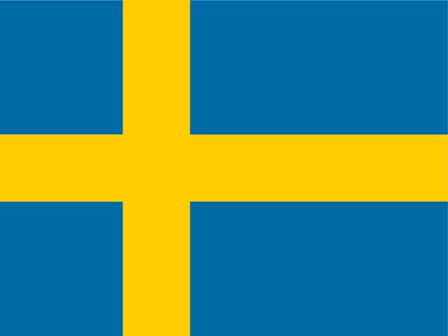

<!--
    WARNING: DO NOT EDIT!
    This file has been generated by script i18n_update.
-->

**[Återgå till sammanfattningen av dokumentationen](../README.md)**

# Papi-web - Engelsk översättning

- [Visa fil locale/sv/LC_MESSAGES/messages.po](../locale/sv/LC_MESSAGES/messages.po)

## Sammanfattning

| locale=`sv` | Svenska  |
|--|:--:|
|Töm obligatoriska meddelanden|0/62|
|Tomma meddelanden|0/1089|
|Message flagged [ai_translation]|1089/1089|

## Töm obligatoriska meddelanden (-)

## Tomma meddelanden (-)

## Flaggade meddelanden (1089)

### Meddelande flaggat [ai_translation] (1089)

|Meddelande- id|Översättning|Platser|
|--|--|--|
|This program should not be launched directly, use the scripts server.bat, ffe.bat and chessevent.bat.|Detta program bör inte startas direkt, använd scripts server.bat, ffe.bat och chessevent.bat.|src/papi_web.py:None|
|The ChessEvent connection is not defined for tournament [{tournament_uniq_id}].|ChessEvent-anslutningen är inte definierad för turnering [{tournament_uniq_id}].|src/chessevent/action_selector.py:None|
|The Papi file is not defined for tournament [{tournament_uniq_id}].|Papi-filen är inte definierad för turnering [{tournament_uniq_id}].|src/chessevent/action_selector.py:None|
|Tournament [{tournament_uniq_id}] has started.|Turneringen [{tournament_uniq_id}] har börjat.|src/chessevent/action_selector.py:None|
|Event: {event_name}|Evenemang: {event_name}|src/chessevent/action_selector.py:None src/ffe/action_selector.py:None|
|Unable to create Papi files since no tournaments are defined.|Kunde inte skapa Papi-filer eftersom inga turneringar är definierade.|src/chessevent/action_selector.py:None|
|Tournaments: {tournament_names}|Turneringar: {tournament_names}|src/chessevent/action_selector.py:None|
|C \*\*\* THE LETTER TO ANSWER CREATE|För produkter som inte är avsedda att användas som livsmedel ska följande villkor vara uppfyllda:|src/chessevent/action_selector.py:None|
|U \*\*\* THE LETTER TO ANSWER UPLOAD|U Ordförande|src/chessevent/action_selector.py:None src/ffe/action_selector.py:None|
|Q \*\*\* THE LETTER TO ANSWER QUIT|Q Uppskattningsvis.|src/chessevent/action_selector.py:None src/chessevent/event_selector.py:None src/common/engine.py:None src/ffe/action_selector.py:None src/ffe/event_selector.py:None|
|Create the Papi files|Skapa Papi- filer|src/chessevent/action_selector.py:None|
|Create the Papi files and send them to the FFE website|Skapa Papi-filerna och skicka dem till FFE:s webbplats|src/chessevent/action_selector.py:None|
|Quit|Sluta|src/chessevent/action_selector.py:None src/chessevent/event_selector.py:None src/ffe/action_selector.py:None src/ffe/event_selector.py:None|
|Your choice (by default {default}): |Ditt val (som standard {default}):|src/chessevent/action_selector.py:None|
|Action: {action}|Åtgärd: {action}|src/chessevent/action_selector.py:None src/ffe/action_selector.py:None|
|1 \*\*\* THE LETTER TO ANSWER ONCE|I detta avsnitt ska följande punkt läggas till:|src/chessevent/action_selector.py:None|
|C \*\*\* THE LETTER TO ANSWER CONTINUOUSLY|För produkter som inte är avsedda att användas som livsmedel ska följande villkor vara uppfyllda:|src/chessevent/action_selector.py:None|
|Once|En gång|src/chessevent/action_selector.py:None|
|Continuously|Kontinuerligt|src/chessevent/action_selector.py:None|
|Frequency: {frequency}|Frekvens: {frequency}|src/chessevent/action_selector.py:None|
|Please choose the Papi version:|Välj Papi-versionen:|src/chessevent/action_selector.py:None|
|Papi version: {version}|Papi version: {version}|src/chessevent/action_selector.py:None|
|This action can not be applied to the tournaments of this event.|Denna åtgärd kan inte tillämpas på turneringarna i denna händelse.|src/chessevent/action_selector.py:None src/ffe/action_selector.py:None|
|Data for tournament [{tournament_uniq_id}] could not be decoded (encoding: [{encoding}]), saved in file [{file}] (error line [{line}], column [{column}], position [{position}]).|Uppgifter för turneringen [{tournament_uniq_id}] kunde inte avkodas (kodning: [{encoding}]), sparas i fil [{file}] (terrorlinje [{line}], kolumn [{column}], position [{position}]).|src/chessevent/action_selector.py:None|
|Data for tournament [{tournament_name}] on ChessEvent are unchanged.|Data för turneringen [{tournament_name}] på ChessEvent är oförändrade.|src/chessevent/action_selector.py:None|
|Papi file [{file}] has been created (players: {num}).|Papi-fil [{file}] har skapats (spelare: {num}).|src/chessevent/action_selector.py:None|
|FFE ID and password are not correctly set for tournament [{tournament_name}], data can not be sent to the FFE website.|FFE ID och lösenord är inte korrekt inställda för turnering [{tournament_name}], data kan inte skickas till FFE webbplats.|src/chessevent/action_selector.py:None|
|Authentication error (code: [{code}]) for [{user_id}] ([{chessevent_string}]).|Behörighetskontrollfel (kod: [{code}]) för [{user_id}] ([{chessevent_string}]).|src/chessevent/chessevent_session.py:None|
|Access denied (code: [{code}]) for [{user_id}] on tournament [{tournament_name}] ([{chessevent_string}]).|Tillträde nekat (kod: [{code}]) för [{user_id}] på turneringen [{tournament_name}] ([{chessevent_string}]).|src/chessevent/chessevent_session.py:None|
|Missing parameter (code: [{code}]): [{error}].|Parameter saknas (kod: [{code}]): [{error}].|src/chessevent/chessevent_session.py:None|
|ID [{user_id}] not found (code: [{code}]): [{error}].|ID [{user_id}] hittades inte (kod: [{code}]): [{error}].|src/chessevent/chessevent_session.py:None|
|Tournament [{tournament_name}] not found (code: [{code}]): [{error}].|Turneringen [{tournament_name}] hittades inte (kod: [{code}]): [{error}].|src/chessevent/chessevent_session.py:None|
|Event [{event_id}] not found (code: [{code}]): [{error}].|Evenemang [{event_id}] hittades inte (kod: [{code}]): [{error}].|src/chessevent/chessevent_session.py:None|
|Unknown response code: [{code}] ([{chessevent_string}]).|Okänd svarskod: [{code}] ([{chessevent_string}]).|src/chessevent/chessevent_session.py:None|
|Failed to read [{url}] (connection error): [{ex}].|Läste inte [{url}] (anslutningsfel): [{ex}].|src/chessevent/chessevent_session.py:None src/common/engine.py:None src/ffe/ffe_session.py:None|
|Failed to read [{url}] (timeout): [{ex}].|Läste inte [{url}] (timeout): [{ex}].|src/chessevent/chessevent_session.py:None src/common/engine.py:None src/ffe/ffe_session.py:None|
|Failed to read [{url}] (error code [{errno}]): [{strerror}].|Läste inte [{url}] (terrorkod [{errno}]): [{strerror}].|src/chessevent/chessevent_session.py:None src/common/engine.py:None src/ffe/ffe_session.py:None|
|Failed to read [{url}]: [{ex}].|Läste inte [{url}]: [{ex}].|src/chessevent/chessevent_session.py:None src/common/engine.py:None src/ffe/ffe_session.py:None|
|No events found.|Inga händelser hittades.|src/chessevent/event_selector.py:None src/ffe/event_selector.py:None|
|One event found, press Enter (Q to quit): |En händelse hittades, tryck på Enter (Q för att avsluta):|src/chessevent/event_selector.py:None src/ffe/event_selector.py:None|
|Please choose the event:|Välj evenemanget:|src/chessevent/event_selector.py:None src/ffe/event_selector.py:None|
|Your choice: |Valet är ditt:|src/chessevent/event_selector.py:None src/common/papi_web_config.py:None src/ffe/event_selector.py:None|
|Configuration file [{file}] not found.|Inställningsfil [{file}] hittades inte.|src/common/config_reader.py:None|
|Configuration file [{file}] is not a file.|Inställningsfil [{file}] är inte en fil.|src/common/config_reader.py:None|
|Could not read file [{file}].|Kunde inte läsa filen [{file}].|src/common/config_reader.py:None|
|Duplicated section at line [{lineno}].|Duplicerad sektion vid linje [{lineno}].|src/common/config_reader.py:None|
|Duplicated option at line [{lineno}].|Duplicerade alternativ vid linjen [{lineno}].|src/common/config_reader.py:None|
|Parsing error: [{ex}].|Tolkningsfel: [{ex}].|src/common/config_reader.py:None|
|Error: [{ex}].|Fel: [{ex}].|src/common/config_reader.py:None|
|Checking Papi-web version...|Kontrollerar papi- webbversion...|src/common/engine.py:None|
|Y \*\*\* THE LETTER TO ANSWER YES|Y Ordförande|src/common/engine.py:None|
|N \*\*\* THE LETTER TO ANSWER NO|Ej tillämpligt|src/common/engine.py:None|
|Do you want to upgrade from [{old_version}] to [{new_version}] [{y_lc}/{n_uc}}]? |Vill du uppgradera från [{old_version}] till [{new_version}] [{y_lc}/{n_uc}]?|src/common/engine.py:None|
|The installation of version [{version}] failed.|Installationen av version [{version}] misslyckades.|src/common/engine.py:None|
|- Version {version} ({events})|- Version {version} ({events})|src/common/engine.py:None|
|- Version {version}: no events|- Version {version}: inga händelser|src/common/engine.py:None|
|No event found in previously installed versions.|Ingen händelse hittades i tidigare installerade versioner.|src/common/engine.py:None|
|No previously installed version found.|Ingen tidigare installerad version hittades.|src/common/engine.py:None|
|Do you want to recover the configuration of version [{version}] [{y_uc}/{n_lc}]?|Vill du återställa konfigurationen av version [{version}] [{y_uc}/{n_lc}]?|src/common/engine.py:None|
|Please choose the version to recover:|Välj den version som ska återställas:|src/common/engine.py:None|
|  - [{q_uc}] Do not recover|- [{q_uc}] Återvinn inte|src/common/engine.py:None|
|Please enter the number of the version to recover [{default}]: |Ange numret på den version som ska återställas [{default}]:|src/common/engine.py:None|
|Do you want to install example event databases [{y_uc}/{n_lc}]?|Vill du installera exempel på evenemangsdatabaser [{y_uc}/{n_lc}]?|src/common/engine.py:None|
|Recovering events from version {version}...|Återhämtning av händelser från version {version}...|src/common/engine.py:None|
|Recovering event [{event_uniq_id}]...|Återhämtningsevenemang [{event_uniq_id}]...|src/common/engine.py:None|
|Event [{event_uniq_id}]: recovering tournament [{tournament_uniq_id}]...|Evenemang [{event_uniq_id}]: återhämtningsturnering [{tournament_uniq_id}]...|src/common/engine.py:None|
|Recovering custom files...|Återställer anpassade filer...|src/common/engine.py:None|
|Events recovered: {num} (from directory [{dir}]).|Händelser som återvunnits: {num} (från katalog [{dir}]).|src/common/engine.py:None|
|Tournaments recovered: {num} (from directory [{dir}]).|Turneringar återvunna: {num} (från katalog [{dir}]).|src/common/engine.py:None|
|Custom files recovered: {num} (from directory [{dir}]).|Anpassade filer återvunna: {num} (från katalog [{dir}]).|src/common/engine.py:None|
|Do you want to send these custom files to the Papi-web developers to enhance futures versions [{y_uc}/{n_lc}]?|Vill du skicka dessa anpassade filer till Papi-web utvecklare för att förbättra terminsversioner [{y_uc}/{n_lc}]?|src/common/engine.py:None|
|Sending the files to a server...|Skickar filerna till en server...|src/common/engine.py:None|
|Files have been sent to bin {bin_name}.|Filer har skickats till bin {bin_name}.|src/common/engine.py:None|
|- View the files on filebin.net: {bin_url}|- Visa filerna på filebin.net: {bin_url}|src/common/engine.py:None|
|- Download the files (ZIP archive): {bin_zip_url}|- Ladda ner filerna (ZIP-arkivet): {bin_zip_url}|src/common/engine.py:None|
|[Papi-web {version}] Request for the integration of custom files|[Papi-web {version}] Begäran om integrering av anpassade filer|src/common/engine.py:None|
|A window will open to send an email to the Papi-web project; If the window does not open, please click on the link below or manually send an email to {email}.|Ett fönster öppnas för att skicka ett e-postmeddelande till Papi-web-projektet; Om fönstret inte öppnas, klicka på länken nedan eller skicka ett e-postmeddelande manuellt till {email}.|src/common/engine.py:None|
|Checking the version failed.|Kontroll av versionen misslyckades.|src/common/engine.py:None|
|Your Papi-web version is up to date.|Din papi-webbversion är uppdaterad.|src/common/engine.py:None|
|A more recent version is available ([{version}]).|En nyare version finns tillgänglig ([{version}]).|src/common/engine.py:None|
|You are using a version newer than the latest stable version available ([{version}]), are you a developer? ;-)|Du använder en version nyare än den senaste stabila versionen tillgänglig ([{version}]), är du en utvecklare? ;-)|src/common/engine.py:None|
|A stable and more recent version is available ([{new_version}]) but upgrading unstable versions (like the one you are currently using: [{old_version}]) must be done manually (upgrade from the last stable version installed on your server).|En stabil och nyare version är tillgänglig ([{new_version}]) men uppgradering av instabila versioner (som den du för närvarande använder: [{old_version}]) måste göras manuellt (uppgradera från den senaste stabila versionen installerad på din server).|src/common/engine.py:None|
|You are using un unstable version more recent than the last stable version available ({version}).|Du använder un un unstable version nyare än den senaste stabila versionen tillgänglig ({version}).|src/common/engine.py:None|
|Looking for a more recent version on GitHub ([{url}])...|Letar efter en nyare version av GitHub ([{url}])...|src/common/engine.py:None|
|No response from GitHub.|Inget svar från GitHub.|src/common/engine.py:None|
|Invalid response from GitHub: {ex}.|Ogiltigt svar från GitHub: {ex}.|src/common/engine.py:None|
|No stable version found.|Ingen stabil version hittades.|src/common/engine.py:None|
|Version [{version}] is already installed in directory [{dir}], please manually delete this folder before installing.|Version [{version}] är redan installerat i katalogen [{dir}], vänligen ta bort den här mappen manuellt innan du installerar.|src/common/engine.py:None|
|Downloading version {version} from GitHub ([{url}])...|Laddar ner version {version} från GitHub ([{url}])...|src/common/engine.py:None|
|Downloading failed with code [{code}].|Nedladdning misslyckades med koden [{code}].|src/common/engine.py:None|
|File downloaded: [{zip_file}].|Fil laddad ner: [{zip_file}].|src/common/engine.py:None|
|New version [{version}] has been installed in [{dir}].|Ny version [{version}] har installerats i [{dir}].|src/common/engine.py:None|
|Option not set, by default [{default}].|Alternativet är inte fastställt, som standard [{default}].|src/common/papi_web_config.py:None|
|Invalid value [{value}].|Ogiltigt värde [{value}].|src/common/papi_web_config.py:None src/web/controllers/admin/index_admin_controller.py:None|
|Locale [{locale}] not found.|Locale [{locale}] hittades inte.|src/common/papi_web_config.py:None|
|Option not set.|Alternativet är inte fastställt.|src/common/papi_web_config.py:None|
|Section not found.|Avsnittet hittades inte.|src/common/papi_web_config.py:None|
|The following languages are available:|Följande språk finns tillgängliga:|src/common/papi_web_config.py:None|
|Invalid log level [{level}], by default [{default}].|Ogiltig loggnivå [{level}], som standard [{default}].|src/common/papi_web_config.py:None|
|Invalid host configuration [{host}], by default [{default}].|Ogiltig värdkonfiguration [{host}], som standard [{default}].|src/common/papi_web_config.py:None|
|Invalid port [{port}], by default [{default}].|Ogiltig port [{port}], som standard [{default}].|src/common/papi_web_config.py:None|
|Invalid delay [{delay}], by default [{default}]|Ogiltig försening [{delay}], som standard [{default}]|src/common/papi_web_config.py:None|
|Section not found, default configuration set.|Avsnitt hittades inte, förvald inställningsuppsättning.|src/common/papi_web_config.py:None|
|Your file {ini_file} has been saved as {ini_file_org}.|Din fil {ini_file} har sparats som {ini_file_org}.|src/common/papi_web_config.py:None|
|Could not save {ini_file} to {ini_file_org}: {ex}.|Kunde inte spara {ini_file} till {ini_file_org}: {ex}.|src/common/papi_web_config.py:None|
|Adding lines to {file}...|Lägger till rader i {file}...|src/common/papi_web_config.py:None|
|[i18n] # Added by Papi-web {version}|[i18n] # Tillagd av Papi-web {version}|src/common/papi_web_config.py:None|
|# The line below has been commented by Papi-web {version}|# Linjen nedan har kommenterats av Papi-web {version}|src/common/papi_web_config.py:None|
|Your file {ini_file} has been modified.|Din akt {ini_file} har ändrats.|src/common/papi_web_config.py:None|
|Could not write to {ini_file}: {ex}.|Kunde inte skriva till {ini_file}: {ex}.|src/common/papi_web_config.py:None|
|Papi-web project|Projekt för papi-web|src/common/papi_web_config.py:None|
|Tournament [{tournament_uniq_id}]: {text}|Turnering [{tournament_uniq_id}]: {text}|src/data/event.py:None|
|ChessEvent connection [{chessevent_uniq_id}]: {text}|ChessEvent-anslutning [{chessevent_uniq_id}]: {text}|src/data/event.py:None|
|Family [{family_uniq_id}]: {text}|Familj [{family_uniq_id}]: {text}|src/data/event.py:None|
|Timer [{timer_uniq_id}], hour [{hour_order}]: {text}|Timer [{timer_uniq_id}], timme [{hour_order}]: {text}|src/data/event.py:None|
|Timer [{timer_uniq_id}]: {text}|Tidpunkt [{timer_uniq_id}]: {text}|src/data/event.py:None|
|Screen [{screen_uniq_id}], screen set [{screen_set_order}]: {text}|Skärm [{screen_uniq_id}], skärmuppsättning [{screen_set_order}]: {text}|src/data/event.py:None|
|Screen [{screen_uniq_id}]: {text}|Skärm [{screen_uniq_id}]: {text}|src/data/event.py:None|
|Rotator [{rotator_uniq_id}]: {text}|Rotator [{rotator_uniq_id}]: {text}|src/data/event.py:None|
|Errors have been found on the event; ChessEvent connections, timers, tournaments, screens, families and rotators will not be loaded.|Fel har upptäckts på eventet; ChessEvent-anslutningar, timers, turneringar, skärmar, familjer och rotatorer kommer inte att laddas.|src/data/event.py:None|
|No name set, by default [{name}]|Inget namn angivet, som standard [{name}]|src/data/event.py:None|
|No directory set for Papi files, by default [{path}].|Ingen kataloguppsättning för Papi-filer, som standard [{path}].|src/data/event.py:None|
|Directory [{path}] not found.|Katalog [{path}] hittades inte.|src/data/event.py:None src/data/tournament.py:None|
|[{path}] is not a directory.|[{path}] är inte en katalog.|src/data/event.py:None src/data/tournament.py:None|
|No background image set, by default [{background_image}]|Ingen bakgrundsbild inställd, som standard [{background_image}]|src/data/event.py:None|
|No background colour set, by default [{background_color}]|Ingen bakgrundsfärg, som standard [{background_color}]|src/data/event.py:None|
|No password set for the results entry|Inget lösenord inställt för resultatposten|src/data/event.py:None|
|Maximum number of illegal moves not set, by default [{record_illegal_moves}]|Maximalt antal olagliga förflyttningar inte satta, som standard [{record_illegal_moves}]|src/data/event.py:None|
|Errors have been found on ChessEvent connections; timers, tournaments, screens, families and rotators will not be loaded.|Fel har upptäckts på ChessEvent-anslutningar; timers, turneringar, skärmar, familjer och rotatorer kommer inte att laddas.|src/data/event.py:None|
|Errors have been found on timers; tournaments, screens, families and rotators will not be loaded.|Fel har hittats på timers; turneringar, skärmar, familjer och rotatorer kommer inte att laddas.|src/data/event.py:None|
|Errors have been found on tournaments; screens, families and rotators will not be loaded.|Fel har hittats på turneringar; skärmar, familjer och rotatorer kommer inte att laddas.|src/data/event.py:None|
|Errors have been found on screens; families and rotators will not be loaded.|Fel har hittats på skärmar; familjer och rotatorer kommer inte att laddas.|src/data/event.py:None|
|Errors have been found on families; rotators will not be loaded.|Fel har hittats på familjer; rotatorer kommer inte att laddas.|src/data/event.py:None|
|Errors have been found on rotators.|Fel har upptäckts på rotatorer.|src/data/event.py:None|
|%t (%f to %l)|%t (%f till %l)|src/data/family.py:None|
|Tournament [{tournament_uniq_id}] can not be read, family ignored.|Turneringen [{tournament_uniq_id}] kan inte läsas, familjen ignoreras.|src/data/family.py:None|
|Tournament [{tournament_uniq_id}] has only [{boards_number}] boards (< [{first}]), family ignored.|Turneringen [{tournament_uniq_id}] har endast [{boards_number}] styrelser (< [{first}]), familjen ignorerade.|src/data/family.py:None|
|Tournament [{tournament_uniq_id}] has only [{players_number}] players (< [{first}]), family ignored.|Turneringen [{tournament_uniq_id}] har endast [{players_number}] spelare (< [{first}]), familjen ignorerade.|src/data/family.py:None|
|Nothing to display for tournament [{tournament_uniq_id}], family ignored.|Inget att visa för turnering [{tournament_uniq_id}], familjen ignoreras.|src/data/family.py:None|
|all the boards|alla brädor|src/data/family.py:None src/data/screen_set.py:None|
|boards from #{first} to end|brädor från #{first} till slutet|src/data/family.py:None src/data/screen_set.py:None|
|boards from start to #{last}|brädor från start till #{last}|src/data/family.py:None src/data/screen_set.py:None|
|boards from #{first} to #{last}|styrelser från #{first} till #{last}|src/data/family.py:None src/data/screen_set.py:None|
|screens of {number} boards|skärmar av {number} tavlor|src/data/family.py:None|
|screens of {number} boards from #{first} to end|screens av {number} styrelser från #{first} till slutet|src/data/family.py:None|
|screens of {number} boards from start to #{last}|screens of {number} tavlor från start till #{last}|src/data/family.py:None|
|screens of {number} boards from #{first} to #{last}|skärmar av {number} styrelser från #{first} till #{last}|src/data/family.py:None|
|boards on {parts} screens|brädor på {parts} skärmar|src/data/family.py:None|
|boards from #{first} to end, on {parts} screens|brädor från #{first} till slutet, på {parts} skärmar|src/data/family.py:None|
|boards from start to #{last}, on {parts} screens|brädor från start till #{last}, på {parts} skärmar|src/data/family.py:None|
|boards from #{first} to #{last}, on {parts} screens|brädor från #{first} till #{last}, på {parts} skärmar|src/data/family.py:None|
|all the players|alla spelare|src/data/family.py:None src/data/screen_set.py:None|
|players from #{first} to end|spelare från #{first} till slutet|src/data/family.py:None src/data/screen_set.py:None|
|players from start to #{last}|spelare från start till #{last}|src/data/family.py:None src/data/screen_set.py:None|
|players from #{first} to #{last}|spelare från #{first} till #{last}|src/data/family.py:None src/data/screen_set.py:None|
|screens of {number} players|screens of {number} spelare|src/data/family.py:None|
|screens of {number} players from #{first} to end|screens of {number} spelare från #{first} till slutet|src/data/family.py:None|
|screens of {number} players from start to #{last}|screens of {number} spelare från start till #{last}|src/data/family.py:None|
|screens of {number} players from #{first} to #{last}|screens of {number} spelare från #{first} till #{last}|src/data/family.py:None|
|players on {parts} screens|spelare på {parts} skärmar|src/data/family.py:None|
|players from #{first} to end, on {parts} screens|spelare från #{first} till slutet, på {parts} skärmar|src/data/family.py:None|
|players from start to #{last}, on {parts} screens|spelare från start till #{last}, på {parts} skärmar|src/data/family.py:None|
|players from #{first} to #{last}, on {parts} screens|spelare från #{first} till #{last}, på {parts} skärmar|src/data/family.py:None|
|Unpaired \*\*\* FEMALE|Ouppklarade|src/data/player.py:None|
|Unpaired \*\*\* MALE|Ouppklarade|src/data/player.py:None|
|Exempt \*\*\* FEMALE|Undantag|src/data/player.py:None|
|Exempt \*\*\* MALE|Undantag|src/data/player.py:None|
|Last results|Senaste resultat|src/data/screen.py:None src/data/util.py:None src/web/controllers/admin/index_admin_controller.py:None src/web/controllers/admin/screen_admin_controller.py:None src/web/templates/admin_screens.html:None|
|Image|Bild|src/data/screen.py:None src/data/util.py:None src/web/controllers/admin/index_admin_controller.py:None src/web/controllers/admin/screen_admin_controller.py:None src/web/templates/admin_screens.html:None|
|Boards %f-%l|Styrelser %f-%l|src/data/screen.py:None src/data/screen_set.py:None|
|By board|Brädor|src/data/screen.py:None|
|%t [Boards %f-%l]|%t [Styrelsen %f-%l]|src/data/screen.py:None|
|%t (by board)|%t (board)|src/data/screen.py:None|
|By player|Av spelare|src/data/screen.py:None|
|%t (by player)|%t (per spelare)|src/data/screen.py:None|
|No screen of type [{screen_type}] for the menu of screen [{screen_uniq_id}].|Ingen skärm av typen [{screen_type}] för menyn på skärmen [{screen_uniq_id}].|src/data/screen.py:None|
|Pattern [{pattern}] can be used by screen families.|Mönster [{pattern}] kan användas av skärmfamiljer.|src/data/screen.py:None|
|Pattern [{pattern}] matches no screen.|Mönster [{pattern}] matchar ingen skärm.|src/data/screen.py:None|
|Screen [{pattern}] not found for the menu of screen [{screen_uniq_id}].|Skärm [{pattern}] hittades inte för menyn på skärmen [{screen_uniq_id}].|src/data/screen.py:None|
|Maximum number of results set to [{results_limit}] to fit on [{columns}] columns.|Maximalt antal resultat satt till [{results_limit}] för att passa på [{columns}] kolumner.|src/data/screen.py:None|
|Invalid board number [{fixed_board_str}].|Ogiltigt styrelsenummer [{fixed_board_str}].|src/data/screen_set.py:None src/web/controllers/admin/screen_admin_controller.py:None|
|Numbers {first} and {last} are not compatible ({first} > {last}).|Siffrorna {first} och {last} är inte förenliga ({first} > {last}).|src/data/screen_set.py:None src/web/controllers/admin/family_admin_controller.py:None src/web/controllers/admin/screen_admin_controller.py:None|
|%f to %l|%f till %l|src/data/screen_set.py:None|
|boards {board_numbers}|styrelser {board_numbers}|src/data/screen_set.py:None|
|Tournament {tournament_uniq_id} ({numbers_str})|Turnering {tournament_uniq_id} ({numbers_str})|src/data/screen_set.py:None|
|Time is not defined.|Tiden är inte definierad.|src/data/timer.py:None|
|Invalid time [{time_str}].|Ogiltig tid [{time_str}].|src/data/timer.py:None|
|The date of the first hour is not defined (mandatory).|Datumet för den första timmen är inte fastställt (obligatoriskt).|src/data/timer.py:None|
|Invalid date [{date_str}].|Ogiltigt datum [{date_str}].|src/data/timer.py:None|
|Invalid hour [{hour}] (before previous hour [{previous_hour}]).|Ogiltig timme [{hour}] (före föregående timme [{previous_hour}]).|src/data/timer.py:None src/web/controllers/admin/timer_admin_controller.py:None|
|Invalid date and time [{datetime_str}].|Ogiltigt datum och tid [{datetime_str}].|src/data/timer.py:None|
|No valid hour defined.|Ingen giltig timme definierad.|src/data/timer.py:None|
|No directory set for the Papi file, by default [{path}].|Ingen katalog inställd för Papi-filen, som standard [{path}].|src/data/tournament.py:None|
|The name of the Papi file is not set, by default [{filename}]|Namnet på Papi- filen är inte inställt, som standard [{filename}]|src/data/tournament.py:None|
|Qualification number and FFE password not set, operations on the FFE website will not be available.|Kvalifikationsnummer och FFE-lösenord är inte satta, verksamheten på FFE:s webbplats kommer inte att vara tillgänglig.|src/data/tournament.py:None|
|ChessEvent connection not defined.|ChessEvent-anslutningen är inte definierad.|src/data/tournament.py:None|
|ChessEvent tournament name not set.|ChessEvent turneringsnamn inte bestämt.|src/data/tournament.py:None|
|Standard rating|Standardbetyg|src/data/util.py:None|
|Rapid rating|Snabba betyg|src/data/util.py:None|
|Blitz rating|Blitz-betyg|src/data/util.py:None|
|- \*\*\* NAME FOR GENDER NONE|- Vad är det?|src/data/util.py:None|
|Female \*\*\* NAME FOR GENDER FEMALE|Kvinna|src/data/util.py:None src/fide/fide_player.py:None|
|Male \*\*\* NAME FOR GENDER MALE|Män|src/data/util.py:None src/fide/fide_player.py:None|
|- \*\*\* SHORT NAME FOR GENDER NONE|- Vad är det?|src/data/util.py:None src/web/templates/admin_players/admin_players_filter_genders.html:None|
|F \*\*\* SHORT NAME FOR GENDER FEMALE|I bilaga I till förordning (EU) nr 1307/2013 ska punkt 1 ersättas med följande:|src/data/util.py:None src/fide/fide_player.py:None src/web/templates/admin_players/admin_players_filter_genders.html:None|
|M \*\*\* SHORT NAME FOR GENDER MALE|Ordförande|src/data/util.py:None src/fide/fide_player.py:None src/web/templates/admin_players/admin_players_filter_genders.html:None|
|No FFE Licence|Ingen FFE-licens|src/data/util.py:None|
|Expired FFE licence|Körkort för FFE som upphör att gälla|src/data/util.py:None|
|FFE licence B (leisure)|FFE-tillstånd B (leisure)|src/data/util.py:None|
|FFE licence A (competition)|FFE-licens A (tävling)|src/data/util.py:None|
|U8|U8 Ordförande|src/data/util.py:None|
|U10|U10 Tillverkning vid vilken värdet av allt använt material inte överstiger 50 % av produktens pris fritt fabrik|src/data/util.py:None|
|U12|U12 Ordförande|src/data/util.py:None|
|U14|U14 Ordförande|src/data/util.py:None|
|U16|U16 Ordförande|src/data/util.py:None|
|U18|U18 Ordförande|src/data/util.py:None|
|U20|U20 Ordförande|src/data/util.py:None|
|20+|20 + 2 + 2 + 2 + 2 + 2 + 2 + 2 + 2 + 2 + 2 + 2 + 2 + 2 + 2 + 2 + 2 + 2 + 2 + 2 + 2 + 2 + 2 + 2 + 2 + 2 + 2 + 2 + 2 + 2 + 2 + 2 + 2 + 2 + 2 + 2 + 2 + 2 + 2 + 2 + 2 + 2 + 2 + 2 + 2 + 2 + 2 + 2 + 2 + 2 + 2 + 2 + 2 + 2 + 2 + 2 + 2 + 2 + 2 + 2 + 2 + 2 + 2 + 2 + 2 + 2 + 2 + 2 + 2 + 2 + 2 + 2 + 2 + 2 + 2 + 2 + 2 + 2 + 2 + 2 + 2 + 2 + 2 + 2 + 2 + 2 + 2 + 2 + 2 + 2 + 2 + 2 + 2 + 2 + 2|src/data/util.py:None|
|50+|50+|src/data/util.py:None|
|65+|Försäkringstekniska avsättningar beräknade som helhet – bruttosoliditetsgradens exponeringsvärde – exponeringar enligt schablonmetoden|src/data/util.py:None|
|No category|Ingen kategori|src/data/util.py:None|
|Under 8|Under 8 år|src/data/util.py:None|
|Under 10|Under 10 år|src/data/util.py:None|
|Under 12|Under 12 år|src/data/util.py:None|
|Under 14|Under 14 år|src/data/util.py:None|
|Under 16|Under 16 år|src/data/util.py:None|
|Under 18|Under 18 år|src/data/util.py:None|
|Under 20|Under 20 år|src/data/util.py:None|
|Over 20|Över 20|src/data/util.py:None|
|Over 50|Över 50|src/data/util.py:None|
|Over 65|Över 65|src/data/util.py:None|
|Estimated \*\*\* NAME FOR RATING TYPE ESTIMATED|Beräknad|src/data/util.py:None|
|National \*\*\* NAME FOR RATING TYPE NATIONAL|Nationellt|src/data/util.py:None|
|FIDE \*\*\* NAME FOR RATING TYPE FIDE|FIDUCERA|src/data/util.py:None|
|E \*\*\* SHORT NAME FOR RATING TYPE ESTIMATED|Ursprunglig hänvisning till den nationella lagstiftningen:|src/data/util.py:None|
|N \*\*\* SHORT NAME FOR RATING TYPE NATIONAL|Ej tillämpligt|src/data/util.py:None|
|F \*\*\* SHORT NAME FOR RATING TYPE FIDE|I bilaga I till förordning (EU) nr 1307/2013 ska punkt 1 ersättas med följande:|src/data/util.py:None|
|No title|Ingen titel|src/data/util.py:None|
|Woman Fide Master|Kvinnlig mästare|src/data/util.py:None|
|Fide Master|Fide Master Ordförande|src/data/util.py:None|
|Woman International Master|Kvinna internationell mästare|src/data/util.py:None|
|International Master|Internationell mästare|src/data/util.py:None|
|Woman Grand Master|Kvinna stormästare|src/data/util.py:None|
|Grand Master|Stormästare|src/data/util.py:None|
|WFM \*\*\* SHORT NAME FOR Woman Fide Master|WFM|src/data/util.py:None|
|FM \*\*\* SHORT NAME FOR Fide Master|FM Ordförande|src/data/util.py:None|
|WIM \*\*\* SHORT NAME FOR Woman International Master|WIM Ordförande|src/data/util.py:None|
|IM \*\*\* SHORT NAME FOR International Master|IM|src/data/util.py:None|
|WGM \*\*\* SHORT NAME FOR Woman Grand Master|WGM|src/data/util.py:None|
|GM \*\*\* SHORT NAME FOR Grand Master|Genetiskt modifierade organismer|src/data/util.py:None|
|White|Vitt|src/data/util.py:None src/web/templates/user_boards_screen_set.html:None src/web/templates/user_results_screen.html:None|
|Black|Svart|src/data/util.py:None src/web/templates/user_boards_screen_set.html:None src/web/templates/user_results_screen.html:None|
|Pairings by board|Parningar ombord|src/data/util.py:None src/web/controllers/admin/index_admin_controller.py:None src/web/controllers/admin/tournament_admin_controller.py:None src/web/templates/admin_families.html:None src/web/templates/admin_screens.html:None|
|Results entry|Resultatinmatning|src/data/util.py:None src/web/controllers/admin/family_admin_controller.py:None src/web/controllers/admin/index_admin_controller.py:None src/web/controllers/admin/screen_admin_controller.py:None src/web/controllers/admin/tournament_admin_controller.py:None src/web/templates/admin_event_modal.html:None src/web/templates/admin_families.html:None src/web/templates/admin_screens.html:None|
|Parings by player|Parningar per spelare|src/data/util.py:None|
|FFE ID not defined for tournament [{tournament_uniq_id}].|FFE ID definieras inte för turnering [{tournament_uniq_id}].|src/ffe/action_selector.py:None|
|Papi file not defined for tournament [{tournament_uniq_id}].|Papi fil inte definierad för turnering [{tournament_uniq_id}].|src/ffe/action_selector.py:None|
|Papi file not found [{file}] for tournament [{tournament_uniq_id}].|Papi-filen hittades inte [{file}] för turnering [{tournament_uniq_id}].|src/ffe/action_selector.py:None|
|Rules file not defined for tournament [{tournament_uniq_id}].|Regler fil inte definierad för turnering [{tournament_uniq_id}].|src/ffe/action_selector.py:None|
|Rules file defined by a URL for tournament [{tournament_uniq_id}].|Regler fil definieras av en URL för turnering [{tournament_uniq_id}].|src/ffe/action_selector.py:None|
|Rules file [{file}] not found for tournament [{tournament_uniq_id}].|Regler fil [{file}] hittades inte för turnering [{tournament_uniq_id}].|src/ffe/action_selector.py:None|
|No FFE operations can be done on the tournaments of this event.|Inga FFE operationer kan göras på turneringarna i denna händelse.|src/ffe/action_selector.py:None|
|Tournaments: {tournament_ffe_ids}|Turneringar: {tournament_ffe_ids}|src/ffe/action_selector.py:None|
|T \*\*\* THE LETTER TO ANSWER TEST|Ursprunglig hänvisning till den nationella lagstiftningen:|src/ffe/action_selector.py:None|
|V \*\*\* THE LETTER TO ANSWER VISIBLE|V|src/ffe/action_selector.py:None|
|F \*\*\* THE LETTER TO ANSWER FEES|I bilaga I till förordning (EU) nr 1307/2013 ska punkt 1 ersättas med följande:|src/ffe/action_selector.py:None|
|R \*\*\* THE LETTER TO ANSWER RULES|Obligatoriskt ("R")|src/ffe/action_selector.py:None|
|Test the tournament passwords on the FFE website|Testa turneringens lösenord på FFE:s webbplats|src/ffe/action_selector.py:None|
|Make the tournaments visible on the FFE website|Gör turneringarna synliga på FFE:s webbplats|src/ffe/action_selector.py:None|
|Download fees invoices|Fakturor för nedladdningsavgifter|src/ffe/action_selector.py:None|
|Upload the rules of the tournaments|Ladda upp reglerna för turneringarna|src/ffe/action_selector.py:None|
|Upload the results of the tournaments|Ladda upp resultatet av turneringarna|src/ffe/action_selector.py:None|
|Actions:|Åtgärder:|src/ffe/action_selector.py:None|
|No need to upload the rules to the FFE website (up to date).|Du behöver inte ladda upp reglerna till FFE:s webbplats (senaste datum).|src/ffe/action_selector.py:None|
|No need to upload the results to the FFE website (up to date).|Du behöver inte ladda upp resultaten till FFE:s webbplats (senaste datum).|src/ffe/action_selector.py:None|
|**Singular:** {recent_updates} tournament has been updated less than {ffe_upload_delay} seconds ago, waiting. **- Vad är det för fel på dig?** {recent_updates} tournaments have been updated less than {ffe_upload_delay} seconds ago, waiting.|**Singular:** {recent_updates} turneringen har uppdaterats mindre än {ffe_upload_delay} sekunder sedan, väntar. **- Vad är det för fel på dig?** {recent_updates} turneringar har uppdaterats mindre än {ffe_upload_delay} sekunder sedan, väntar.|src/ffe/action_selector.py:None|
|End of upload (Ctrl-C)|Slut på uppladdning (Ctrl-C)|src/ffe/action_selector.py:None|
|Content of URL [{url}] is not valid (input[id=[{id]] not found).|Innehållet i webbadressen [{url}] är inte giltigt (input[id=[{id]] hittades inte).|src/ffe/ffe_session.py:None|
|Initializing a session to [{url}]...|Initiera en session till [{url}]...|src/ffe/ffe_session.py:None|
|OK|Okej.|src/ffe/ffe_session.py:None src/web/templates/admin_players/admin_players_filter_categories.html:None src/web/templates/admin_players/admin_players_filter_check_ins.html:None src/web/templates/admin_players/admin_players_filter_clubs.html:None src/web/templates/admin_players/admin_players_filter_columns.html:None src/web/templates/admin_players/admin_players_filter_federations.html:None src/web/templates/admin_players/admin_players_filter_ffe_licences.html:None src/web/templates/admin_players/admin_players_filter_genders.html:None src/web/templates/admin_players/admin_players_filter_leagues.html:None src/web/templates/admin_players/admin_players_filter_tournaments.html:None|
|Authenticating...|Behörighetskontroll...|src/ffe/ffe_session.py:None|
|Authentication failed.|Behörighetskontroll misslyckades.|src/ffe/ffe_session.py:None|
|Tournament [{ffe_id}]:|Turnering [{ffe_id}]:|src/ffe/ffe_session.py:None|
|Getting fees for tournament [{ffe_id}]...|Få avgifter för turnering [{ffe_id}]...|src/ffe/ffe_session.py:None|
|Fees link not found, check that a Papi file has already been sent and that the tournament has not been archived on the FFE website.|Avgiftslänk hittades inte, kontrollera att en Papi-fil redan har skickats och att turneringen inte har arkiverats på FFE:s webbplats.|src/ffe/ffe_session.py:None|
|Tournament exempt from registration fees.|Turnering befrias från registreringsavgifter.|src/ffe/ffe_session.py:None|
|Invalid fees link text [{text}].|Ogiltiga avgifter länkar text [{text}].|src/ffe/ffe_session.py:None|
|Invoice saved to [{file}].|Fakturering sparad till [{file}].|src/ffe/ffe_session.py:None|
|Sending tournament [{ffe_id}] ({file}) to the FFE website...|Skickar turnering [{ffe_id}] ({file}) till FFE:s webbplats...|src/ffe/ffe_session.py:None|
|Upload link not found, check that the tournament is not marked as finished on the FFE website.|Ladda upp länk hittades inte, kontrollera att turneringen inte är markerad som klar på FFE webbplats.|src/ffe/ffe_session.py:None|
|Results upload OK|Resultat ladda upp OK|src/ffe/ffe_session.py:None|
|Making the tournament visible on the FFE website...|Gör turneringen synlig på FFE:s webbplats...|src/ffe/ffe_session.py:None|
|Display link not found, check that a Papi file has already been sent.|Visa länk hittades inte, kontrollera att en Papi-fil redan har skickats.|src/ffe/ffe_session.py:None|
|Data is already displayed on the FFE website.|Data visas redan på FFE:s webbplats.|src/ffe/ffe_session.py:None|
|Invalid display link text [{text}]|Ogiltig länktext för visning [{text}]|src/ffe/ffe_session.py:None|
|Sending the rules of tournament [{ffe_id}] ({file}) to the FFE website...|Skicka reglerna för turneringen [{ffe_id}] ({file}) till FFE:s webbplats...|src/ffe/ffe_session.py:None|
|Rules upload link not found, check that the tournament is not marked as finished on the FFE website.|Regler uppladdning länk hittades inte, kontrollera att turneringen inte är markerad som klar på FFE webbplats.|src/ffe/ffe_session.py:None|
|Opening the welcome page [{url}] in a browser...|Öppnar välkomstsidan [{url}] i en webbläsare...|src/web/server_engine.py:None|
|Web server not started yet ({ex}), waiting...|Webbserver ännu inte startat ({ex}), väntar...|src/web/server_engine.py:None|
|Starting Papi-web server, please wait...|Börjar papi-webbserver, vänta...|src/web/server_engine.py:None|
|Logging level: {log_level}|Loggningsnivå: {log_level}|src/web/server_engine.py:None|
|Port: {port}|Hamn: {port}|src/web/server_engine.py:None|
|Local URL: {local_url}|Lokal webbadress: {local_url}|src/web/server_engine.py:None|
|LAN/WAN URL: {lan_url}|LAN/WAN URL: {lan_url}|src/web/server_engine.py:None|
|Port [{port}] already in use, can not start Papi-web server.|Port [{port}] redan i bruk, kan inte starta Papi-webbserver.|src/web/server_engine.py:None|
|USE AT YOUR OWN RISKS|ANVÄNDNING VID DINA EGNA RISKER|src/web/controllers/index_controller.py:None|
|Please enter the ID of ChessEvent connection.|Ange identifikationen för ChessEvent-anslutningen.|src/web/controllers/admin/chessevent_admin_controller.py:None|
|ChessEvent connection [{uniq_id}] already exists.|ChessEvent-anslutning [{uniq_id}] finns redan.|src/web/controllers/admin/chessevent_admin_controller.py:None|
|Please enter the ID used to connect to the ChessEvent platform.|Ange ID som används för att ansluta till ChessEvent-plattformen.|src/web/controllers/admin/chessevent_admin_controller.py:None|
|Please enter the password used to connect to the ChessEvent platform.|Ange lösenordet som används för att ansluta till ChessEvent-plattformen.|src/web/controllers/admin/chessevent_admin_controller.py:None|
|Please enter the ID of the event on the ChessEvent platform.|Ange ID för händelsen på ChessEvent-plattformen.|src/web/controllers/admin/chessevent_admin_controller.py:None|
|ChessEvent connection [{chessevent_uniq_id}] has been created.|ChessEvent-anslutning [{chessevent_uniq_id}] har skapats.|src/web/controllers/admin/chessevent_admin_controller.py:None|
|ChessEvent connection [{chessevent_uniq_id}] has been updated.|ChessEvent-anslutningen [{chessevent_uniq_id}] har uppdaterats.|src/web/controllers/admin/chessevent_admin_controller.py:None|
|ChessEvent connection [{chessevent_uniq_id}] has been deleted.|ChessEvent anslutning [{chessevent_uniq_id}] har tagits bort.|src/web/controllers/admin/chessevent_admin_controller.py:None|
|Tournaments ({num})|Turneringar ({num})|src/web/controllers/admin/event_admin_controller.py:None|
|Players ({num})|Spelare ({num})|src/web/controllers/admin/event_admin_controller.py:None|
|Screens ({num})|Skärmar ({num})|src/web/controllers/admin/event_admin_controller.py:None|
|Families ({num})|Familjer ({num})|src/web/controllers/admin/event_admin_controller.py:None|
|Rotators ({num})|Rotatorer ({num})|src/web/controllers/admin/event_admin_controller.py:None src/web/controllers/user/event_user_controller.py:None|
|Timers ({num})|Timers ({num})|src/web/controllers/admin/event_admin_controller.py:None|
|ChessEvent ({num})|ChessEvent ({num})|src/web/controllers/admin/event_admin_controller.py:None|
|Messages ({num})|Meddelanden ({num})|src/web/controllers/admin/event_admin_controller.py:None|
|Renaming the database failed: {ex}.|Byte av databas misslyckades: {ex}.|src/web/controllers/admin/event_admin_controller.py:None|
|Event [{old_uniq_id}] has been renamed ([{new_uniq_id}]) and updated.|Händelse [{old_uniq_id}] har bytt namn ([{new_uniq_id}]) och uppdaterats.|src/web/controllers/admin/event_admin_controller.py:None|
|Event [{uniq_id}] has been updated.|Händelse [{uniq_id}] har uppdaterats.|src/web/controllers/admin/event_admin_controller.py:None|
|Event [{uniq_id}] has been created.|Händelse [{uniq_id}] har skapats.|src/web/controllers/admin/event_admin_controller.py:None src/web/controllers/admin/index_admin_controller.py:None|
|Event [{uniq_id}] has been deleted, the database has been archived ({arch}).|Evenemanget [{uniq_id}] har raderats, databasen har arkiverats ({arch}).|src/web/controllers/admin/event_admin_controller.py:None|
|Please enter the family ID.|Ange familje-ID.|src/web/controllers/admin/family_admin_controller.py:None|
|Character [{char}] is not allowed.|Tecken [{char}] är inte tillåtet.|src/web/controllers/admin/family_admin_controller.py:None src/web/controllers/admin/index_admin_controller.py:None src/web/controllers/admin/screen_admin_controller.py:None src/web/controllers/admin/tournament_admin_controller.py:None|
|Family [{uniq_id}] already exists.|Familjen [{uniq_id}] finns redan.|src/web/controllers/admin/family_admin_controller.py:None|
|Please choose the tournament.|Välj turneringen.|src/web/controllers/admin/family_admin_controller.py:None src/web/controllers/admin/player_admin_controller.py:None src/web/controllers/admin/screen_admin_controller.py:None|
|Tournament [{tournament_id}] not found.|Turneringen [{tournament_id}] hittades inte.|src/web/controllers/admin/family_admin_controller.py:None src/web/controllers/admin/screen_admin_controller.py:None|
|A positive integer is expected.|Ett positivt heltal förväntas.|src/web/controllers/admin/family_admin_controller.py:None src/web/controllers/admin/rotator_admin_controller.py:None src/web/controllers/admin/screen_admin_controller.py:None|
|Timer [{timer_id}] not found.|Timer [{timer_id}] hittades inte.|src/web/controllers/admin/family_admin_controller.py:None src/web/controllers/admin/screen_admin_controller.py:None|
|Specifying the number of parts and the number of items per part is not possible.|Det är inte möjligt att ange antalet delar och antalet objekt per del.|src/web/controllers/admin/family_admin_controller.py:None|
|pairings by board|Parningar per plan|src/web/controllers/admin/family_admin_controller.py:None src/web/controllers/admin/screen_admin_controller.py:None src/web/templates/admin_rotator_modal.html:None|
|Pairings by player|Parningar av spelare|src/web/controllers/admin/family_admin_controller.py:None src/web/controllers/admin/index_admin_controller.py:None src/web/controllers/admin/screen_admin_controller.py:None src/web/controllers/admin/tournament_admin_controller.py:None src/web/templates/admin_families.html:None src/web/templates/admin_screens.html:None|
|No recording|Ingen inspelning|src/web/controllers/admin/index_admin_controller.py:None src/web/templates/admin_event_config.html:None|
|**Singular:** {num} illegal move max **- Vad är det för fel på dig?** {num} illegal moves max|**Singular:** {num} olagligt drag max **- Vad är det för fel på dig?** {num} olagliga förflyttningar max|src/web/controllers/admin/index_admin_controller.py:None|
|By default - {option}|Som standard - {option}|src/web/controllers/admin/index_admin_controller.py:None|
|Colour #1 is used until {delay_1} minutes before the start of the rounds (delay #1), the color then changes gradually until colour #2 ({delay_2} minutes before the start of the rounds).|Färg #1 används tills {delay_1} minuter innan rundorna börjar (fördröjning #1), färgen ändras sedan gradvis till färg #2 ({delay_2} minuter innan rundorna börjar).|src/web/controllers/admin/index_admin_controller.py:None|
|Colour #2 is used {delay_2} minutes before the start of the rounds (delay #2), the color then changes gradually until colour #3 (at the start of the rounds).|Färg #2 används {delay_2} minuter innan rundorna börjar (fördröj #2), färgen ändras sedan gradvis till färg #3 (i början av rundorna).|src/web/controllers/admin/index_admin_controller.py:None|
|Colour #3 is used from the start of the rounds and for {delay_3} minutes after (delay #3).|Färg #3 används från början av rundorna och för {delay_3} minuter efter (fördröj #3).|src/web/controllers/admin/index_admin_controller.py:None|
|Use no timer|Använd ingen timer|src/web/controllers/admin/index_admin_controller.py:None|
|No timer defined|Ingen timer definierad|src/web/controllers/admin/index_admin_controller.py:None|
|Timer {timer_uniq_id}|Tidpunkt {timer_uniq_id}|src/web/controllers/admin/index_admin_controller.py:None|
|Display the exit button|Visa utgångsknappen@ info: whatsthis|src/web/controllers/admin/index_admin_controller.py:None|
|Hide the exit button|Dölj utgångsknappen|src/web/controllers/admin/index_admin_controller.py:None|
|Display only paired players|Visa endast parade spelare|src/web/controllers/admin/index_admin_controller.py:None|
|Display all the players, paired and unpaired|Visa alla spelare, parade och oparade|src/web/controllers/admin/index_admin_controller.py:None|
|URL [{url}] responded code [{code}].|URL [{url}] svarade kod [{code}].|src/web/controllers/admin/index_admin_controller.py:None src/web/controllers/admin/screen_admin_controller.py:None|
|URL [{url}] did not respond (error: [{error}]).|URL [{url}] svarade inte (terror: [{error}]).|src/web/controllers/admin/index_admin_controller.py:None src/web/controllers/admin/screen_admin_controller.py:None|
|Incorrect path [{path}].|Felaktig stig [{path}].|src/web/controllers/admin/index_admin_controller.py:None|
|File [{file}] not found.|Filen [{file}] hittades inte.|src/web/controllers/admin/index_admin_controller.py:None|
|Wrong file extension [{ext}] ([pdf] expected).|Fel filändelse [{ext}] ([pdf] förväntas).|src/web/controllers/admin/index_admin_controller.py:None|
|Invalid color [{color}] ([#RRGGBB] expected).|Ogiltig färg [{color}] ([# RRGGBB] förväntas).|src/web/controllers/admin/index_admin_controller.py:None src/web/controllers/admin/timer_admin_controller.py:None|
|Please enter the event ID.|Ange händelse-ID.|src/web/controllers/admin/index_admin_controller.py:None|
|event ID does not match.|Händelse-ID matchar inte.|src/web/controllers/admin/index_admin_controller.py:None|
|Event [{uniq_id}] already exists.|Händelse [{uniq_id}] finns redan.|src/web/controllers/admin/index_admin_controller.py:None|
|Please enter the name of the event.|Ange händelsens namn.|src/web/controllers/admin/index_admin_controller.py:None|
|Please enter the start date of the event.|Ange evenemangets startdatum.|src/web/controllers/admin/index_admin_controller.py:None|
|Please enter the end date of the event.|Ange evenemangets slutdatum.|src/web/controllers/admin/index_admin_controller.py:None|
|Please enter a date after the start date.|Ange ett datum efter startdatum.|src/web/controllers/admin/index_admin_controller.py:None|
|Please enter a URL or select an image on the right hand side.|Ange en webbadress eller välj en bild på höger sida.|src/web/controllers/admin/index_admin_controller.py:None|
|Invalid delay [{delay}] (positive integer expected).|Ogiltig fördröjning [{delay}] (positivt heltal förväntas).|src/web/controllers/admin/index_admin_controller.py:None src/web/controllers/admin/timer_admin_controller.py:None|
|New event|Nytt evenemang|src/web/controllers/admin/index_admin_controller.py:None|
|event|händelse|src/web/controllers/admin/index_admin_controller.py:None|
|Current events ({num})|Aktuella händelser ({num})|src/web/controllers/admin/index_admin_controller.py:None src/web/controllers/user/index_user_controller.py:None|
|No current events.|Inga aktuella händelser.|src/web/controllers/admin/index_admin_controller.py:None src/web/controllers/user/index_user_controller.py:None|
|Upcoming events ({num})|Kommande evenemang ({num})|src/web/controllers/admin/index_admin_controller.py:None src/web/controllers/user/index_user_controller.py:None|
|No upcoming events.|Inga kommande händelser.|src/web/controllers/admin/index_admin_controller.py:None src/web/controllers/user/index_user_controller.py:None|
|Passed events ({num})|Godkända evenemang ({num})|src/web/controllers/admin/index_admin_controller.py:None src/web/controllers/user/index_user_controller.py:None|
|No passed events.|Inga förbipasserade händelser.|src/web/controllers/admin/index_admin_controller.py:None src/web/controllers/user/index_user_controller.py:None|
|Archived events ({num})|Arkiverade evenemang ({num})|src/web/controllers/admin/index_admin_controller.py:None|
|No archived events.|Inga arkiverade händelser.|src/web/controllers/admin/index_admin_controller.py:None|
|Papi-web configuration|Inställning av papi-webben|src/web/controllers/admin/index_admin_controller.py:None src/web/templates/admin_config.html:None|
|Please enter the last name.|Ange efternamnet.|src/web/controllers/admin/player_admin_controller.py:None|
|Please enter the date of birth.|Ange födelsedatum.|src/web/controllers/admin/player_admin_controller.py:None|
|Only estimated rankings are optional.|Endast uppskattade rankningar är valfria.|src/web/controllers/admin/player_admin_controller.py:None|
|Invalid FIDE ID [{fide_id}].|Ogiltigt FIDE-ID [{fide_id}].|src/web/controllers/admin/player_admin_controller.py:None|
|Invalid FFE ID [{ffe_id}].|Ogiltigt FFE-ID [{ffe_id}].|src/web/controllers/admin/player_admin_controller.py:None|
|Invalid FFE licence number [{ffe_licence_number}].|Ogiltigt FFE-tillståndsnummer [{ffe_licence_number}].|src/web/controllers/admin/player_admin_controller.py:None|
|Invalid mail [{mail}].|Ogiltigt brev [{mail}].|src/web/controllers/admin/player_admin_controller.py:None|
|Invalid phone number [{phone}].|Ogiltigt telefonnummer [{phone}].|src/web/controllers/admin/player_admin_controller.py:None|
|Invalid amount [{amount}].|Ogiltigt belopp [{amount}].|src/web/controllers/admin/player_admin_controller.py:None|
|Invalid fixed board number [{fixed_board}].|Ogiltigt fast brädnummer [{fixed_board}].|src/web/controllers/admin/player_admin_controller.py:None|
|Standard:|Standard:|src/web/controllers/admin/player_admin_controller.py:None|
|The rating used when the time control is at least 60 minutes.|Det betyg som används när tidsstyrningen är minst 60 minuter.|src/web/controllers/admin/player_admin_controller.py:None|
|Rapid:|Snabbt:|src/web/controllers/admin/player_admin_controller.py:None|
|The rating used when the time control is more than 10 minutes and less than 60 minutes.|Den klassificering som används när tidsstyrningen är mer än 10 minuter och mindre än 60 minuter.|src/web/controllers/admin/player_admin_controller.py:None|
|Blitz:|- Vad är det som händer?|src/web/controllers/admin/player_admin_controller.py:None|
|The rating used when the time control is at most 10 minutes.|Det betyg som används när tidsstyrningen är högst 10 minuter.|src/web/controllers/admin/player_admin_controller.py:None|
|Tournament [{tournament_uniq_id}] is finished, you can not add players any longer.|Turneringen [{tournament_uniq_id}] är klar, du kan inte lägga till spelare längre.|src/web/controllers/admin/player_admin_controller.py:None|
|No Papi file found for tournament [{tournament_uniq_id}], can not add the player.|Ingen papi fil hittades för turnering [{tournament_uniq_id}], kan inte lägga till spelaren.|src/web/controllers/admin/player_admin_controller.py:None|
|Player [{last_name} {first_name}] has pairings in tournament [{tournament_uniq_id}].|Spelaren [{last_name} {first_name}] har parningar i turneringen [{tournament_uniq_id}].|src/web/controllers/admin/player_admin_controller.py:None|
|Papi file [{tournament_file}] not found.|Papi-filen [{tournament_file}] hittades inte.|src/web/controllers/admin/player_admin_controller.py:None|
|FFE licence [{ffe_licence_number}] already present in tournament [{tournament_uniq_id}].|FFE-licens [{ffe_licence_number}] som redan finns i turneringen [{tournament_uniq_id}].|src/web/controllers/admin/player_admin_controller.py:None|
|Fide ID [{fide_id}] already present in tournament [{tournament_uniq_id}].|Fide ID [{fide_id}] redan närvarande i turneringen [{tournament_uniq_id}].|src/web/controllers/admin/player_admin_controller.py:None|
|Player [{last_name} {first_name}] has been moved from tournament [{src_tournament_uniq_id}] to tournament [{dst_tournament_uniq_id}].|Spelaren [{last_name} {first_name}] har flyttats från turneringen [{src_tournament_uniq_id}] till turneringen [{dst_tournament_uniq_id}].|src/web/controllers/admin/player_admin_controller.py:None|
|Check-in is open for tournament [{tournament_uniq_id}].|Incheckningen är öppen för turnering [{tournament_uniq_id}].|src/web/controllers/admin/player_admin_controller.py:None|
|Check-in is closed for tournament [{tournament_uniq_id}].|Incheckningen är stängd för turnering [{tournament_uniq_id}].|src/web/controllers/admin/player_admin_controller.py:None|
|Please enter the rotator ID.|Ange rotator-ID.|src/web/controllers/admin/rotator_admin_controller.py:None|
|Rotator [{uniq_id}] already exists.|Rotator [{uniq_id}] finns redan.|src/web/controllers/admin/rotator_admin_controller.py:None|
|Rotator [{rotator_uniq_id}] has been created.|Rotator [{rotator_uniq_id}] har skapats.|src/web/controllers/admin/rotator_admin_controller.py:None|
|Rotator [{rotator_uniq_id}] has been updated.|Rotator [{rotator_uniq_id}] har uppdaterats.|src/web/controllers/admin/rotator_admin_controller.py:None|
|Rotator [{rotator_uniq_id}] has been deleted.|Rotator [{rotator_uniq_id}] har utgått.|src/web/controllers/admin/rotator_admin_controller.py:None|
|Please enter the screen ID.|Ange skärm-ID.|src/web/controllers/admin/screen_admin_controller.py:None|
|Screen [{uniq_id}] already exists.|Skärmen [{uniq_id}] finns redan.|src/web/controllers/admin/screen_admin_controller.py:None|
|Please enter the image URL.|Ange bildens URL.|src/web/controllers/admin/screen_admin_controller.py:None|
|Invalid URL [{background_image}].|Ogiltig webbadress [{background_image}].|src/web/controllers/admin/screen_admin_controller.py:None|
|{screen_type}-screen|{screen_type}-skärm|src/web/controllers/admin/screen_admin_controller.py:None|
|Screen [{screen_uniq_id}] has been created.|Skärmen [{screen_uniq_id}] har skapats.|src/web/controllers/admin/screen_admin_controller.py:None|
|Screen [{screen_uniq_id}] has been updated.|Skärmen [{screen_uniq_id}] har uppdaterats.|src/web/controllers/admin/screen_admin_controller.py:None|
|Screen [{screen_uniq_id}] has been deleted.|Skärmen [{screen_uniq_id}] har tagits bort.|src/web/controllers/admin/screen_admin_controller.py:None|
|The last set of a screen can not be deleted.|Den sista uppsättningen av en skärm kan inte tas bort.|src/web/controllers/admin/screen_admin_controller.py:None|
|Please enter the timer ID.|Ange timer-ID.|src/web/controllers/admin/timer_admin_controller.py:None|
|Timer [{uniq_id}] already exists.|Timer [{uniq_id}] finns redan.|src/web/controllers/admin/timer_admin_controller.py:None|
|Please enter the round number or the hour ID.|Ange rundnumret eller tim-ID:et.|src/web/controllers/admin/timer_admin_controller.py:None|
|Please enter the time.|Vänligen ange tiden.|src/web/controllers/admin/timer_admin_controller.py:None|
|Please enter a valid time.|Ange en giltig tid.|src/web/controllers/admin/timer_admin_controller.py:None|
|Please enter the date of the first hour.|Ange datum för första timmen.|src/web/controllers/admin/timer_admin_controller.py:None|
|Please enter a valid date.|Ange ett giltigt datum.|src/web/controllers/admin/timer_admin_controller.py:None|
|Please enter valid date and time.|Ange giltigt datum och tid.|src/web/controllers/admin/timer_admin_controller.py:None|
|Hour [{uniq_id}] already exists.|Timme [{uniq_id}] finns redan.|src/web/controllers/admin/timer_admin_controller.py:None|
|Round numbers must be positive integers.|Runda tal måste vara positiva heltal.|src/web/controllers/admin/timer_admin_controller.py:None|
|Please enter the text to display before the hour (mandatory except for rounds).|Ange texten som ska visas före timmen (obligatoriskt med undantag för rundor).|src/web/controllers/admin/timer_admin_controller.py:None|
|Please enter the text to display after the hour (mandatory except for rounds).|Ange texten som ska visas efter timmen (obligatoriskt med undantag för rundor).|src/web/controllers/admin/timer_admin_controller.py:None|
|Timer [{timer_uniq_id}] has been created.|Timer [{timer_uniq_id}] har skapats.|src/web/controllers/admin/timer_admin_controller.py:None|
|Timer [{timer_uniq_id}] has been updated.|Timer [{timer_uniq_id}] har uppdaterats.|src/web/controllers/admin/timer_admin_controller.py:None|
|Timer [{timer_uniq_id}] has been deleted.|Timer [{timer_uniq_id}] har utgått.|src/web/controllers/admin/timer_admin_controller.py:None|
|Please enter the tournament ID.|Ange turneringens ID.|src/web/controllers/admin/tournament_admin_controller.py:None|
|tournament ID does not match.|Turnerings-ID matchar inte.|src/web/controllers/admin/tournament_admin_controller.py:None|
|Tournament [{uniq_id}] already exists.|Turneringen [{uniq_id}] finns redan.|src/web/controllers/admin/tournament_admin_controller.py:None|
|Please enter the tournament name.|Ange turneringens namn.|src/web/controllers/admin/tournament_admin_controller.py:None|
|The FFE ID is a positive integer.|FFE ID är ett positivt heltal.|src/web/controllers/admin/tournament_admin_controller.py:None|
|The password of the tournament on the FFE website is made of 10 uppercase letters.|Lösenordet för turneringen på FFE webbplats är gjord av 10 stora bokstäver.|src/web/controllers/admin/tournament_admin_controller.py:None|
|No ChessEvent connection|Ingen ChessEvent-anslutning|src/web/controllers/admin/tournament_admin_controller.py:None|
|tournament|turnering|src/web/controllers/admin/tournament_admin_controller.py:None|
|New tournament|Ny turnering|src/web/controllers/admin/tournament_admin_controller.py:None|
|Tournament [{tournament_uniq_id}] has been created and default screens have been added.|Turneringen [{tournament_uniq_id}] har skapats och standardskärmar har lagts till.|src/web/controllers/admin/tournament_admin_controller.py:None|
|Tournament [{tournament_uniq_id}] has been created.|Turneringen [{tournament_uniq_id}] har skapats.|src/web/controllers/admin/tournament_admin_controller.py:None|
|Tournament [{tournament_uniq_id}] has been updated.|Turneringen [{tournament_uniq_id}] har uppdaterats.|src/web/controllers/admin/tournament_admin_controller.py:None|
|Tournament [{tournament_uniq_id}] has been deleted.|Turneringen [{tournament_uniq_id}] har tagits bort.|src/web/controllers/admin/tournament_admin_controller.py:None|
|Results entry ({num})|Resultatinmatning ({num})|src/web/controllers/user/event_user_controller.py:None|
|Pairings by board ({num})|Parningar ombord ({num})|src/web/controllers/user/event_user_controller.py:None|
|Pairings by player ({num})|Parningar efter spelare ({num})|src/web/controllers/user/event_user_controller.py:None|
|Last results ({num})|Senaste resultaten ({num})|src/web/controllers/user/event_user_controller.py:None|
|Image ({num})|Bild ({num})|src/web/controllers/user/event_user_controller.py:None|
|Access denied, please authenticate to enter results.|Åtkomst nekad, vänligen autentisera för att ange resultat.|src/web/controllers/user/screen_user_controller.py:None|
|Incorrect password.|Felaktigt lösenord.|src/web/controllers/user/screen_user_controller.py:None|
|Authentication successful!|Behörighetskontroll lyckades!|src/web/controllers/user/screen_user_controller.py:None|
|Please enter the password.|Ange lösenordet.|src/web/controllers/user/screen_user_controller.py:None|
|Tournament [{tournament_uniq_id}] is not started yet.|Turneringen [{tournament_uniq_id}] har inte startat ännu.|src/web/controllers/user/tournament_user_controller.py:None|
|Tournament [{tournament_uniq_id}] is started.|Turneringen inleds [{tournament_uniq_id}].|src/web/controllers/user/tournament_user_controller.py:None|
|Archived event|Arkiverad händelse|src/web/templates/admin_archives.html:None|
|Deletion date|Datum för borttagning|src/web/templates/admin_archives.html:None|
|Check-in|Incheckning|src/web/templates/admin_check_in.html:None src/web/templates/admin_players/admin_players_check_in_tournaments.html:None src/web/templates/user_screen.html:None|
|Chessevent ID: %(chessevent_user_id)s|Chessevent ID: %(chessevent_user_id)s|src/web/templates/admin_chessevent_card.html:None|
|ChessEvent password: %(chessevent_password)s|ChessEvent lösenord: %(chessevent_password)s|src/web/templates/admin_chessevent_card.html:None|
|ChessEvent event: %(chessevent_event)s|ChessEvenemang: %(chessevent_event)s|src/web/templates/admin_chessevent_card.html:None|
|Edit the properties of the ChessEvent connection.|Redigera egenskaperna hos ChessEvent-anslutningen.|src/web/templates/admin_chessevent_card.html:None|
|Edit|Redigera|src/web/templates/admin_chessevent_card.html:None src/web/templates/admin_event_config.html:None src/web/templates/admin_family_card.html:None src/web/templates/admin_players.html:None src/web/templates/admin_rotator_card.html:None src/web/templates/admin_screen_card.html:None src/web/templates/admin_timer_card.html:None src/web/templates/admin_tournament_card.html:None|
|Clone the ChessEvent connection.|Clone the ChessEvent-anslutningen.|src/web/templates/admin_chessevent_card.html:None|
|Delete the ChessEvent connection.|Ta bort ChessEvent-anslutningen.|src/web/templates/admin_chessevent_card.html:None|
|ChessEvent connection creation|ChessEvent-anslutningsskapande|src/web/templates/admin_chessevent_modal.html:None|
|Edition of ChessEvent connection [%(chessevent_uniq_id)s]|Upplaga av ChessEvent-anslutning [%(chessevent_uniq_id)s]|src/web/templates/admin_chessevent_modal.html:None|
|Deletion of ChessEvent connection [%(chessevent_uniq_id)s]|Radering av ChessEvent-anslutningen [%(chessevent_uniq_id)s]|src/web/templates/admin_chessevent_modal.html:None|
|Warning: the deletion of a ChessEvent connection is permanent!|Varning: Raderingen av en ChessEvent-anslutning är permanent!|src/web/templates/admin_chessevent_modal.html:None|
|The following tournaments will not be connected to ChessEvent anymore:|Följande turneringar kommer inte längre att kopplas till ChessEvent:|src/web/templates/admin_chessevent_modal.html:None|
|Properties|Egenskaper|src/web/templates/admin_chessevent_modal.html:None src/web/templates/admin_event_modal.html:None src/web/templates/admin_rotator_modal.html:None src/web/templates/admin_screen_sets_modal_set_div.html:None src/web/templates/admin_timer_modal.html:None src/web/templates/admin_tournament_modal.html:None|
|ID (unique):|Identitet (unik):|src/web/templates/admin_chessevent_modal.html:None src/web/templates/admin_event_modal.html:None src/web/templates/admin_family_modal.html:None src/web/templates/admin_rotator_modal.html:None src/web/templates/admin_screen_modal.html:None src/web/templates/admin_timer_modal.html:None src/web/templates/admin_tournament_modal.html:None|
|The Unique ID, used to reference the ChessEvent connection.|Det unika ID, som används för att referera till ChessEvent-anslutningen.|src/web/templates/admin_chessevent_modal.html:None|
|Connection to the ChessEvent platform|Anslutning till ChessEvent-plattformen|src/web/templates/admin_chessevent_modal.html:None|
|Chessevent ID:|Chessevent ID:|src/web/templates/admin_chessevent_modal.html:None|
|E.g.: %(string)s|T.ex.: %(string)s|src/web/templates/admin_chessevent_modal.html:None src/web/templates/admin_player_modal.html:None src/web/templates/admin_screen_sets_modal_set_div.html:None src/web/templates/admin_tournament_modal.html:None|
|the ID used to connect to the ChessEvent platform.|ID som används för att ansluta till ChessEvent-plattformen.|src/web/templates/admin_chessevent_modal.html:None|
|Password:|Lösenord:|src/web/templates/admin_chessevent_modal.html:None|
|E.g.: my_password|T.ex.: mitt lösenord|src/web/templates/admin_chessevent_modal.html:None src/web/templates/admin_event_modal.html:None|
|The password used to connect to the ChessEvent platform.|Lösenordet som användes för att ansluta till ChessEvent-plattformen.|src/web/templates/admin_chessevent_modal.html:None|
|ChessEvent event:|ChessEvent-evenemang:|src/web/templates/admin_chessevent_modal.html:None|
|The name of the event on the ChessEvent password.|Namnet på händelsen på lösenordet ChessEvent.|src/web/templates/admin_chessevent_modal.html:None|
|Create|Skapa|src/web/templates/admin_chessevent_modal.html:None src/web/templates/admin_event_modal.html:None src/web/templates/admin_family_modal.html:None src/web/templates/admin_player_modal.html:None src/web/templates/admin_rotator_modal.html:None src/web/templates/admin_screen_modal.html:None src/web/templates/admin_timer_modal.html:None src/web/templates/admin_tournament_modal.html:None|
|Update|Uppdatera|src/web/templates/admin_chessevent_modal.html:None src/web/templates/admin_event_modal.html:None src/web/templates/admin_family_modal.html:None src/web/templates/admin_player_modal.html:None src/web/templates/admin_rotator_modal.html:None src/web/templates/admin_screen_modal.html:None src/web/templates/admin_screen_sets_modal_set_div.html:None src/web/templates/admin_timer_modal.html:None src/web/templates/admin_tournament_modal.html:None|
|Delete|Ta bort|src/web/templates/admin_chessevent_modal.html:None src/web/templates/admin_event_config.html:None src/web/templates/admin_event_modal.html:None src/web/templates/admin_family_modal.html:None src/web/templates/admin_player_modal.html:None src/web/templates/admin_players.html:None src/web/templates/admin_rotator_modal.html:None src/web/templates/admin_screen_modal.html:None src/web/templates/admin_timer_modal.html:None src/web/templates/admin_tournament_modal.html:None|
|Cancel|Avbryt|src/web/templates/admin_chessevent_modal.html:None src/web/templates/admin_close_check_in_modal.html:None src/web/templates/admin_event_modal.html:None src/web/templates/admin_family_modal.html:None src/web/templates/admin_player_modal.html:None src/web/templates/admin_rotator_modal.html:None src/web/templates/admin_screen_modal.html:None src/web/templates/admin_screen_sets_modal.html:None src/web/templates/admin_screen_sets_modal_set_div.html:None src/web/templates/admin_timer_modal.html:None src/web/templates/admin_tournament_modal.html:None|
|Refresh this page.|Uppdatera den här sidan.|src/web/templates/admin_chessevents.html:None src/web/templates/admin_events.html:None src/web/templates/admin_players.html:None src/web/templates/admin_screens.html:None src/web/templates/admin_timers.html:None src/web/templates/admin_tournaments.html:None|
|Add a ChessEvent connection to the event.|Lägg till en ChessEvent-anslutning till evenemanget.|src/web/templates/admin_chessevents.html:None|
|Create a ChessEvent connection|Skapa en schackevent-anslutning|src/web/templates/admin_chessevents.html:None|
|No ChessEvent connections.|Inga ChessEvent-förbindelser.|src/web/templates/admin_chessevents.html:None src/web/templates/admin_tournament_modal.html:None|
|Close check-in for tournament [%(tournament_uniq_id)s]|Stäng incheckning för turnering [%(tournament_uniq_id)s]|src/web/templates/admin_close_check_in_modal.html:None|
|The following players did not check-in:|Följande spelare checkade inte in:|src/web/templates/admin_close_check_in_modal.html:None|
|Choose what to do after closing the check-in:|Välj vad du ska göra efter att ha avslutat incheckningen:|src/web/templates/admin_close_check_in_modal.html:None|
|Mark the players as forfeit for the rest of the tournament (no check-in allowed until the forfeits are removed).|Markera spelarna som förverkade för resten av turneringen (ingen incheckning tillåten tills de förverkade tas bort).|src/web/templates/admin_close_check_in_modal.html:None|
|Mark the players as forfeit for the coming round (players will be able to check-in for the next rounds).|Markera spelarna som förverkade för den kommande omgången (spelare kommer att kunna checka in för nästa omgång).|src/web/templates/admin_close_check_in_modal.html:None|
|All the players intended to play the coming round did check-in.|Alla spelare avsedda att spela den kommande omgången gjorde incheckning.|src/web/templates/admin_close_check_in_modal.html:None|
|Mark as forfeit for the rest of the tournament|Markera som förverkad för resten av turneringen|src/web/templates/admin_close_check_in_modal.html:None|
|Mark as forfeit for the coming round|Markera som förverkad för den kommande omgången|src/web/templates/admin_close_check_in_modal.html:None|
|Close the check-in|Stäng incheckningen|src/web/templates/admin_close_check_in_modal.html:None|
|Add an event.|Lägg till en händelse.|src/web/templates/admin_config.html:None src/web/templates/admin_events.html:None|
|Create an event|Skapa en händelse|src/web/templates/admin_config.html:None src/web/templates/admin_events.html:None|
|Configuration|Inställning|src/web/templates/admin_config.html:None|
|Port|Hamn|src/web/templates/admin_config.html:None|
|Access from the Papi-web server|Åtkomst från Papi-web-servern|src/web/templates/admin_config.html:None|
|Access from the local network (LAN/WAN)|Tillträde från det lokala nätverket (LAN/WAN)|src/web/templates/admin_config.html:None|
|Launching the browser on server startup|Starta webbläsaren vid serverstart|src/web/templates/admin_config.html:None|
|Yes|Ja, det är jag.|src/web/templates/admin_config.html:None|
|No|Ej tillämpligt|src/web/templates/admin_config.html:None|
|%(lib)s version|%(lib)s version|src/web/templates/admin_config.html:None|
|Access driver (found)|Åtkomstdrivrutin (hittad)|src/web/templates/admin_config.html:None|
|Access driver (not found)|Åtkomstdrivrutin (finns inte)|src/web/templates/admin_config.html:None|
|Other ODBC drivers found on the server|Andra ODBC-drivrutiner hittades på servern|src/web/templates/admin_config.html:None|
|Colour #%(num)d:|Färg # %(num)d:|src/web/templates/admin_edit_timer_colors.html:None|
|by default|Som standard|src/web/templates/admin_edit_timer_colors.html:None src/web/templates/admin_event_modal.html:None src/web/templates/admin_screen_modal.html:None src/web/templates/admin_screen_modal_message.html:None src/web/templates/user_screen_card.html:None|
|Delay #%(num)d:|Försening nr %(num)d:|src/web/templates/admin_edit_timer_delays.html:None|
|Unique ID: %(uniq_id)s|Unikt ID: %(uniq_id)s|src/web/templates/admin_event_card.html:None|
|Tournaments: %(num)d|Turneringar: %(num)d|src/web/templates/admin_event_card.html:None src/web/templates/user_event_card.html:None|
|ChessEvent connections: %(num)d|ChessEvent-förbindelser: %(num)d|src/web/templates/admin_event_card.html:None|
|Timers: %(num)d|Tidtagare: %(num)d|src/web/templates/admin_event_card.html:None|
|Screens: %(num)d|Skärmar: %(num)d|src/web/templates/admin_event_card.html:None|
|Families: %(num)d|Familjer: %(num)d|src/web/templates/admin_event_card.html:None|
|Rotators: %(num)d|Rotatorer: %(num)d|src/web/templates/admin_event_card.html:None|
|Errors: %(num)d|Fel: %(num)d|src/web/templates/admin_event_card.html:None|
|Warnings: %(num)d|Varningar: %(num)d|src/web/templates/admin_event_card.html:None|
|Informations: %(num)d|Information: %(num)d|src/web/templates/admin_event_card.html:None|
|Clone|Clone Ordförande|src/web/templates/admin_event_config.html:None|
|Customization|Anpassning|src/web/templates/admin_event_config.html:None|
|Unique ID|Unikt ID|src/web/templates/admin_event_config.html:None|
|Start|Börja|src/web/templates/admin_event_config.html:None|
|End|Slut|src/web/templates/admin_event_config.html:None|
|Visibility|Synlighet|src/web/templates/admin_event_config.html:None|
|Public event|Offentligt evenemang|src/web/templates/admin_event_config.html:None src/web/templates/admin_event_modal.html:None|
|Private event|Privat evenemang|src/web/templates/admin_event_config.html:None|
|Default directory of the Papi files|Förvald katalog för Papi-filerna|src/web/templates/admin_event_config.html:None|
|(by default)|(som standard)|src/web/templates/admin_event_config.html:None src/web/templates/admin_family_card.html:None src/web/templates/admin_rotator_card.html:None src/web/templates/admin_screen_card.html:None|
|Background image and colour|Bakgrundsbild och färg|src/web/templates/admin_event_config.html:None|
|Password to enter results|Lösenord för att ange resultat|src/web/templates/admin_event_config.html:None|
|No password required|Inget lösenord krävs|src/web/templates/admin_event_config.html:None|
|Maximum number of illegal moves|Maximalt antal olagliga förflyttningar|src/web/templates/admin_event_config.html:None|
|Rules|Regler|src/web/templates/admin_event_config.html:None src/web/templates/admin_event_modal.html:None src/web/templates/admin_tournament_modal.html:None|
|No rules file set|Ingen regelfil inställd@ info: whatsthis|src/web/templates/admin_event_config.html:None src/web/templates/admin_tournament_card.html:None|
|Default timer configuration|Förvald timerinställning|src/web/templates/admin_event_config.html:None|
|%(minutes)d minutes before|%(minutes)d minuter före|src/web/templates/admin_event_config.html:None src/web/templates/admin_timer_card.html:None|
|%(minutes)d minutes after|%(minutes)d minuter efter|src/web/templates/admin_event_config.html:None src/web/templates/admin_timer_card.html:None|
|Alert message|Varningsmeddelande|src/web/templates/admin_event_config.html:None src/web/templates/admin_event_modal.html:None|
|No alert message|Inget varningsmeddelande|src/web/templates/admin_event_config.html:None src/web/templates/admin_family_card.html:None src/web/templates/admin_rotator_card.html:None src/web/templates/admin_screen_card.html:None|
|Last update|Senaste uppdatering|src/web/templates/admin_event_config.html:None|
|Event creation|Skapande av händelse|src/web/templates/admin_event_modal.html:None|
|Edition of event [%(event_uniq_id)s]|Upplaga av evenemang [%(event_uniq_id)s]|src/web/templates/admin_event_modal.html:None|
|Deletion of event [%(event_uniq_id)s]|Radering av evenemanget [%(event_uniq_id)s]|src/web/templates/admin_event_modal.html:None|
|Warning: the deletion of an event is permanent!|Varning: Raderingen av en händelse är permanent!|src/web/templates/admin_event_modal.html:None|
|Enter the event ID to confirm its deletion:|Ange händelsens ID för att bekräfta dess radering:|src/web/templates/admin_event_modal.html:None|
|Enter here the event ID|Ange händelsens ID här|src/web/templates/admin_event_modal.html:None|
|Recovering deleted events is not possible from the web interface (however the events are archived and can be recovered from the filesystem.|Återhämtning av raderade händelser är inte möjligt från webbgränssnittet (oavsett om händelserna arkiveras och kan återställas från filsystemet.|src/web/templates/admin_event_modal.html:None|
|The Unique ID, used for data storage and export.|Unikt ID, som används för datalagring och export.|src/web/templates/admin_event_modal.html:None|
|Name:|Beteckning:|src/web/templates/admin_event_modal.html:None src/web/templates/admin_family_modal.html:None src/web/templates/admin_screen_modal.html:None src/web/templates/admin_screen_sets_modal_set_div.html:None src/web/templates/admin_tournament_modal.html:None|
|The name of the event, used for display and reports.|Händelsens namn, som används för visning och rapporter.|src/web/templates/admin_event_modal.html:None|
|Visibility:|Synlighet:|src/web/templates/admin_event_modal.html:None src/web/templates/admin_family_modal.html:None src/web/templates/admin_rotator_modal.html:None src/web/templates/admin_screen_modal.html:None|
|Only arbiters can see private events.|Endast skiljedomare kan se privata evenemang.|src/web/templates/admin_event_modal.html:None|
|Start:|Börja:|src/web/templates/admin_event_modal.html:None|
|The start date and time of the event.|Startdatum och tidpunkt för händelsen.|src/web/templates/admin_event_modal.html:None|
|End:|Slut:|src/web/templates/admin_event_modal.html:None|
|The end date and time of the event.|Slutdatum och tidpunkt för händelsen.|src/web/templates/admin_event_modal.html:None|
|Default directory of the Papi files:|Förvald katalog för Papi-filerna:|src/web/templates/admin_event_modal.html:None|
|The default directory of the Papi files for the tournaments (absolute or relative path, by default %(dir)s).|Standardkatalogen för Papi-filerna för turneringarna (absolut eller relativ sökväg, som standard %(dir)s).|src/web/templates/admin_event_modal.html:None|
|Password to enter results:|Lösenord för att ange resultat:|src/web/templates/admin_event_modal.html:None|
|The password required on input screens to enter results (optional).|Lösenordet som krävs på inmatningsskärmar för att ange resultat (valfritt).|src/web/templates/admin_event_modal.html:None|
|Illegal moves recording:|Olaglig förflyttning inspelning:|src/web/templates/admin_event_modal.html:None src/web/templates/admin_tournament_modal.html:None|
|The maximum number of illegal moves that can be recorded per round for a player (from 0 to 3, by default %(default)d). This value can be modified for each tournament.|Det maximala antalet olagliga drag som kan registreras per runda för en spelare (från 0 till 3, som standard %(default)d). Detta värde kan ändras för varje turnering.|src/web/templates/admin_event_modal.html:None|
|Rules file location:|Regler filplats:|src/web/templates/admin_event_modal.html:None src/web/templates/admin_tournament_modal.html:None|
|A URL, or the path to the rules file on the server, in PDF format (optional).|En webbadress, eller sökvägen till regelfilen på servern, i PDF-format (valfritt).|src/web/templates/admin_event_modal.html:None|
|Display|Visa|src/web/templates/admin_event_modal.html:None src/web/templates/admin_rotator_modal.html:None src/web/templates/admin_screen_modal.html:None|
|Background image:|Bakgrundsbild:|src/web/templates/admin_event_modal.html:None|
|no background image|ingen bakgrundsbild|src/web/templates/admin_event_modal.html:None|
|The URL or the path of the image to display (by default the Papi-web logo).|Webbadressen eller sökvägen för bilden att visa (som standard papi-web-logotypen).|src/web/templates/admin_event_modal.html:None|
|Background colour:|Bakgrundsfärg:|src/web/templates/admin_event_modal.html:None src/web/templates/admin_screen_modal.html:None src/web/templates/user_screen_card.html:None|
|The background colour is used when the image dost fill the whole screen.|Bakgrundsfärgen används när bildens dost fyller hela skärmen.|src/web/templates/admin_event_modal.html:None src/web/templates/admin_screen_modal.html:None|
|Choose a custom image:|Välj en egen bild:|src/web/templates/admin_event_modal.html:None|
|Timers|Tidtagare|src/web/templates/admin_event_modal.html:None|
|Text colour:|Textfärg:|src/web/templates/admin_event_modal.html:None|
|Text:|Text:|src/web/templates/admin_event_modal.html:None|
|E.g.: Please keep quiet until the end of the round!|T.ex.: Var tyst till slutet av ronden!|src/web/templates/admin_event_modal.html:None src/web/templates/admin_screen_modal_message.html:None|
|When defined, the alert message is displayed in a scrolling banner at the bottom of the screens. The alert message defined at event-level can be overridden at rotator, screen family or screen-level.|När det definieras visas varningsmeddelandet i en rullningsbanner längst ner på skärmarna. Varningsmeddelandet som definieras på händelsenivå kan överskridas på rotator, skärmfamilj eller skärmnivå.|src/web/templates/admin_event_modal.html:None|
|Screen families|Skärmfamiljer|src/web/templates/admin_families.html:None|
|Enable/disable the details of the screen families on the cards below.|Aktivera/inaktivera detaljerna för skärmfamiljerna på korten nedan.|src/web/templates/admin_families.html:None|
|Details|Detaljer|src/web/templates/admin_families.html:None src/web/templates/admin_rotators.html:None src/web/templates/admin_screens.html:None|
|You must create a tournament before creating a screen family.|Du måste skapa en turnering innan du skapar en skärmfamilj.|src/web/templates/admin_families.html:None|
|Create a screen family|Skapa en skärmfamilj|src/web/templates/admin_families.html:None|
|Add a family of screens to enter the results.|Lägg till en familj av skärmar för att ange resultaten.|src/web/templates/admin_families.html:None|
|Add a family of screens to display the pairings by board.|Lägg till en familj av skärmar för att visa parningar per bord.|src/web/templates/admin_families.html:None|
|Add a family of screens to display the pairings by alphabetical order.|Lägg till en grupp skärmar för att visa parningar i alfabetisk ordning.|src/web/templates/admin_families.html:None|
|No screen families.|Inga skärmfamiljer.|src/web/templates/admin_families.html:None src/web/templates/admin_rotator_modal.html:None|
|Type: %(family_type)s|Typ: %(family_type)s|src/web/templates/admin_family_card.html:None|
|Tournament: %(tournament_name)s|Turnering: %(tournament_name)s|src/web/templates/admin_family_card.html:None src/web/templates/admin_screen_sets_modal_set_div.html:None|
|Selection: %(selection)s|Urval: %(selection)s|src/web/templates/admin_family_card.html:None src/web/templates/admin_screen_sets_modal_set_div.html:None|
|Columns:|Kolumner:|src/web/templates/admin_family_card.html:None src/web/templates/admin_family_modal.html:None src/web/templates/admin_screen_card.html:None src/web/templates/admin_screen_modal.html:None src/web/templates/user_screen_card.html:None|
|Menu link label: %(menu_label)s|Menylänk etikett: %(menu_label)s|src/web/templates/admin_family_card.html:None src/web/templates/admin_screen_card.html:None|
|Menu link label: none|Menylänketikett: ingen|src/web/templates/admin_family_card.html:None src/web/templates/admin_screen_card.html:None|
|Menu: %(menu)s|Meny: %(menu)s|src/web/templates/admin_family_card.html:None src/web/templates/admin_screen_card.html:None|
|Menu: none|Menyn: inget|src/web/templates/admin_family_card.html:None src/web/templates/admin_screen_card.html:None|
|Timer: %(timer_uniq_id)s|Tidpunkt: %(timer_uniq_id)s|src/web/templates/admin_family_card.html:None src/web/templates/admin_screen_card.html:None|
|Timer: none|Timer: inget|src/web/templates/admin_family_card.html:None src/web/templates/admin_screen_card.html:None|
|Exit button:|Utgångsknapp:|src/web/templates/admin_family_card.html:None src/web/templates/admin_screen_card.html:None|
|yes|Ja, det är jag.|src/web/templates/admin_family_card.html:None src/web/templates/admin_screen_card.html:None|
|no|Ingen känd frekvens:|src/web/templates/admin_family_card.html:None src/web/templates/admin_screen_card.html:None|
|Unpaired: displayed|Oparerad: visas|src/web/templates/admin_family_card.html:None src/web/templates/admin_screen_card.html:None|
|Unpaired: hidden|Oparerad: gömd|src/web/templates/admin_family_card.html:None src/web/templates/admin_screen_card.html:None|
|Boards from #%(first)d to #%(last)d|Styrelser från #%(first)d till #%(last)d|src/web/templates/admin_family_card.html:None|
|Players from #%(first)s to #%(last)s|Spelare från #%(first)s till #%(last)s|src/web/templates/admin_family_card.html:None|
|No screens|Inga skärmar|src/web/templates/admin_family_card.html:None|
|Edit the properties of the screen family.|Redigera egenskaperna hos skärmfamiljen.|src/web/templates/admin_family_card.html:None|
|Clone the screen family.|Klona filmfamiljen.|src/web/templates/admin_family_card.html:None|
|Delete the screen family.|Ta bort skärmfamiljen.|src/web/templates/admin_family_card.html:None|
|Input screen family creation|Inmatningsskärmens familjeskapelse|src/web/templates/admin_family_modal.html:None|
|Boards screen family creation|Brädor skärmfamilj skapande|src/web/templates/admin_family_modal.html:None|
|Players screen family creation|Spelare skärmfamilj skapande|src/web/templates/admin_family_modal.html:None|
|Cloning of screen family [%(family_uniq_id)s]|Kloning av skärmfamiljen [%(family_uniq_id)s]|src/web/templates/admin_family_modal.html:None|
|Edition of screen family [%(family_uniq_id)s]|Upplaga av skärmfamilj [%(family_uniq_id)s]|src/web/templates/admin_family_modal.html:None|
|Deletion of screen family [%(family_uniq_id)s]|Radering av skärmfamiljen [%(family_uniq_id)s]|src/web/templates/admin_family_modal.html:None|
|Warning: the deletion of a screen family is permanent!|Varning: Raderingen av en skärmfamilj är permanent!|src/web/templates/admin_family_modal.html:None|
|Properties (results entry)|Egenskaper (resultatpost)|src/web/templates/admin_family_modal.html:None src/web/templates/admin_screen_modal.html:None|
|Properties (pairings by board)|Egenskaper (parningar efter styrelse)|src/web/templates/admin_family_modal.html:None src/web/templates/admin_screen_modal.html:None|
|Properties (pairings by player)|Egenskaper (parningar av spelare)|src/web/templates/admin_family_modal.html:None src/web/templates/admin_screen_modal.html:None|
|Public screen family|Allmänbildsfamilj|src/web/templates/admin_family_modal.html:None|
|Only arbiters can see private screen families.|Endast skiljedomare kan se privata skärmfamiljer.|src/web/templates/admin_family_modal.html:None|
|E.g.: %(family_type)s-family|T.ex.: %(family_type)s-familj|src/web/templates/admin_family_modal.html:None|
|The Unique ID, used to reference the screen family.|Det unika ID, som används för att referera till skärmfamiljen.|src/web/templates/admin_family_modal.html:None|
|E.g.: My screen family|T.ex. min skärmfamilj|src/web/templates/admin_family_modal.html:None|
|The name of the screen family, optional. The following tokens are automatically replaced by the board numbers or players' names):  %%f=first, %%l=last, %%t=tournament.|Namn på skärmfamiljen, valfritt. Följande polletter ersätts automatiskt med brädnummer eller spelarnas namn: %%f=först, %%l=senaste, %%t=turnering.|src/web/templates/admin_family_modal.html:None|
|Tournament:|Turnering:|src/web/templates/admin_family_modal.html:None src/web/templates/admin_player_modal.html:None src/web/templates/admin_screen_modal.html:None src/web/templates/admin_screen_sets_modal_set_div.html:None|
|The tournament of the screens of the family, mandatory (unlike basic screens, only one tournament can be displayed on family screens).|Turneringen av skärmar i familjen, obligatorisk (till skillnad från grundläggande skärmar, bara en turnering kan visas på familjeskärmar).|src/web/templates/admin_family_modal.html:None|
|Board selection (by number)|Utnämning av styrelse (antal)|src/web/templates/admin_family_modal.html:None src/web/templates/admin_screen_sets_modal_set_div.html:None|
|Player selection (by alphabetical order)|Val av spelare (i alfabetisk ordning)|src/web/templates/admin_family_modal.html:None src/web/templates/admin_screen_sets_modal_set_div.html:None|
|First board:|Första brädet:|src/web/templates/admin_family_modal.html:None src/web/templates/admin_screen_sets_modal_set_div.html:None|
|First player:|Första spelare:|src/web/templates/admin_family_modal.html:None src/web/templates/admin_screen_sets_modal_set_div.html:None|
|E.g.: %(num)d|T.ex.: %(num)d|src/web/templates/admin_family_modal.html:None src/web/templates/admin_screen_modal.html:None src/web/templates/admin_screen_sets_modal_set_div.html:None src/web/templates/admin_tournament_modal.html:None|
|The number of the first board to select, optional (the first board by default).|Numret på det första brädet att välja, valfritt (det första brädet som standard).|src/web/templates/admin_family_modal.html:None src/web/templates/admin_screen_sets_modal_set_div.html:None|
|The number of the first player to select, optional (the first player by alphabetical order by default).|Antalet av den första spelaren att välja, valfritt (den första spelaren i alfabetisk ordning som standard).|src/web/templates/admin_family_modal.html:None src/web/templates/admin_screen_sets_modal_set_div.html:None|
|Last board:|Sista brädet:|src/web/templates/admin_family_modal.html:None src/web/templates/admin_screen_sets_modal_set_div.html:None|
|Last player:|Senaste spelare:|src/web/templates/admin_family_modal.html:None src/web/templates/admin_screen_sets_modal_set_div.html:None|
|The number of the last board to select, optional (the last board by default).|Numret på det sista brädet att välja, valfritt (det sista brädet som standard).|src/web/templates/admin_family_modal.html:None src/web/templates/admin_screen_sets_modal_set_div.html:None|
|The number of the last player to select, optional (the last player by alphabetical order by default).|Antalet av den sista spelaren att välja, valfritt (den sista spelaren i alfabetisk ordning som standard).|src/web/templates/admin_family_modal.html:None src/web/templates/admin_screen_sets_modal_set_div.html:None|
|On a given number of screens:|På ett visst antal skärmar:|src/web/templates/admin_family_modal.html:None|
|E.g.: 4 (split on 4 screens)|T.ex.: 4 (splitta på 4 skärmar)|src/web/templates/admin_family_modal.html:None|
|The number of screens on which the boards will be distributed, optional (the number of screens is always the same and the number of boards per screen adapts to the number of boards).|Antalet skärmar på vilka tavlorna kommer att fördelas, valfritt (antalet skärmar är alltid samma och antalet tavlor per skärm anpassas till antalet tavlor).|src/web/templates/admin_family_modal.html:None|
|The number of screens on which the players will be distributed, optional (the number of screens is always the same and the number of players per screen adapts to the number of players.|Antalet skärmar där spelarna kommer att distribueras, valfritt (antalet skärmar är alltid samma och antalet spelare per skärm anpassar sig till antalet spelare.|src/web/templates/admin_family_modal.html:None|
|On fixed size screens:|På skärmar med fast storlek:|src/web/templates/admin_family_modal.html:None|
|The number of boards per screen, optional (the number of screens adapts to the number of boards).|Antalet tavlor per skärm, valfritt (antalet skärmar anpassar sig till antalet tavlor).|src/web/templates/admin_family_modal.html:None|
|The number of players per screen, optional (the number of screens adapts to the number of players).|Antalet spelare per skärm, valfritt (antalet skärmar anpassar sig till antalet spelare).|src/web/templates/admin_family_modal.html:None|
|Layout|Layout (layout)|src/web/templates/admin_family_modal.html:None src/web/templates/admin_screen_modal.html:None|
|Timer:|Tidpunkt:|src/web/templates/admin_family_modal.html:None src/web/templates/admin_screen_modal.html:None src/web/templates/user_screen_card.html:None|
|The timer displayed on the screens of the family.|Timern visas på skärmar i familjen.|src/web/templates/admin_family_modal.html:None|
|The number of columns used to display data.|Antalet kolumner som används för att visa data.|src/web/templates/admin_family_modal.html:None src/web/templates/admin_screen_modal.html:None|
|Menus|Menyer|src/web/templates/admin_family_modal.html:None src/web/templates/admin_screen_modal.html:None|
|Links displayed on the screen menu:|Länkar som visas på skärmens meny:|src/web/templates/admin_family_modal.html:None src/web/templates/admin_screen_modal.html:None|
|E.g.: @boards, @family, another-screen|T.ex.: @ boards, @ family, another-screen|src/web/templates/admin_family_modal.html:None|
|This field allows you to specify the screens whose links will be displayed on the menu of the screens of the family. Screen identifiers must be separated by commas, the keywords @family (all screens of the family), @boards (all boards screens), @input (all input screens), @players (all players screens) as well as the wildcard \* can be used. If this field is left empty, no menu will be displayed on the screens.|Fältet låter dig ange skärmar vars länkar kommer att visas på menyn på skärmar i familjen. Skärmidentifierare måste separeras med kommatecken, nyckelorden @ familj (alla skärmar i familjen), @ tavlor (alla brädor skärmar), @ input (alla inmatningsskärmar), @ spelare (alla spelare skärmar) samt jokertecken \* kan användas. Om fältet lämnas tomt, visas ingen meny på skärmarna.|src/web/templates/admin_family_modal.html:None|
|Links to this screen:|Länkar till den här skärmen:|src/web/templates/admin_family_modal.html:None src/web/templates/admin_screen_modal.html:None|
|Allow|Tillåt|src/web/templates/admin_family_modal.html:None src/web/templates/admin_screen_modal.html:None|
|Check the box to allow other screens to display a link to the screen of this family.|Markera rutan för att låta andra skärmar visa en länk till den här familjens skärm.|src/web/templates/admin_family_modal.html:None|
|Menu link label:|Menyn länketikett:|src/web/templates/admin_family_modal.html:None src/web/templates/admin_screen_modal.html:None|
|E.g.: Boards %%f-%%l|T.ex.: styrelser %%f-%%l|src/web/templates/admin_family_modal.html:None|
|E.g.: Players %%f-%%l|Till exempel: Spelare %%f-%%l|src/web/templates/admin_family_modal.html:None|
|This label will be used for the link to other screens to the screens of the family. If left empty, a default label will be used.|Den här etiketten används för länken till andra skärmar i familjen. Om den lämnas tom, används en förvald etikett.|src/web/templates/admin_family_modal.html:None|
|When not defined at family-level, the alert message defined at rotator or event-level is used (if no alert message is set, the scrolling banner at the bottom of the screens of the family is not displayed).|När det inte definieras på familjenivå används det varningsmeddelande som definieras på rotator- eller händelsenivå (om inget varningsmeddelande är inställt visas inte rullningsbannern längst ner på skärmarna i familjen).|src/web/templates/admin_family_modal.html:None|
|Go back to the home page.|Gå tillbaka till hemsidan.|src/web/templates/admin_index.html:None src/web/templates/user_index.html:None|
|Level|Nivå|src/web/templates/admin_messages.html:None|
|Message|Meddelande|src/web/templates/admin_messages.html:None|
|No messages.|Inga meddelanden.|src/web/templates/admin_messages.html:None|
|Pairings|Paraplyer|src/web/templates/admin_pairings.html:None|
|Player creation|Skapande av spelare|src/web/templates/admin_player_modal.html:None|
|Edition of player [%(last_name)s %(first_name)s]|Upplaga av spelare [%(last_name)s %(first_name)s]|src/web/templates/admin_player_modal.html:None|
|Deletion of player [%(last_name)s %(first_name)s]|Borttagning av spelare [%(last_name)s %(first_name)s]|src/web/templates/admin_player_modal.html:None|
|Warning: the deletion of a player is permanent!|Varning: raderingen av en spelare är permanent!|src/web/templates/admin_player_modal.html:None|
|Identity|Identitet|src/web/templates/admin_player_modal.html:None|
|Last name:|Efternamn:|src/web/templates/admin_player_modal.html:None|
|E.g.: DOE|T.ex.: DOE|src/web/templates/admin_player_modal.html:None|
|The player's last name.|Spelarens efternamn.|src/web/templates/admin_player_modal.html:None|
|First name:|Förnamn:|src/web/templates/admin_player_modal.html:None|
|E.g.: John|T.ex.: John|src/web/templates/admin_player_modal.html:None|
|The player's first name.|Spelarens förnamn.|src/web/templates/admin_player_modal.html:None|
|Date of birth:|Födelsedatum:|src/web/templates/admin_player_modal.html:None|
|The player's birth date.|Spelarens födelsedatum.|src/web/templates/admin_player_modal.html:None|
|Gender:|Kön:|src/web/templates/admin_player_modal.html:None|
|The player's gender.|Spelarens kön.|src/web/templates/admin_player_modal.html:None|
|The player's tournament.|Spelarens turnering.|src/web/templates/admin_player_modal.html:None|
|FIDE ratings, title and fédération|FIDE-betyg, titel och fédération|src/web/templates/admin_player_modal.html:None|
|FIDE Title:|FIDE-titel:|src/web/templates/admin_player_modal.html:None|
|The player's FIDE title.|Spelarens FIDE-titel.|src/web/templates/admin_player_modal.html:None|
|Federation:|Förbund:|src/web/templates/admin_player_modal.html:None|
|The player's federation.|Spelarens förbund.|src/web/templates/admin_player_modal.html:None|
|FIDE ID:|FIDG-ID:|src/web/templates/admin_player_modal.html:None|
|The player's FIDE ID (do not change).|Spelarens FIDE-ID (ändras inte).|src/web/templates/admin_player_modal.html:None|
|French Chess Federation|Franska schackförbundet|src/web/templates/admin_player_modal.html:None|
|League:|Förbundet:|src/web/templates/admin_player_modal.html:None|
|The player's league.|Spelarens liga.|src/web/templates/admin_player_modal.html:None|
|Club:|Klubben:|src/web/templates/admin_player_modal.html:None|
|E.g.: My favourite club!|T.ex. min favoritklubb!|src/web/templates/admin_player_modal.html:None|
|The player's club.|Spelarens klubb.|src/web/templates/admin_player_modal.html:None|
|Licence:|Körkort:|src/web/templates/admin_player_modal.html:None|
|The player's licence.|Spelarens licens.|src/web/templates/admin_player_modal.html:None|
|Licence number:|Licensnummer:|src/web/templates/admin_player_modal.html:None|
|The player's licence number.|Spelarens licensnummer.|src/web/templates/admin_player_modal.html:None|
|FFE Uniq ID:|FFE Uniq- ID:|src/web/templates/admin_player_modal.html:None|
|The player's Uniq ID for the French federation (do not change).|Spelarens Uniq ID för den franska federationen (ändra inte).|src/web/templates/admin_player_modal.html:None|
|Contact and registration|Kontakt och registrering|src/web/templates/admin_player_modal.html:None|
|Email:|E-post:|src/web/templates/admin_player_modal.html:None|
|The player's email.|Spelarens e-post.|src/web/templates/admin_player_modal.html:None|
|Phone number:|Telefonnummer:|src/web/templates/admin_player_modal.html:None|
|The player's phone number.|Spelarens telefonnummer.|src/web/templates/admin_player_modal.html:None|
|Comment:|Anmärkning:|src/web/templates/admin_player_modal.html:None|
|Any comment on the player (comments are visible only by the arbiters).|Eventuella kommentarer på spelaren (kommentarer syns endast av skiljedomarna).|src/web/templates/admin_player_modal.html:None|
|Owed:|På grund av detta:|src/web/templates/admin_player_modal.html:None|
|The price the player pays to register.|Priset spelaren betalar för att registrera sig.|src/web/templates/admin_player_modal.html:None|
|Paid:|Betalat:|src/web/templates/admin_player_modal.html:None|
|The price the player already paid.|Priset spelaren redan betalat.|src/web/templates/admin_player_modal.html:None|
|Fixed board:|Fast bräde:|src/web/templates/admin_player_modal.html:None|
|The board number the player will always be assigned to (use it for disabled people).|Kortnumret spelaren alltid kommer att tilldelas (använd det för funktionshindrade).|src/web/templates/admin_player_modal.html:None|
|Players|Spelare|src/web/templates/admin_players.html:None src/web/templates/admin_screen_card.html:None|
|Add a player to the event.|Lägg till en spelare i evenemanget.|src/web/templates/admin_players.html:None|
|Tournaments are finished, you can not add players any longer.|Turneringar är avslutade, du kan inte lägga till spelare längre.|src/web/templates/admin_players.html:None|
|No Papi file for the tournaments of the event, players can not be added.|Ingen papi fil för turneringarna i händelsen, spelare kan inte läggas till.|src/web/templates/admin_players.html:None|
|Add a tournament before adding players.|Lägg till en turnering innan du lägger till spelare.|src/web/templates/admin_players.html:None|
|Create a player|Skapa en spelare|src/web/templates/admin_players.html:None|
|Clear all the filters.|Rensa alla filter.|src/web/templates/admin_players.html:None|
|Name \*\*\* NAME COLUMN HEADER FOR PLAYERS|Beteckning|src/web/templates/admin_players.html:None|
|Elo \*\*\* ELO COLUMN HEADER FOR PLAYERS|Elo Ordförande|src/web/templates/admin_players.html:None|
|Origin \*\*\* ORIGIN COLUMN HEADER FOR PLAYERS|Ursprung|src/web/templates/admin_players.html:None|
|YOB \*\*\* YEAR-OF-BIRTH COLUMN HEADER FOR PLAYERS|HUVUDBYGGNAD|src/web/templates/admin_players.html:None|
|Cat \*\*\* CATEGORY COLUMN HEADER FOR PLAYERS|Katt|src/web/templates/admin_players.html:None|
|The mail addresses.|Postadresserna.|src/web/templates/admin_players.html:None|
|The phone numbers.|Telefonnumren.|src/web/templates/admin_players.html:None|
|FIDE \*\*\* FIDE COLUMN HEADER FOR PLAYERS|FIDUCERA|src/web/templates/admin_players.html:None|
|FFE \*\*\* FFE COLUMN HEADER FOR PLAYERS|FFE Ordförande|src/web/templates/admin_players.html:None|
|Owed \*\*\* OWED COLUMN HEADER FOR PLAYERS|På grund av detta|src/web/templates/admin_players.html:None|
|Paid \*\*\* PAID COLUMN HEADER FOR PLAYERS|Betald|src/web/templates/admin_players.html:None|
|Tournament [%(tournament_uniq_id)s] is finished.|Turneringen [%(tournament_uniq_id)s] är avslutad.|src/web/templates/admin_players.html:None src/web/templates/admin_players/admin_players_check_in_tournaments.html:None|
|Tournament [%(tournament_uniq_id)s] is playing.|Turneringen [%(tournament_uniq_id)s] spelas.|src/web/templates/admin_players.html:None src/web/templates/admin_players/admin_players_check_in_tournaments.html:None|
|Check-in is closed for tournament [%(tournament_uniq_id)s].|Incheckningen är stängd för turnering [%(tournament_uniq_id)s].|src/web/templates/admin_players.html:None|
|Player [%(last_name)s %(first_name)s] if forfeit for the next round in tournament [%(tournament_uniq_id)s].|Spelare [%(last_name)s %(first_name)s] om förverkad för nästa omgång i turneringen [%(tournament_uniq_id)s].|src/web/templates/admin_players.html:None|
|Click to check-out the player.|Klicka för att checka ut spelaren.|src/web/templates/admin_players.html:None|
|Click to check-in the player.|Klicka för att checka in spelaren.|src/web/templates/admin_players.html:None|
|Mail: %(mail)s (click to copy to the clipboard).|Mail: %(mail)s (klicka för att kopiera till klippbordet).|src/web/templates/admin_players.html:None|
|No mail defined.|Ingen post definierad.|src/web/templates/admin_players.html:None|
|Phone: %(phone)s (click to copy to the clipboard).|Telefon: %(phone)s (klicka för att kopiera till klippbordet).|src/web/templates/admin_players.html:None|
|No phone defined.|Ingen telefon definierad.|src/web/templates/admin_players.html:None|
|FIDE ID: %(fide_id)s (click to copy to the clipboard).|FIDE ID: %(fide_id)s (klicka för att kopiera till klippbordet).|src/web/templates/admin_players.html:None|
|No FIDE ID.|Inget FID-ID.|src/web/templates/admin_players.html:None|
|FFE licence: %(ffe_licence_number)s (click to copy to the clipboard).|FFE-licens: %(ffe_licence_number)s (klicka för att kopiera till klippbordet).|src/web/templates/admin_players.html:None|
|Unknown FFE Licence type [%(ffe_licence)s].|Okänd typ av FFE-licens [%(ffe_licence)s].|src/web/templates/admin_players.html:None|
|Change the player's tournament.|Ändra spelarens turnering.|src/web/templates/admin_players.html:None|
|Edit the player's properties.|Redigera spelarens egenskaper.|src/web/templates/admin_players.html:None|
|Remove the player from the event.|Ta bort spelaren från händelsen.|src/web/templates/admin_players.html:None|
|No players.|Inga spelare.|src/web/templates/admin_players.html:None|
|Rotation delay: %(seconds)d sec.|Rotationsfördröjning: %(seconds)d sek.|src/web/templates/admin_rotator_card.html:None src/web/templates/user_rotator_card.html:None|
|No screen neither family to rotate.|Ingen skärm varken familj att rotera.|src/web/templates/admin_rotator_card.html:None|
|Screens:|Skärmar:|src/web/templates/admin_rotator_card.html:None src/web/templates/admin_rotator_modal.html:None src/web/templates/user_rotator_card.html:None|
|Screen families:|Skärmfamiljer:|src/web/templates/admin_rotator_card.html:None src/web/templates/admin_rotator_modal.html:None src/web/templates/user_rotator_card.html:None|
|**Singular:** (%(num)d screen) **- Vad är det för fel på dig?** (%(num)d screens)|**Singular:** (%(num)d s.k. screen) **- Vad är det för fel på dig?** (%(num)d skärmar)|src/web/templates/admin_rotator_card.html:None|
|(no screens)|(inga skärmar)|src/web/templates/admin_rotator_card.html:None|
|Edit the properties of the rotator.|Redigera rotatorns egenskaper.|src/web/templates/admin_rotator_card.html:None|
|Clone the rotator.|Klona rotatorn.|src/web/templates/admin_rotator_card.html:None|
|Delete the rotator.|Ta bort rotatorn.|src/web/templates/admin_rotator_card.html:None|
|Rotator creation|Rotatorskapelse|src/web/templates/admin_rotator_modal.html:None|
|Edition of rotator [%(rotator_uniq_id)s]|Upplaga av rotator [%(rotator_uniq_id)s]|src/web/templates/admin_rotator_modal.html:None|
|Deletion of rotator [%(rotator_uniq_id)s]|Borttagning av rotator [%(rotator_uniq_id)s]|src/web/templates/admin_rotator_modal.html:None|
|Warning: the deletion of a rotator is permanent!|Varning: raderingen av en rotator är permanent!|src/web/templates/admin_rotator_modal.html:None|
|Public rotator|Offentlig rotator|src/web/templates/admin_rotator_modal.html:None|
|Only arbiters can view private rotators.|Endast skiljedomare kan se privata rotatorer.|src/web/templates/admin_rotator_modal.html:None|
|The Unique ID, used to reference the rotator.|Det unika ID, som används för att referera rotatorn.|src/web/templates/admin_rotator_modal.html:None|
|Parameters|För en driftspänning av mer än 1000 V men högst 1000 V|src/web/templates/admin_rotator_modal.html:None|
|Delay:|Fördröjning:|src/web/templates/admin_rotator_modal.html:None|
|E.g.: %(seconds)d (seconds)|T.ex.: %(seconds)d (sekunder)|src/web/templates/admin_rotator_modal.html:None src/web/templates/admin_tournament_modal.html:None|
|The rotating delay between two screens (by default %(default)d seconds).|Den roterande fördröjningen mellan två skärmar (som standard %(default)d sekunder).|src/web/templates/admin_rotator_modal.html:None|
|Selection|Urval|src/web/templates/admin_rotator_modal.html:None|
|results entry|resultatinmatning|src/web/templates/admin_rotator_modal.html:None|
|pairings by player|parningar av spelare|src/web/templates/admin_rotator_modal.html:None|
|last results|Senaste resultat|src/web/templates/admin_rotator_modal.html:None|
|image|bild|src/web/templates/admin_rotator_modal.html:None|
|No screens.|Inga skärmar.|src/web/templates/admin_rotator_modal.html:None|
|The screens to rotate (the input screens are emphasised because they should not appear on rotators).|Skärmarna att rotera (ingångsskärmarna betonas eftersom de inte bör visas på rotatorer).|src/web/templates/admin_rotator_modal.html:None|
|The screen families to rotate (the input screen families are emphasised because they should not appear on rotators).|Skärmfamiljerna att rotera (indataskärmsfamiljerna betonas eftersom de inte ska visas på rotatorer).|src/web/templates/admin_rotator_modal.html:None|
|When not defined at rotator-level, the alert message defined at event-level is used (if no alert message is set, the scrolling banner at the bottom of the screen is not displayed). The alert message defined at rotator-level can be overridden at screen or family-level.|När det inte definieras på rotatornivå, används det varningsmeddelande som definieras på händelsenivå (om inget varningsmeddelande är inställt, visas inte rullningsbannern längst ner på skärmen). Varningsmeddelandet som definieras på rotatornivå kan överskridas på skärmen eller på familjenivå.|src/web/templates/admin_rotator_modal.html:None|
|Rotators|Rotatorer|src/web/templates/admin_rotators.html:None|
|Enable/disable the details of the rotators on the cards below.|Aktivera/inaktivera information om rotatorerna på korten nedan.|src/web/templates/admin_rotators.html:None|
|Add a rotator to the event.|Lägg till en rotator till händelsen.|src/web/templates/admin_rotators.html:None|
|You must create a screen or a family of screens before creating a rotator.|Du måste skapa en skärm eller en familj av skärmar innan du skapar en rotator.|src/web/templates/admin_rotators.html:None|
|Create a rotator|Skapa en rotator|src/web/templates/admin_rotators.html:None|
|No rotators.|Inga ruttnare.|src/web/templates/admin_rotators.html:None src/web/templates/user_event.html:None|
|Type: %(screen_type)s|Typ: %(screen_type)s|src/web/templates/admin_screen_card.html:None|
|Max number: %(num)d|Max antal: %(num)d|src/web/templates/admin_screen_card.html:None|
|Max number: unlimited|Max antal: obegränsat|src/web/templates/admin_screen_card.html:None|
|**Singular:** Max age: %(num)d minute **- Vad är det för fel på dig?** Max age: %(num)d minutes|**Singular:** Max ålder: %(num)d minut **- Vad är det för fel på dig?** Max ålder: %(num)d minuter|src/web/templates/admin_screen_card.html:None|
|Max age: unlimited|Max ålder: obegränsad|src/web/templates/admin_screen_card.html:None|
|Image: %(image)s|Bild: %(image)s|src/web/templates/admin_screen_card.html:None|
|Background colour: %(color)s|Bakgrundsfärg: %(color)s|src/web/templates/admin_screen_card.html:None|
|All the tournaments|Alla turneringar|src/web/templates/admin_screen_card.html:None src/web/templates/user_screen_card.html:None|
|Edit the properties of the screen.|Redigera skärmens egenskaper.|src/web/templates/admin_screen_card.html:None|
|Edit the sets of boards displayed on the screen.|Redigera uppsättningar bräder som visas på skärmen.|src/web/templates/admin_screen_card.html:None|
|Edit the sets of players displayed on the screen.|Redigera uppsättningar spelare som visas på skärmen.|src/web/templates/admin_screen_card.html:None|
|Boards|Brädor|src/web/templates/admin_screen_card.html:None|
|Input screen creation|Skapa skärminmatning|src/web/templates/admin_screen_modal.html:None|
|Boards screen creation|Bildskärmsskapelse av brädor|src/web/templates/admin_screen_modal.html:None|
|Players screen creation|Bildskärmsskapelse för spelare|src/web/templates/admin_screen_modal.html:None|
|Results screen creation|Bildskärmens resultat|src/web/templates/admin_screen_modal.html:None|
|Image screen creation|Bildskärmsskapelse|src/web/templates/admin_screen_modal.html:None|
|Edition of screen [%(screen_uniq_id)s]|Upplaga av skärmen [%(screen_uniq_id)s]|src/web/templates/admin_screen_modal.html:None|
|Deletion of screen [%(screen_uniq_id)s]|Radering av skärmen [%(screen_uniq_id)s]|src/web/templates/admin_screen_modal.html:None|
|Warning: the deletion of a screen is permanent!|Varning: Raderingen av en skärm är permanent!|src/web/templates/admin_screen_modal.html:None|
|Properties (last results)|Egenskaper (sista resultat)|src/web/templates/admin_screen_modal.html:None|
|Properties (image)|Egenskaper (bild)|src/web/templates/admin_screen_modal.html:None|
|Public screen|Öppen skärm|src/web/templates/admin_screen_modal.html:None|
|Only arbiters can see private screens.|Endast skiljedomare kan se privata skärmar.|src/web/templates/admin_screen_modal.html:None|
|E.g.: %(screen_type)s-screen|T.ex.: %(screen_type)s-skärm|src/web/templates/admin_screen_modal.html:None|
|The Unique ID, used to reference the screen.|Det unika ID, som används för att referera skärmen.|src/web/templates/admin_screen_modal.html:None|
|E.g.: My screen|T.ex. min skärm|src/web/templates/admin_screen_modal.html:None|
|The name of the screen, displayed on event screens.|Namn på skärmen, visas på händelseskärmar.|src/web/templates/admin_screen_modal.html:None|
|The first tournament of the screen, mandatory (it is possible to add other tournaments later).|Den första turneringen på skärmen, obligatorisk (det är möjligt att lägga till andra turneringar senare).|src/web/templates/admin_screen_modal.html:None|
|The timer displayed on the screen.|Timern som visas på skärmen.|src/web/templates/admin_screen_modal.html:None|
|E.g.: @boards, fixed-boards, tournament-a-\*|T.ex.: @ boards, fasta boards, turnering-a-\*|src/web/templates/admin_screen_modal.html:None|
|This field allows you to specify the screens whose links will be displayed on the screen menu. Screen identifiers must be separated by commas, the keywords @boards (all boards screens), @input (all input screens), @players (all players screens) as well as the wildcard \* can be used. If this field is left empty, no menu will be displayed on the screen.|Fältet låter dig ange skärmar vars länkar kommer att visas på skärmens meny. Skärmidentifierare måste separeras med kommatecken, nyckelorden @ tavlor (alla brädor skärmar), @ input (alla inmatningsskärmar), @ spelare (alla spelare skärmar) samt jokertecken \* kan användas. Om fältet lämnas tomt, visas ingen meny på skärmen.|src/web/templates/admin_screen_modal.html:None|
|Check the box to allow other screens to display a link to this screen.|Markera rutan för att låta andra skärmar visa en länk till den här skärmen.|src/web/templates/admin_screen_modal.html:None|
|E.g.: Link to my screen|T.ex.: Länk till min skärm|src/web/templates/admin_screen_modal.html:None|
|This label will be used for the link to other screens to this screen. If left empty, a default label will be used.|Den här etiketten används för länken till andra skärmar till den här skärmen. Om den lämnas tom, används en förvald etikett.|src/web/templates/admin_screen_modal.html:None|
|When not defined at screen-level, the alert message defined at rotator or event-level is used (if no alert message is set, the scrolling banner at the bottom of the screen is not displayed).|När det inte definieras på skärmnivå används det varningsmeddelande som definieras på rotator- eller händelsenivå (om inget varningsmeddelande är inställt visas inte rullningsbannern längst ner på skärmen).|src/web/templates/admin_screen_modal.html:None|
|Maximum number of results displayed:|Maximalt antal resultat som visas:|src/web/templates/admin_screen_modal.html:None|
|The maximum number of results displayed on the screen, optional (if left empty, all the results are displayed).|Maximalt antal resultat som visas på skärmen, valfritt (om det lämnas tomt, visas alla resultat).|src/web/templates/admin_screen_modal.html:None|
|Maximum age of the results:|Högsta ålder på resultaten:|src/web/templates/admin_screen_modal.html:None|
|E.g.: %(minutes)d (minutes)|T.ex.: %(minutes)d (minuter)|src/web/templates/admin_screen_modal.html:None|
|The maximum age of the results, in minutes (by default %(minutes)d minutes).|Den maximala åldern för resultaten, i minuter (som standard %(minutes)d minuter).|src/web/templates/admin_screen_modal.html:None|
|Tournaments displayed:|Turneringar visade:|src/web/templates/admin_screen_modal.html:None|
|When not tournament is selected, the results of all the tournaments are displayed.|När inte turnering väljs visas resultaten av alla turneringar.|src/web/templates/admin_screen_modal.html:None|
|Image:|Bild:|src/web/templates/admin_screen_modal.html:None src/web/templates/user_screen_card.html:None|
|E.g.: https://my.club.us/tournament.jpg|Till exempel: https://my.club.us/tournament.jpg|src/web/templates/admin_screen_modal.html:None|
|The URL of the image to display.|Webbadressen till bilden som ska visas.|src/web/templates/admin_screen_modal.html:None|
|Display of a screen exit button:|Visa en skärmutgångsknapp:|src/web/templates/admin_screen_modal_input_exit_button.html:None|
|When not displaying the exit button, users can not accidentally exit input screens.|När du inte visar utgångsknappen, kan användare inte av misstag avsluta inmatningsskärmar.|src/web/templates/admin_screen_modal_input_exit_button.html:None|
|Alert message:|Varningsmeddelande:|src/web/templates/admin_screen_modal_message.html:None|
|Display of unpaired players:|Display av oparade spelare:|src/web/templates/admin_screen_modal_players_show_unpaired.html:None|
|When unpaired players are not displayed, there is no way to distinguish the absent (zero-point) players and the players with a half-point bye).|När oparade spelare inte visas, finns det inget sätt att skilja de frånvarande (noll poäng) spelare och spelarna med en halv poäng bye).|src/web/templates/admin_screen_modal_players_show_unpaired.html:None|
|Board sets of screen [%(screen_uniq_id)s]|Skärmuppsättningar av brädor [%(screen_uniq_id)s]|src/web/templates/admin_screen_sets_modal.html:None|
|Player sets of screen [%(screen_uniq_id)s]|Spelaruppsättningar av skärmen [%(screen_uniq_id)s]|src/web/templates/admin_screen_sets_modal.html:None|
|Save the set or cancel.|Spara uppsättningen eller avbryta.|src/web/templates/admin_screen_sets_modal.html:None|
|Drag the sets to order them.|Dra uppsättningarna för att beställa dem.|src/web/templates/admin_screen_sets_modal.html:None|
|Add a set|Lägg till en uppsättning|src/web/templates/admin_screen_sets_modal.html:None|
|The tournament of which you want to show the pairings, mandatory.|Turneringen som du vill visa parningar, obligatorisk.|src/web/templates/admin_screen_sets_modal_set_div.html:None|
|E.g.: Boards %%f to %%l|T.ex.: styrelser %%f till %%l|src/web/templates/admin_screen_sets_modal_set_div.html:None|
|E.g.: Players %%f to %%l|T.ex.: Spelare %%f till %%l|src/web/templates/admin_screen_sets_modal_set_div.html:None|
|The name of the screen set (the name of the first set of a screen is by default the name of the screen).|Namnet på skärmen (namnet på den första uppsättningen av en skärm är som standard namnet på skärmen).|src/web/templates/admin_screen_sets_modal_set_div.html:None|
|Fixed boards:|Fasta brädor:|src/web/templates/admin_screen_sets_modal_set_div.html:None|
|Comma-separated board numbers ; if this field is set, other fields are omitted.|Komma-separerade brädnummer ; om detta fält är inställt, utelämnas andra fält.|src/web/templates/admin_screen_sets_modal_set_div.html:None|
|Tournament: not set|Turnering: inte inställd|src/web/templates/admin_screen_sets_modal_set_div.html:None|
|Name: %(screen_set_name)s|Namn: %(screen_set_name)s|src/web/templates/admin_screen_sets_modal_set_div.html:None|
|Name: by default|Namn: som standard|src/web/templates/admin_screen_sets_modal_set_div.html:None|
|Screens|Skärmar|src/web/templates/admin_screens.html:None|
|Show/hide the screens created from screen families.|Visa/göm skärmarna skapade från skärmfamiljer.|src/web/templates/admin_screens.html:None|
|Families|Familjer|src/web/templates/admin_screens.html:None|
|Enable/disable the details of the screens on the cards below.|Aktivera/inaktivera detaljerna på skärmarna på korten nedan.|src/web/templates/admin_screens.html:None|
|You must create a tournament before creating screens.|Du måste skapa en turnering innan du skapar skärmar.|src/web/templates/admin_screens.html:None|
|Create a screen|Skapa en skärm|src/web/templates/admin_screens.html:None|
|Add a screen to enter the results.|Lägg till en skärm för att ange resultaten.|src/web/templates/admin_screens.html:None|
|Add a screen to display the pairings by board.|Lägg till en skärm för att visa parningar efter bräde.|src/web/templates/admin_screens.html:None|
|Add a screen to display the pairings by alphabetical order.|Lägg till en skärm för att visa parningar i alfabetisk ordning.|src/web/templates/admin_screens.html:None|
|Add a screen to display the last results.|Lägg till en skärm för att visa de sista resultaten.|src/web/templates/admin_screens.html:None|
|Add a screen to display an image.|Lägg till en skärm för att visa en bild.|src/web/templates/admin_screens.html:None|
|Show/hide the input screens.|Visa/göm ingångsskärmarna.|src/web/templates/admin_screens.html:None|
|Show/hide the boards screens.|Visa/göm brädornas skärmar.|src/web/templates/admin_screens.html:None|
|Show/hide the players screens.|Visa/göm spelskärmarna.|src/web/templates/admin_screens.html:None|
|Show/hide the results screens.|Visa/göm resultatskärmarna.|src/web/templates/admin_screens.html:None|
|Show/hide the image screens.|Visa/göm bildskärmarna.|src/web/templates/admin_screens.html:None|
|No such screens.|Inga sådana skärmar.|src/web/templates/admin_screens.html:None src/web/templates/user_event.html:None|
|Round #%(round)d|Omgång nr %(round)d|src/web/templates/admin_timer_card.html:None|
|No hours.|Inga timmar.|src/web/templates/admin_timer_card.html:None src/web/templates/admin_timer_hours_modal.html:None|
|Edit the properties of the timer.|Redigera timerns egenskaper.|src/web/templates/admin_timer_card.html:None|
|Edit the hours of the timer|Redigera timmarna för timern|src/web/templates/admin_timer_card.html:None|
|Hours|Timmar|src/web/templates/admin_timer_card.html:None|
|Clone the timer.|Klona timern.|src/web/templates/admin_timer_card.html:None|
|Delete the timer.|Ta bort timern.|src/web/templates/admin_timer_card.html:None|
|Timer hours|Tidpunkt|src/web/templates/admin_timer_hours_modal.html:None|
|Save the hour or cancel.|Spara timme eller avboka.|src/web/templates/admin_timer_hours_modal.html:None|
|Drag the hours to order them.|Dra timmarna för att beställa dem.|src/web/templates/admin_timer_hours_modal.html:None|
|Add a hour|Lägg till en timme|src/web/templates/admin_timer_hours_modal.html:None|
|Close|Stäng|src/web/templates/admin_timer_hours_modal.html:None|
|Date:|Datum:|src/web/templates/admin_timer_hours_modal_hour_div.html:None|
|Format: YYYY-MM-DD|Format: ÅÅÅÅÅ-MM-DD|src/web/templates/admin_timer_hours_modal_hour_div.html:None|
|Mandatory for the first hour, optional for next hours.|Obligatoriskt för den första timmen, valfritt för nästa timmar.|src/web/templates/admin_timer_hours_modal_hour_div.html:None|
|Hour:|Timme:|src/web/templates/admin_timer_hours_modal_hour_div.html:None|
|Format: HH-MM|Format: HH-MM|src/web/templates/admin_timer_hours_modal_hour_div.html:None|
|Mandatory for all the hours.|Obligatoriskt för alla timmar.|src/web/templates/admin_timer_hours_modal_hour_div.html:None|
|Round number or text:|Runda nummer eller text:|src/web/templates/admin_timer_hours_modal_hour_div.html:None|
|E.g.: Start of check-in|T.ex.: Incheckning börjar|src/web/templates/admin_timer_hours_modal_hour_div.html:None|
|Texts before and after the hour below are optional for round numbers, mandatory otherwise.|Texter före och efter timmen nedan är valfria för runda tal, annars obligatoriska.|src/web/templates/admin_timer_hours_modal_hour_div.html:None|
|Text before the hour:|Text före timmen:|src/web/templates/admin_timer_hours_modal_hour_div.html:None|
|E.g.: Start of check-in in %%s|T.ex.: Incheckningen börjar kl. %%s|src/web/templates/admin_timer_hours_modal_hour_div.html:None|
|%%s is replaced by the time left before the hour.|%%s ersätts med den tid som återstår före timmen.|src/web/templates/admin_timer_hours_modal_hour_div.html:None|
|Text after the hour:|Text efter timmen:|src/web/templates/admin_timer_hours_modal_hour_div.html:None|
|E.g.: Check-in started for %%s|T.ex.: Incheckning påbörjas för %%s|src/web/templates/admin_timer_hours_modal_hour_div.html:None|
|%%s is replaced by the time elapsed since the hour.|%%s ersätts med den tid som förflutit sedan timmen.|src/web/templates/admin_timer_hours_modal_hour_div.html:None|
|Warning: the deletion of a timer is permanent!|Varning: raderingen av en timer är permanent!|src/web/templates/admin_timer_modal.html:None|
|E.g.: timer|T.ex. timer|src/web/templates/admin_timer_modal.html:None|
|Add a timer to the event.|Lägg till en timer till evenemanget.|src/web/templates/admin_timers.html:None|
|Create a timer|Skapa en timer|src/web/templates/admin_timers.html:None|
|No timers.|Inga timers.|src/web/templates/admin_timers.html:None|
|The Papi file for the tournament does not exist (%(papi_file)s).|Papi-filen för turneringen finns inte (%(papi_file)s).|src/web/templates/admin_tournament_card.html:None|
|The Papi file for the tournament exists but could not be read (%(papi_file)s).|Papi-filen för turneringen finns men kunde inte läsas (%(papi_file)s).|src/web/templates/admin_tournament_card.html:None|
|The Papi file for the tournament was successfully read (%(papi_file)s).|Papi-filen för turneringen lästes framgångsrikt (%(papi_file)s).|src/web/templates/admin_tournament_card.html:None|
|Players found in the Papi_file : %(num)d|Spelare som finns i Papi_filen : %(num)d|src/web/templates/admin_tournament_card.html:None|
|ChessEvent connection [%(chessevent_uniq_id)s] is used.|ChessEvent-anslutning [%(chessevent_uniq_id)s] används.|src/web/templates/admin_tournament_card.html:None|
|No ChessEvent connection is used.|Ingen ChessEvent-anslutning används.|src/web/templates/admin_tournament_card.html:None|
|Illegal moves are not recorded.|Olagliga rörelser registreras inte.|src/web/templates/admin_tournament_card.html:None|
|**Singular:** At most %(num)d illegal move is recorded. **- Vad är det för fel på dig?** At most %(num)d illegal moves are recorded.|**Singular:** Högst %(num)d Olagligt drag registreras. **- Vad är det för fel på dig?** På de flesta %(num)d olagliga rörelser registreras.|src/web/templates/admin_tournament_card.html:None|
|Rules file set|Regelfil inställd|src/web/templates/admin_tournament_card.html:None|
|Edit the properties of the tournament.|Redigera egenskaperna hos turneringen.|src/web/templates/admin_tournament_card.html:None|
|Clone the tournament.|-Klara turneringen.|src/web/templates/admin_tournament_card.html:None|
|Delete the tournament.|Ta bort turneringen.|src/web/templates/admin_tournament_card.html:None|
|Tournament creation|Skapande av turneringar|src/web/templates/admin_tournament_modal.html:None|
|Edition of tournament [%(tournament_uniq_id)s]|Upplaga av turnering [%(tournament_uniq_id)s]|src/web/templates/admin_tournament_modal.html:None|
|Deletion of tournament [%(tournament_uniq_id)s]|Radering av turneringen [%(tournament_uniq_id)s]|src/web/templates/admin_tournament_modal.html:None|
|Warning: the deletion of a tournament is permanent!|Varning: raderingen av en turnering är permanent!|src/web/templates/admin_tournament_modal.html:None|
|The following screens will also be deleted:|Följande skärmar kommer också att strykas:|src/web/templates/admin_tournament_modal.html:None|
|The following screen families will also be deleted:|Följande skärmfamiljer kommer också att strykas:|src/web/templates/admin_tournament_modal.html:None|
|Enter the tournament ID to confirm its deletion:|Ange turneringens ID för att bekräfta dess radering:|src/web/templates/admin_tournament_modal.html:None|
|Enter here the tournament ID|Ange turneringens ID här|src/web/templates/admin_tournament_modal.html:None|
|The Papi-web tournament are deleted but the Papi file is still available on the filesystem.|Papi-web turneringen raderas men Papi-filen är fortfarande tillgänglig på filsystemet.|src/web/templates/admin_tournament_modal.html:None|
|E.g.: main|T.ex.: huvud|src/web/templates/admin_tournament_modal.html:None|
|The Unique ID, used to reference the tournament.|Det unika ID, används för att referera turneringen.|src/web/templates/admin_tournament_modal.html:None|
|E.g.: Main tournament|T.ex.: Huvudturnering|src/web/templates/admin_tournament_modal.html:None|
|The name of the tournament, used for display.|Namnet på turneringen, som används för visning.|src/web/templates/admin_tournament_modal.html:None|
|Directory of the Papi file:|Katalog över Papi-filen:|src/web/templates/admin_tournament_modal.html:None|
|E.g.: c:\chess\tournaments\papi|T.ex.: c:\chess\ tournaments\papi|src/web/templates/admin_tournament_modal.html:None|
|The directory of the Papi file, by default %(dir)s.|Katalogen för Papi-filen, som standard %(dir)s.|src/web/templates/admin_tournament_modal.html:None|
|Name of the Papi file (with no extension):|Namn på Papi- filen (utan förlängning):|src/web/templates/admin_tournament_modal.html:None|
|The name of the Papi file, without the .papi extension (by default the FFE qualification number of the tournament, then The Unique ID of the tournament).|Namnet på Papi-filen, utan .papi förlängning (som standard FFE kvalificeringsnumret för turneringen, sedan Den unika ID för turneringen).|src/web/templates/admin_tournament_modal.html:None|
|Connections (FFE and ChessEvent)|Anslutningar (FFE och ChessEvent)|src/web/templates/admin_tournament_modal.html:None|
|FFE qualification number (optional):|FFE:s kvalifikationsnummer (frivilligt):|src/web/templates/admin_tournament_modal.html:None|
|The qualification number given by the French Federation is an integer, it is used to connect to the FFE website.|Det kvalifikationsnummer som ges av den franska federationen är ett heltal, det används för att ansluta till FFE webbplats.|src/web/templates/admin_tournament_modal.html:None|
|FFE password:|Lösenord för FFE:|src/web/templates/admin_tournament_modal.html:None|
|The password is made of 10 uppercase letters, it is used to connect to the FFE website.|Lösenordet är gjort av 10 stora bokstäver, det används för att ansluta till FFE webbplats.|src/web/templates/admin_tournament_modal.html:None|
|ChessEvent connection:|ChessEvent-anslutning:|src/web/templates/admin_tournament_modal.html:None|
|The ChessEvent connection allows the retrieval of registrations from the ChessEvent platform.|ChessEvent-anslutningen gör det möjligt att hämta registreringar från ChessEvent-plattformen.|src/web/templates/admin_tournament_modal.html:None|
|Name of the ChessEvent tournament:|Namn på turneringen ChessEvent:|src/web/templates/admin_tournament_modal.html:None|
|The name of the tournament on the ChessEvent platform.|Namnet på turneringen på ChessEvent-plattformen.|src/web/templates/admin_tournament_modal.html:None|
|Time control|Tidskontroll|src/web/templates/admin_tournament_modal.html:None|
|E.g.: %(seconds)d (%(minutes)d minutes)|T.ex.: %(seconds)d (%(minutes)dminuter)|src/web/templates/admin_tournament_modal.html:None|
|The initial time in seconds (may be empty if an increment is set).|Den inledande tiden i sekunder (kan vara tom om en ökning är inställd).|src/web/templates/admin_tournament_modal.html:None|
|Increment (optional):|Inkrement (frivillig uppgift):|src/web/templates/admin_tournament_modal.html:None|
|The number of seconds added to the players' clock at each move.|Antalet sekunder som läggs till spelarnas klocka vid varje drag.|src/web/templates/admin_tournament_modal.html:None|
|Penalty (handicap):|Påföljder (handikappa):|src/web/templates/admin_tournament_modal.html:None|
|The time subtracted from the highest ranked player, in seconds (this time is multiplied by the number of difference steps between the two players).|Tiden subtraherade från den högst rankade spelaren, i sekunder (denna gång multipliceras med antalet differenssteg mellan de två spelarna).|src/web/templates/admin_tournament_modal.html:None|
|Elo step (handicap):|Elo steg (handikapp):|src/web/templates/admin_tournament_modal.html:None|
|E.g.: 50 (Elo)|T.ex.: 50 (Elo)|src/web/templates/admin_tournament_modal.html:None|
|The number of points difference between the ranking of the players used to calculate the number of penalties applied to the highest ranked player.|Antalet poäng skillnad mellan rankingen av de spelare som används för att beräkna antalet straff som tillämpas på den högst rankade spelaren.|src/web/templates/admin_tournament_modal.html:None|
|Minimal time (handicap):|Minimal tid (handikapp):|src/web/templates/admin_tournament_modal.html:None|
|The minimum time, whatever the ranking difference between the two players.|Den minsta tiden, oavsett rankningsskillnaden mellan de två spelarna.|src/web/templates/admin_tournament_modal.html:None|
|E.g.: c:\chess\tournaments\main\rules.pdf|T.ex.: c:\chess\ tournaments\main\ rules.pdf|src/web/templates/admin_tournament_modal.html:None|
|A URL, or the path to the rules file on the server, in PDF format (optional, by default the rules files of the event).|En URL, eller sökvägen till regelfilen på servern, i PDF-format (valfritt, som standard regelfilerna i händelsen).|src/web/templates/admin_tournament_modal.html:None|
|The maximum number of illegal moves that can be recorded per round for a player (from 0 to 3, by default %(default)d).|Det maximala antalet olagliga drag som kan spelas in per runda för en spelare (från 0 till 3, som standard %(default)d).|src/web/templates/admin_tournament_modal.html:None|
|Create and add default screens|Skapa och lägg till standardskärmar|src/web/templates/admin_tournament_modal.html:None|
|Tournaments|Turneringar|src/web/templates/admin_tournaments.html:None|
|Add a tournament to the event.|Lägg till en turnering i evenemanget.|src/web/templates/admin_tournaments.html:None|
|Create a tournament|Skapa en turnering|src/web/templates/admin_tournaments.html:None|
|No tournaments.|Inga turneringar.|src/web/templates/admin_tournaments.html:None|
|Change the number of columns.|Ändra antal kolumner.|src/web/templates/columns_number_dropdown.html:None|
|Welcome to Papi-web!|Välkommen till Papi-webben!|src/web/templates/index.html:None|
|Language|Språk|src/web/templates/index.html:None|
|Web access|Webbåtkomst|src/web/templates/index.html:None|
|From the Papi-web server|Från Papi- webbservern|src/web/templates/index.html:None|
|From the local network (LAN/WAN)|Från det lokala nätverket (LAN/WAN)|src/web/templates/index.html:None|
|Click here to access the public screens of the events.|Klicka här för att komma åt evenemangens offentliga skärmar.|src/web/templates/index.html:None|
|Events (public access)|Evenemang (allmän tillgång)|src/web/templates/index.html:None|
|The arbiter interface allows the management of the events.|Arbiter-gränssnittet gör det möjligt att hantera händelserna.|src/web/templates/index.html:None|
|Access to the arbiter interface is not allowed from this client.|Tillgång till arbiter-gränssnittet är inte tillåtet från denna klient.|src/web/templates/index.html:None|
|Arbiter interface (private access)|Skiljemannagränssnitt (privat åtkomst)|src/web/templates/index.html:None|
|This event is public (by default, screens are visible by the users).|Denna händelse är offentlig (som standard är skärmarna synliga av användarna).|src/web/templates/macros.j2:None|
|This screen is public (visible by the users).|Den här skärmen är offentlig (synlig för användarna).|src/web/templates/macros.j2:None|
|This screen family is public (visible by the users).|Denna skärmfamilj är offentlig (synlig för användarna).|src/web/templates/macros.j2:None|
|This rotator is public (visible by the users).|Denna rotator är offentlig (synlig av användarna).|src/web/templates/macros.j2:None|
|This event is private (by default, screens are not visible by the users).|Denna händelse är privat (som standard är skärmarna inte synliga av användarna).|src/web/templates/macros.j2:None|
|This screen is private (not visible by the users).|Den här skärmen är privat (som inte syns av användarna).|src/web/templates/macros.j2:None|
|This screen family is private (not visible by the users).|Denna skärmfamilj är privat (som inte syns av användarna).|src/web/templates/macros.j2:None|
|This rotator is private (not visible by the users).|Denna rotator är privat (inte synlig av användarna).|src/web/templates/macros.j2:None|
|The tournament is not started yet.|Turneringen är inte igång än.|src/web/templates/macros.j2:None|
|Round %(round)d is running.|Runda %(round)d är igång.|src/web/templates/macros.j2:None|
|Round #%(round)d is finished.|Runda #%(round)d är klar.|src/web/templates/macros.j2:None|
|The tournament is finished.|Turneringen är klar.|src/web/templates/macros.j2:None|
|Boards screens show pairings by board number.|Brädorna visar parningar efter brädnummer.|src/web/templates/macros.j2:None|
|Input screens show pairings by board number and allow people to enter results.|Inmatningsskärmar visar parningar efter brädnummer och tillåter människor att ange resultat.|src/web/templates/macros.j2:None|
|Players screens show pairings by alphabetical order.|Spelarskärmar visar parningar i alfabetisk ordning.|src/web/templates/macros.j2:None|
|Results screens show the last results (most recent first).|Resultatskärmar visar de sista resultaten (senaste först).|src/web/templates/macros.j2:None|
|Image screens show an image (local or remote).|Bildskärmar visar en bild (lokal eller fjärr).|src/web/templates/macros.j2:None|
|Rotator automatically rotate between multiple screens.|Rotator roterar automatiskt mellan flera skärmar.|src/web/templates/macros.j2:None|
|Sort the players by name.|Sortera spelarna efter namn.|src/web/templates/macros.j2:None|
|Sort the players by rating (most rated first).|Sortera spelarna efter betyg (mest betyg först).|src/web/templates/macros.j2:None|
|Sort the players by rating (less rated first).|Sortera spelarna efter betyg (mindre betyg först).|src/web/templates/macros.j2:None|
|Sort the players by origin (federation, league, club).|Sortera spelarna efter ursprung (federation, liga, klubb).|src/web/templates/macros.j2:None|
|Sort the players by year of birth (youngest first).|Sortera spelarna efter födelseår (ungast först).|src/web/templates/macros.j2:None|
|Sort the players by year of birth (oldest first).|Sortera spelarna efter födelseår (äldsta först).|src/web/templates/macros.j2:None|
|Sort the players by category (oldest first).|Sortera spelarna efter kategori (äldsta först).|src/web/templates/macros.j2:None|
|Sort the players by category (youngest first).|Sortera spelarna efter kategori (ungast först).|src/web/templates/macros.j2:None|
|Sort the players by tournament.|Sortera spelarna efter turnering.|src/web/templates/macros.j2:None|
|EXEMPT|EXEMPEL|src/web/templates/user_boards_screen_board_row_player_cell.html:None|
|/move|/förflyttning|src/web/templates/user_boards_screen_board_row_player_cell.html:None|
|%(set_name)s (round %(round)d)|%(set_name)s (runda %(round)d)|src/web/templates/user_boards_screen_set.html:None src/web/templates/user_players_screen_set.html:None|
|time control|Tidskontroll|src/web/templates/user_boards_screen_set.html:None|
|#%(board_number)d|#%(board_number)d|src/web/templates/user_boards_screen_set.html:None|
|%(set_name)s (check-in)|%(set_name)s (incheckning)|src/web/templates/user_boards_screen_set.html:None|
|Player / Elo|Spelare / Elo|src/web/templates/user_boards_screen_set.html:None|
|Go back to the events page.|Gå tillbaka till händelsesidan.|src/web/templates/user_event.html:None|
|Player Elo [Pts]|Spelare Elo [Pts]|src/web/templates/user_players_screen_set.html:None|
|Player Elo|Spelare Elo|src/web/templates/user_players_screen_set.html:None|
|Board & color|Skrivbordsfärg|src/web/templates/user_players_screen_set.html:None|
|Opponent Elo [Pts]|Motståndare Elo [Pts]|src/web/templates/user_players_screen_set.html:None|
|Opponent Elo|Motståndare Elo|src/web/templates/user_players_screen_set.html:None|
|Board #%(board_number)d with %(color)s|Styrelsen #%(board_number)d med %(color)s|src/web/templates/user_players_screen_set.html:None|
|vs|vs|src/web/templates/user_players_screen_set.html:None|
|Tournament|Turnering|src/web/templates/user_results_screen.html:None|
|Rnd.Boa|Styckningsdelar av höns av arten Gallus domesticus|src/web/templates/user_results_screen.html:None|
|Score|Poäng|src/web/templates/user_results_screen.html:None|
|No screen nor family to rotate.|Ingen skärm eller familj att rotera.|src/web/templates/user_rotator_card.html:None|
|%(family_uniq_id)s %(family_name)s (%(screens_number)d screens)|%(family_uniq_id)s %(family_name)s (%(screens_number)d skärmar)|src/web/templates/user_rotator_card.html:None|
|Please enter the password to enter results:|Ange lösenordet för att ange resultat:|src/web/templates/user_screen.html:None|
|Event|Händelse|src/web/templates/user_screen.html:None|
|A password is required to enter results for the event %(event_uniq_id)s.|Ett lösenord krävs för att ange resultat för evenemanget %(event_uniq_id)s.|src/web/templates/user_screen.html:None|
|Password|Lösenord|src/web/templates/user_screen.html:None|
|Please ask the organizer to get the password.|Be arrangören att få lösenordet.|src/web/templates/user_screen.html:None|
|Enter the result|Skriv in resultatet|src/web/templates/user_screen.html:None|
|WHITE WINS|VITA VINSTER|src/web/templates/user_screen.html:None|
|DRAW|DRÅK|src/web/templates/user_screen.html:None|
|BLACK WINS|SVARTA VINSEN|src/web/templates/user_screen.html:None|
|BY FORFEIT|GENOM UTFÄRDANDE|src/web/templates/user_screen.html:None|
|DOUBLE|DUBBEL|src/web/templates/user_screen.html:None|
|FORFEIT|UTFÄRDANDE|src/web/templates/user_screen.html:None|
|CLEAR THE RESULT|GODKÄNN RESULTATET|src/web/templates/user_screen.html:None|
|CHECK-IN|KONTROLLINSTRUMENT|src/web/templates/user_screen.html:None|
|CHECK-OUT|KONTROLL AV KONTROLLEN|src/web/templates/user_screen.html:None|
|Menu label:|Menyetikett:|src/web/templates/user_screen_card.html:None|
|Menu:|Menyn:|src/web/templates/user_screen_card.html:None|
|Unpaired players: displayed|Oparerade spelare: visas|src/web/templates/user_screen_card.html:None|
|Unpaired players: hidden|Oparerade spelare: gömda|src/web/templates/user_screen_card.html:None|
|Maximum number of results: %(num)d|Maximalt antal resultat: %(num)d|src/web/templates/user_screen_card.html:None|
|Maximum number of results: unlimited|Maximalt antal resultat: obegränsad|src/web/templates/user_screen_card.html:None|
|Open/close check-in.|Öppna/stänga incheckningen.|src/web/templates/admin_players/admin_players_check_in_tournaments.html:None|
|Close check-in for tournament [%(tournament_uniq_id)s].|Stäng incheckning för turnering [%(tournament_uniq_id)s].|src/web/templates/admin_players/admin_players_check_in_tournaments.html:None|
|Open check-in for tournament [%(tournament_uniq_id)s].|Öppna incheckning för turnering [%(tournament_uniq_id)s].|src/web/templates/admin_players/admin_players_check_in_tournaments.html:None|
|Filter the categories.|Filtrera kategorierna.|src/web/templates/admin_players/admin_players_filter_categories.html:None|
|Filter the check-in status.|Filtrera incheckningsstatusen.|src/web/templates/admin_players/admin_players_filter_check_ins.html:None|
|Absent|Frånvarande|src/web/templates/admin_players/admin_players_filter_check_ins.html:None|
|Not checked-in yet|Inte incheckat än|src/web/templates/admin_players/admin_players_filter_check_ins.html:None|
|Checked-in|Incheckning|src/web/templates/admin_players/admin_players_filter_check_ins.html:None|
|Filter the clubs.|Filtrera klubbarna.|src/web/templates/admin_players/admin_players_filter_clubs.html:None|
|Choose the columns displayed.|Välj kolumnerna som visas.|src/web/templates/admin_players/admin_players_filter_columns.html:None|
|Columns|Kolumner|src/web/templates/admin_players/admin_players_filter_columns.html:None|
|Mail \*\*\* MAIL FOR PLAYERS COLUMNS|Brev|src/web/templates/admin_players/admin_players_filter_columns.html:None|
|Phone \*\*\* PHONE FOR PLAYERS COLUMNS|Tfn|src/web/templates/admin_players/admin_players_filter_columns.html:None|
|Name \*\*\* NAME FOR PLAYERS COLUMNS|Beteckning|src/web/templates/admin_players/admin_players_filter_columns.html:None|
|Rating \*\*\* RATING FOR PLAYERS COLUMNS|Betyg|src/web/templates/admin_players/admin_players_filter_columns.html:None|
|Federation \*\*\* FEDERATION FOR PLAYERS COLUMNS|Förbund|src/web/templates/admin_players/admin_players_filter_columns.html:None|
|League \*\*\* LEAGUE FOR PLAYERS COLUMNS|Förbundet|src/web/templates/admin_players/admin_players_filter_columns.html:None|
|Club \*\*\* CLUB FOR PLAYERS COLUMNS|Klubb|src/web/templates/admin_players/admin_players_filter_columns.html:None|
|Year of birth \*\*\* YEAR OF BIRTH FOR PLAYERS COLUMNS|Födelseår|src/web/templates/admin_players/admin_players_filter_columns.html:None|
|Category \*\*\* CATEGORY FOR PLAYERS COLUMNS|Denna förordning träder i kraft den tjugonde dagen efter det att den har offentliggjorts i Europeiska unionens officiella tidning.|src/web/templates/admin_players/admin_players_filter_columns.html:None|
|Gender \*\*\* GENDER FOR PLAYERS COLUMNS|Kön|src/web/templates/admin_players/admin_players_filter_columns.html:None|
|Fixed board \*\*\* FIXED FOR PLAYERS COLUMNS|Fast bräde|src/web/templates/admin_players/admin_players_filter_columns.html:None|
|FIDE \*\*\* FIDE FOR PLAYERS COLUMNS|FIDUCERA|src/web/templates/admin_players/admin_players_filter_columns.html:None|
|FFE \*\*\* FFE FOR PLAYERS COLUMNS|FFE Ordförande|src/web/templates/admin_players/admin_players_filter_columns.html:None|
|Check-in \*\*\* CHECK-IN FOR PLAYERS COLUMNS|Incheckning|src/web/templates/admin_players/admin_players_filter_columns.html:None|
|Owed/paid \*\*\* OWED/PAID FOR PLAYERS COLUMNS|Betald/utbetald|src/web/templates/admin_players/admin_players_filter_columns.html:None|
|Tournament \*\*\* TOURNAMENT FOR PLAYERS COLUMNS|Turnering|src/web/templates/admin_players/admin_players_filter_columns.html:None|
|Comment \*\*\* COMMENT FOR PLAYERS COLUMNS|Anmärkningar|src/web/templates/admin_players/admin_players_filter_columns.html:None|
|History \*\*\* HISTORY FOR PLAYERS COLUMNS|Bakgrund|src/web/templates/admin_players/admin_players_filter_columns.html:None|
|Filter the federations.|Filtrera federationerna.|src/web/templates/admin_players/admin_players_filter_federations.html:None|
|Filter the licences.|Filtrera licenserna.|src/web/templates/admin_players/admin_players_filter_ffe_licences.html:None|
|Filter the genders.|Filtrera könet.|src/web/templates/admin_players/admin_players_filter_genders.html:None|
|Filter the leagues.|Filtrera ligorna.|src/web/templates/admin_players/admin_players_filter_leagues.html:None|
|Tournament \*\*\* TOURNAMENT COLUMN HEADER FOR PLAYERS|Turnering|src/web/templates/admin_players/admin_players_filter_tournaments.html:None|
|Filter the tournaments.|Filtrera turneringarna.|src/web/templates/admin_players/admin_players_filter_tournaments.html:None|
|Return to documentation summary|Återgå till sammanfattningen av dokumentationen|utils/i18n/i18n_update.py:None|
|English translation \*\*\* TRANSLATE !|Engelsk översättning|utils/i18n/i18n_update.py:None|
|View file {file}|Visa fil {file}|utils/i18n/i18n_update.py:None|
|Summary|Sammanfattning|utils/i18n/i18n_update.py:None|
|Empty mandatory messages|Töm obligatoriska meddelanden|utils/i18n/i18n_update.py:None|
|Empty messages|Tomma meddelanden|utils/i18n/i18n_update.py:None|
|Message flagged [{flag}]|Meddelande flaggat [{flag}]|utils/i18n/i18n_update.py:None|
|Message ID|Meddelande- id|utils/i18n/i18n_update.py:None|
|Locations|Platser|utils/i18n/i18n_update.py:None|
|Singular:|Singular:|utils/i18n/i18n_update.py:None|
|Plural:|- Vad är det för fel på dig?|utils/i18n/i18n_update.py:None|
|Empty messages are not shown for the default language.|Tomma brev visas inte för standardspråket.|utils/i18n/i18n_update.py:None|
|Flagged messages|Flaggade meddelanden|utils/i18n/i18n_update.py:None|
|Translation|Översättning|utils/i18n/i18n_update.py:None|

