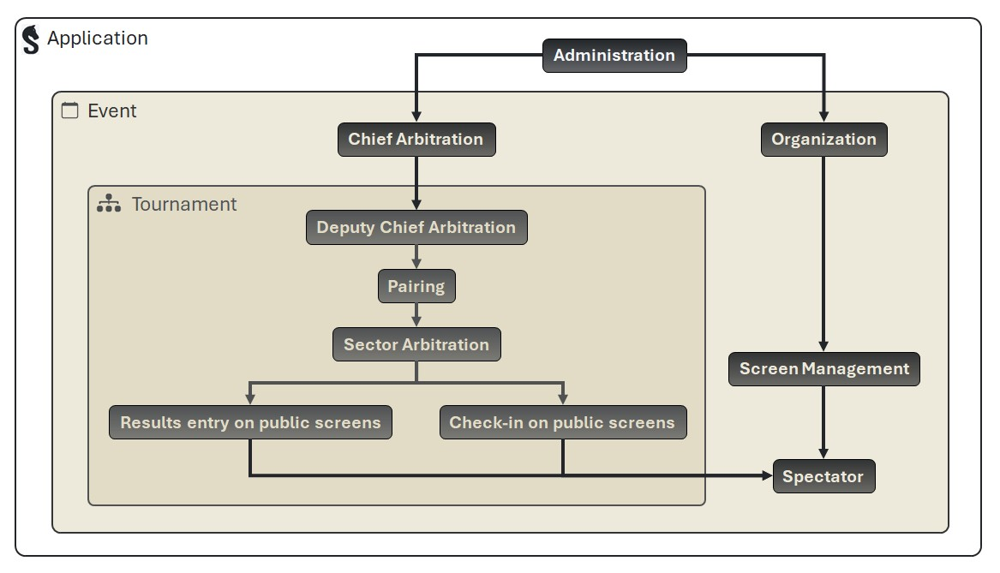

# _Sharly Chess_ - Authorizations

> [!NOTE]
> This document is intended to move to the user documentation in version 3.1.

## Execution modes

Two execution modes are possible, set at event-level (for each event):

- **Standard (by default)**: use connected devices to check-in players and enter results on public screens.
- **Custom**: grant roles (fixed set of permissions) to accounts and devices.

The execution mode is set when launching the server (only if the LAN IP of the server has changed).

Possible solutions to set the execution mode:
1. Each time we start the server (no database storage)
2. Never (store the execution mode in the database, edit it on the app config modal)
3. each time we start the server with a different IP (store the IP and the execution mode in the database, edit the execution mode on the app config modal)

## Authentication (custom execution mode only)

### Safe / unsafe networks

The _Sharly Chess_ administrator declares the network on which the server is connected as:

- **safe**: all the devices connected to the network are trusted and unknown devices can not connect (e.g. a private Wi-Fi network, protected by a password)
- **unsafe**: devices connected to the network can not be trusted (e.g. a public Wi-Fi network)

### Accounts

Accounts are declared on the _Sharly Chess_ server by authorized people (ADM, ORG and CA, see below):
- a username (letters, numbers, ``_`` and ``-`` accepted);
- a mandatory password.

Unauthenticated accounts are named below "anonymous" (roles can be granted to anonymous, e.g. Spectator).

Access to the _Sharly Chess_ server is allowed for accounts by providing:
- an existing username;
- the corresponding password;
- on unsafe networks, an additional confirmation (One-Time Password generated by the server).

### Devices

Devices are declared on the _Sharly Chess_ server by authorized people (ADM, ORG and CA, see below):
- an IP address.

On unsafe networks, access to the _Sharly Chess_ server is not possible (accounts must be used):

On safe networks, access to the _Sharly Chess_ server is allowed to devices by providing:
- their IP address (automatic, no user action);
- an additional confirmation (One-Time Password generated by the server).

Unauthenticated devices are named below "unknown devices" (roles can be granted to unknown devices, e.g. Spectator).

> [!NOTE]
> Additional confirmations prevent from man-in-the-middle attacks.

## Roles

The roles are used only when the custom mode is selected, they offer a powerful way to customize the authorizations granted to accounts and devices.

A role:
- has a **fixed** set of permissions;
- inherit the permissions of sub-roles.

### Roles inheritance

The diagram below shows the sub-roles each role inherits from.

### Roles management

The diagram below shows the roles that can be managed by each role.

| Role | Scope | Sub roles | Inherited roles | Manageable roles |
|-|:-:|:-:|:-:|:-:|
|ADM: Administration|Application|ORG CA|_all_|_all_|
|ORG: Organization|Event|SCR|SPE|SCR CA SPE|
|SCR: Screen Management|Event|SPE|_none_|SPE|
|CA: Chief Arbitration|Event|DCA|PAI SEC CHE RES SPE|DCA PAI SEC CHE RES SPE|
|DCA: Deputy Chief Arbitration|Event|PAI|SEC CHE RES SPE|_none_|
|PAI: Pairing|Tournament|SEC|CHE RES SPE|_none_|
|SEC: Sector arbitration|Tournament|CHE RES|SPE|_none_|
|CHE: Check-in via public screens|Tournament|SPE|_none_|_none_|
|RES: Results Entry via public screens|Tournament|SPE|_none_|_none_|
|SPE: Spectator|Event|_none_|_none_|_none_|

_Generated by script generate_roles_doc.py on 2025-08-19 16:36_

### Permissions by role

The table below shows what each role can do in the application.

| Permissions / Roles               |                       |                       |                       |                       |                       |                       |                       |                       |                       |                       |                       |
|-----------------------------------|:---------------------:|:---------------------:|:---------------------:|:---------------------:|:---------------------:|:---------------------:|:---------------------:|:---------------------:|:---------------------:|:---------------------:|:---------------------:|
| APPLICATION MANAGEMENT            | ADM                   | ORG                   | SCR                   | CA                    | DCA                   | PAI                   | SEC                   | CHE                   | RES                   | SPE                   | _none_                |
| View application settings         | :white_check_mark:    | :white_circle:        | :white_circle:        | :white_circle:        | :white_circle:        | :white_circle:        | :white_circle:        | :white_circle:        | :white_circle:        | :white_circle:        | :x:                   |
| Update application settings       | :white_check_mark:    | :white_circle:        | :white_circle:        | :white_circle:        | :white_circle:        | :white_circle:        | :white_circle:        | :white_circle:        | :white_circle:        | :white_circle:        | :x:                   |
| Manage source databases           | :white_check_mark:    | :white_circle:        | :white_circle:        | :white_circle:        | :white_circle:        | :white_circle:        | :white_circle:        | :white_circle:        | :white_circle:        | :white_circle:        | :x:                   |
| EVENTS ACCESS                     | ADM                   | ORG                   | SCR                   | CA                    | DCA                   | PAI                   | SEC                   | CHE                   | RES                   | SPE                   | _none_                |
| View public current events        | :white_check_mark:    | :white_circle:        | :white_circle:        | :white_circle:        | :white_circle:        | :white_circle:        | :white_circle:        | :white_circle:        | :white_circle:        | :white_circle:        | :white_check_mark:(*) |
| View private events               | :white_check_mark:    | :white_circle:        | :white_circle:        | :white_circle:        | :white_circle:        | :white_circle:        | :white_circle:        | :white_circle:        | :white_circle:        | :white_circle:        | :x:                   |
| View passed and upcoming events   | :white_check_mark:    | :white_circle:        | :white_circle:        | :white_circle:        | :white_circle:        | :white_circle:        | :white_circle:        | :white_circle:        | :white_circle:        | :white_circle:        | :x:                   |
| View event cards details          | :white_check_mark:    | :white_circle:        | :white_circle:        | :white_circle:        | :white_circle:        | :white_circle:        | :white_circle:        | :white_circle:        | :white_circle:        | :white_circle:        | :x:                   |
| EVENTS MANAGEMENT                 | ADM                   | ORG                   | SCR                   | CA                    | DCA                   | PAI                   | SEC                   | CHE                   | RES                   | SPE                   | _none_                |
| Add events                        | :white_check_mark:    | :x:                   | :x:                   | :x:                   | :x:                   | :x:                   | :x:                   | :x:                   | :x:                   | :x:                   | :x:                   |
| Delete events                     | :white_check_mark:    | :x:                   | :x:                   | :x:                   | :x:                   | :x:                   | :x:                   | :x:                   | :x:                   | :x:                   | :x:                   |
| Rename events                     | :white_check_mark:    | :x:                   | :x:                   | :x:                   | :x:                   | :x:                   | :x:                   | :x:                   | :x:                   | :x:                   | :x:                   |
| Update events                     | :white_check_mark:    | :white_check_mark:    | :x:                   | :white_check_mark:    | :x:                   | :x:                   | :x:                   | :x:                   | :x:                   | :x:                   | :x:                   |
| View complete event configuration | :white_check_mark:    | :white_check_mark:    | :x:                   | :white_check_mark:    | :white_check_mark:    | :x:                   | :x:                   | :x:                   | :x:                   | :x:                   | :x:                   |
| View basic event configuration    | :white_check_mark:    | :white_check_mark:    | :x:                   | :white_check_mark:    | :white_check_mark:    | :white_check_mark:    | :white_check_mark:    | :x:                   | :x:                   | :x:                   | :x:                   |
| ACCESS CONTROL                    | ADM                   | ORG                   | SCR                   | CA                    | DCA                   | PAI                   | SEC                   | CHE                   | RES                   | SPE                   | _none_                |
| Manage accounts                   | :white_check_mark:    | :white_check_mark:    | :white_check_mark:    | :white_check_mark:    | :x:                   | :x:                   | :x:                   | :x:                   | :x:                   | :x:                   | :x:                   |
| Manage devices                    | :white_check_mark:    | :white_check_mark:    | :white_check_mark:    | :white_check_mark:    | :x:                   | :x:                   | :x:                   | :x:                   | :x:                   | :x:                   | :x:                   |
| Give/take away role ADM             | :x:                   | :x:                   | :x:                   | :x:                   | :x:                   | :x:                   | :x:                   | :x:                   | :x:                   | :x:                   | :x:                   |
| Give/take away role ORG             | :white_check_mark:    | :x:                   | :x:                   | :x:                   | :x:                   | :x:                   | :x:                   | :x:                   | :x:                   | :x:                   | :x:                   |
| Give/take away role SCR             | :white_check_mark:    | :white_check_mark:    | :x:                   | :x:                   | :x:                   | :x:                   | :x:                   | :x:                   | :x:                   | :x:                   | :x:                   |
| Give/take away role CA              | :white_check_mark:    | :white_check_mark:    | :x:                   | :x:                   | :x:                   | :x:                   | :x:                   | :x:                   | :x:                   | :x:                   | :x:                   |
| Give/take away role DCA             | :white_check_mark:    | :x:                   | :x:                   | :white_check_mark:    | :x:                   | :x:                   | :x:                   | :x:                   | :x:                   | :x:                   | :x:                   |
| Give/take away role PAI             | :white_check_mark:    | :x:                   | :x:                   | :white_check_mark:    | :x:                   | :x:                   | :x:                   | :x:                   | :x:                   | :x:                   | :x:                   |
| Give/take away role SEC             | :white_check_mark:    | :x:                   | :x:                   | :white_check_mark:    | :x:                   | :x:                   | :x:                   | :x:                   | :x:                   | :x:                   | :x:                   |
| Give/take away role CHE             | :white_check_mark:    | :x:                   | :x:                   | :white_check_mark:    | :x:                   | :x:                   | :x:                   | :x:                   | :x:                   | :x:                   | :x:                   |
| Give/take away role RES             | :white_check_mark:    | :x:                   | :x:                   | :white_check_mark:    | :x:                   | :x:                   | :x:                   | :x:                   | :x:                   | :x:                   | :x:                   |
| Give/take away role SPE             | :white_check_mark:    | :white_check_mark:    | :white_check_mark:    | :white_check_mark:    | :x:                   | :x:                   | :x:                   | :x:                   | :x:                   | :x:                   | :x:                   |
| TOURNAMENTS MANAGEMENT            | ADM                   | ORG                   | SCR                   | CA                    | DCA                   | PAI                   | SEC                   | CHE                   | RES                   | SPE                   | _none_                |
| View the Tournaments tab          | :white_check_mark:    | :x:                   | :x:                   | :white_check_mark:    | :white_check_mark:    | :x:                   | :x:                   | :x:                   | :x:                   | :x:                   | :x:                   |
| Add tournaments                   | :white_check_mark:    | :x:                   | :x:                   | :white_check_mark:    | :x:                   | :x:                   | :x:                   | :x:                   | :x:                   | :x:                   | :x:                   |
| Update tournaments                | :white_check_mark:    | :x:                   | :x:                   | :white_check_mark:    | :white_check_mark:    | :x:                   | :x:                   | :x:                   | :x:                   | :x:                   | :x:                   |
| Delete tournaments                | :white_check_mark:    | :x:                   | :x:                   | :white_check_mark:    | :x:                   | :x:                   | :x:                   | :x:                   | :x:                   | :x:                   | :x:                   |
| Publish tournament results        | :white_check_mark:    | :x:                   | :x:                   | :white_check_mark:    | :white_check_mark:    | :x:                   | :x:                   | :x:                   | :x:                   | :x:                   | :x:                   |
| Publish tournament rules          | :white_check_mark:    | :x:                   | :x:                   | :white_check_mark:    | :white_check_mark:    | :x:                   | :x:                   | :x:                   | :x:                   | :x:                   | :x:                   |
| Download tournament fees          | :white_check_mark:    | :white_check_mark:    | :x:                   | :white_check_mark:    | :white_check_mark:    | :x:                   | :x:                   | :x:                   | :x:                   | :x:                   | :x:                   |
| PLAYERS                           | ADM                   | ORG                   | SCR                   | CA                    | DCA                   | PAI                   | SEC                   | CHE                   | RES                   | SPE                   | _none_                |
| View Players tab                  | :white_check_mark:    | :x:                   | :x:                   | :white_check_mark:    | :white_check_mark:    | :white_check_mark:    | :white_check_mark:    | :x:                   | :x:                   | :x:                   | :x:                   |
| Add players                       | :white_check_mark:    | :x:                   | :x:                   | :white_check_mark:    | :white_check_mark:    | :x:                   | :x:                   | :x:                   | :x:                   | :x:                   | :x:                   |
| Update players                    | :white_check_mark:    | :x:                   | :x:                   | :white_check_mark:    | :white_check_mark:    | :x:                   | :x:                   | :x:                   | :x:                   | :x:                   | :x:                   |
| Update players' history           | :white_check_mark:    | :x:                   | :x:                   | :white_check_mark:    | :white_check_mark:    | :white_check_mark:    | :white_check_mark:    | :white_check_mark:    | :x:                   | :x:                   | :x:                   |
| Delete players                    | :white_check_mark:    | :x:                   | :x:                   | :white_check_mark:    | :white_check_mark:    | :x:                   | :x:                   | :x:                   | :x:                   | :x:                   | :x:                   |
| CHECK-IN                          | ADM                   | ORG                   | SCR                   | CA                    | DCA                   | PAI                   | SEC                   | CHE                   | RES                   | SPE                   | _none_                |
| Open/close check-in               | :white_check_mark:    | :x:                   | :x:                   | :white_check_mark:    | :white_check_mark:    | :white_check_mark:    | :x:                   | :x:                   | :x:                   | :x:                   | :x:                   |
| Check-in players                  | :white_check_mark:    | :x:                   | :x:                   | :white_check_mark:    | :white_check_mark:    | :white_check_mark:    | :white_check_mark:    | :white_check_mark:    | :x:                   | :x:                   | :x:                   |
| PAIRINGS                          | ADM                   | ORG                   | SCR                   | CA                    | DCA                   | PAI                   | SEC                   | CHE                   | RES                   | SPE                   | _none_                |
| View Pairings tab                 | :white_check_mark:    | :x:                   | :x:                   | :white_check_mark:    | :white_check_mark:    | :white_check_mark:    | :white_check_mark:    | :x:                   | :x:                   | :x:                   | :x:                   |
| Use pairing engines               | :white_check_mark:    | :x:                   | :x:                   | :white_check_mark:    | :white_check_mark:    | :white_check_mark:    | :x:                   | :x:                   | :x:                   | :x:                   | :x:                   |
| Manually pair players             | :white_check_mark:    | :x:                   | :x:                   | :white_check_mark:    | :white_check_mark:    | :white_check_mark:    | :x:                   | :x:                   | :x:                   | :x:                   | :x:                   |
| Unpair all the boards of a round  | :white_check_mark:    | :x:                   | :x:                   | :white_check_mark:    | :white_check_mark:    | :white_check_mark:    | :x:                   | :x:                   | :x:                   | :x:                   | :x:                   |
| Unpair one board                  | :white_check_mark:    | :x:                   | :x:                   | :white_check_mark:    | :white_check_mark:    | :white_check_mark:    | :x:                   | :x:                   | :x:                   | :x:                   | :x:                   |
| Permute boards                    | :white_check_mark:    | :x:                   | :x:                   | :white_check_mark:    | :white_check_mark:    | :white_check_mark:    | :x:                   | :x:                   | :x:                   | :x:                   | :x:                   |
| Set the current round             | :white_check_mark:    | :x:                   | :x:                   | :white_check_mark:    | :white_check_mark:    | :white_check_mark:    | :x:                   | :x:                   | :x:                   | :x:                   | :x:                   |
| Set Zero-Points Byes              | :white_check_mark:    | :x:                   | :x:                   | :white_check_mark:    | :white_check_mark:    | :white_check_mark:    | :x:                   | :x:                   | :x:                   | :x:                   | :x:                   |
| Set Half-Points Byes              | :white_check_mark:    | :x:                   | :x:                   | :white_check_mark:    | :white_check_mark:    | :white_check_mark:    | :x:                   | :x:                   | :x:                   | :x:                   | :x:                   |
| Set Full-Points Byes              | :white_check_mark:    | :x:                   | :x:                   | :white_check_mark:    | :white_check_mark:    | :x:                   | :x:                   | :x:                   | :x:                   | :x:                   | :x:                   |
| View draft pairings               | :white_check_mark:    | :x:                   | :x:                   | :white_check_mark:    | :white_check_mark:    | :white_check_mark:    | :x:                   | :x:                   | :x:                   | :x:                   | :x:                   |
| Publish pairings                  | :white_check_mark:    | :x:                   | :x:                   | :white_check_mark:    | :white_check_mark:    | :white_check_mark:    | :x:                   | :x:                   | :x:                   | :x:                   | :x:                   |
| RANKINGS                          | ADM                   | ORG                   | SCR                   | CA                    | DCA                   | PAI                   | SEC                   | CHE                   | RES                   | SPE                   | _none_                |
| View draft rankings               | :white_check_mark:    | :x:                   | :x:                   | :white_check_mark:    | :white_check_mark:    | :white_check_mark:    | :x:                   | :x:                   | :x:                   | :x:                   | :x:                   |
| Publish rankings                  | :white_check_mark:    | :x:                   | :x:                   | :white_check_mark:    | :white_check_mark:    | :white_check_mark:    | :x:                   | :x:                   | :x:                   | :x:                   | :x:                   |
| RESULTS                           | ADM                   | ORG                   | SCR                   | CA                    | DCA                   | PAI                   | SEC                   | CHE                   | RES                   | SPE                   | _none_                |
| Enter results                     | :white_check_mark:    | :x:                   | :x:                   | :white_check_mark:    | :white_check_mark:    | :white_check_mark:    | :white_check_mark:    | :x:                   | :white_check_mark:    | :x:                   | :x:                   |
| Update results                    | :white_check_mark:    | :x:                   | :x:                   | :white_check_mark:    | :white_check_mark:    | :white_check_mark:    | :white_check_mark:    | :x:                   | :x:                   | :x:                   | :x:                   |
| Set illegal moves                 | :white_check_mark:    | :x:                   | :x:                   | :white_check_mark:    | :white_check_mark:    | :white_check_mark:    | :white_check_mark:    | :x:                   | :x:                   | :x:                   | :x:                   |
| Set special results               | :white_check_mark:    | :x:                   | :x:                   | :white_check_mark:    | :white_check_mark:    | :x:                   | :x:                   | :x:                   | :x:                   | :x:                   | :x:                   |
| SCREENS                           | ADM                   | ORG                   | SCR                   | CA                    | DCA                   | PAI                   | SEC                   | CHE                   | RES                   | SPE                   | _none_                |
| Manage screens                    | :white_check_mark:    | :white_check_mark:    | :white_check_mark:    | :white_check_mark:    | :white_check_mark:    | :x:                   | :x:                   | :x:                   | :x:                   | :x:                   | :x:                   |
| View private screens              | :white_check_mark:    | :white_check_mark:    | :white_check_mark:    | :white_check_mark:    | :white_check_mark:    | :x:                   | :x:                   | :x:                   | :x:                   | :x:                   | :x:                   |
| View public screens               | :white_check_mark:    | :white_check_mark:    | :white_check_mark:    | :white_check_mark:    | :white_check_mark:    | :white_check_mark:    | :white_check_mark:    | :white_check_mark:    | :white_check_mark:    | :white_check_mark:    | :x:                   |
| PRIZES                            | ADM                   | ORG                   | SCR                   | CA                    | DCA                   | PAI                   | SEC                   | CHE                   | RES                   | SPE                   | _none_                |
| View Prizes tab                   | :white_check_mark:    | :x:                   | :x:                   | :white_check_mark:    | :white_check_mark:    | :x:                   | :x:                   | :x:                   | :x:                   | :x:                   | :x:                   |
| Manage prizes                     | :white_check_mark:    | :x:                   | :x:                   | :white_check_mark:    | :white_check_mark:    | :x:                   | :x:                   | :x:                   | :x:                   | :x:                   | :x:                   |
| PRINT                             | ADM                   | ORG                   | SCR                   | CA                    | DCA                   | PAI                   | SEC                   | CHE                   | RES                   | SPE                   | _none_                |
| Print                             | :white_check_mark:    | :x:                   | :x:                   | :white_check_mark:    | :white_check_mark:    | :x:                   | :x:                   | :x:                   | :x:                   | :x:                   | :x:                   |

_Generated by script generate_roles_doc.py on 2025-08-19 16:31_

(*) Accessing the list of the public events is needed to authenticate (since the accounts are defined at event-level).

### Examples

#### Devices

| :unlock:/:lock: |      Device       | Comment           |
|:---------------:|:-----------------:|:------------------|
|     :lock:      |   ``127.0.0.1``   | The server itself |
|                 | ``192.168.1.115`` | A local device    |
|     :lock:      |    ``0.0.0.0``    | Any device        |

#### Accounts

| :unlock:/:lock: |        User        | Comment           |
|:---------------:|:------------------:|:------------------|
|     :lock:      | from ``127.0.0.1`` | The server itself |
|                 |    ``arbiter``     | The Chief Arbiter |
|     :lock:      |   ``anonymous``    | _Unauthenticated_ |
