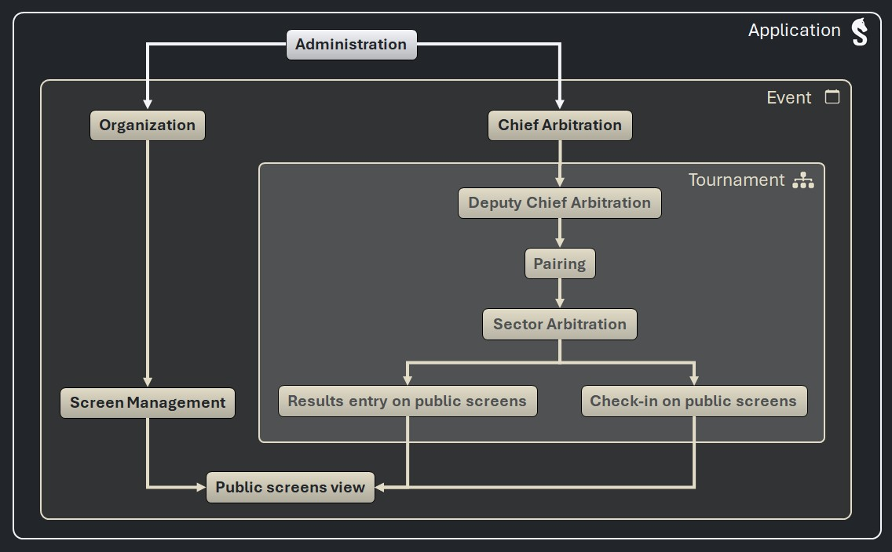

# _Sharly Chess_ - Delegating event management

> [!NOTE]
> This document is intended to move to the user documentation in version 3.1.

## Access levels

Access levels offer a powerful way to customize the authorizations granted to the devices connected to your network.

An access level:
- is a **predefined** and **fixed** set of permissions;
- inherits the permissions of sub access levels.

The access levels in _Shary Chess_ are:

| Access level                         |    Scope    |
|--------------------------------------|:-----------:|
| ADM Administration                   | Application |
| ORG Organization                     |    Event    |
| SCR Screen Management                |    Event    |
| CA Chief Arbitration                 |    Event    |
| DCA Deputy Chief Arbitration         | Tournament  |
| PAI Pairing                          | Tournament  |
| SEC Sector arbitration               | Tournament  |
| CHE Check-in via public screens      | Tournament  |
| RES Results Entry via public screens | Tournament  |
| SPE Spectator                        |    Event    |

### Access levels inheritance

The diagram below shows the sub access levels each access level inherits from.

Access levels are set for each event.

Default access levels are set at event creation and can be changed later at any time.

### Default access levels

Administrators (connected to the _Sharly Chess_ server) have full privileges for the whole application, they can do anything on any event.

By default, unauthenticated devices connected to the network can:
- display the public screens;
- check-in players or enter results on the public screens.

> [!NOTE]
> It is possible to forbid unauthenticated devices from checking-in players or entering results by revoking the default access levels to unauthenticated devices.

## Accounts

### Definition

Accounts are defined for an event on the _Sharly Chess_ server by authorized people (ADM, ORG and CA, see below):
- an optional FIDE ID (unique at event-level);
- an optional first name;
- a mandatory last name;
- a password.

> [!NOTE]
> - When no password is set, authenticating with this account is nto possible.
> - When a password is deleted, devices authenticated with the account are disconnected (become unauthenticated devices).

### Unauthenticated devices

Unauthenticated devices are considered to be logged in with the special Anonymous account.

> [!NOTE]
> The Anonymous account can not be removed, only the access levels granted to the Anonymous account can be modified.

### Access levels for accounts

Accounts are granted access levels for the application, events or tournaments.

Any access level can be granted or revoked to accounts (except _Administration_).

Limited access levels can be granted to the Anonymous account (up to _Check-in_ and _Results entry_).

### Example

| FIDE ID     | First name    | Last name    | Comment                | Access levels            |
|:------------|:--------------|--------------|------------------------|:-------------------------|
| ``1234567`` | ``Charlotte`` | ``RAMPLING`` | The Chief Arbiter      | CA                       |
| ``9876543`` | ``John``      | ``WAYNE``    | A deputy Chief Arbiter | DCA for some tournaments |
| ``-``       | ``-``         | ``-``        | _Anonymous_            | SPE                      |

## Access levels management

The diagram below shows the access levels that can be managed by each access level.

| Access level                         |    Scope    | Sub access levels | Inherited access levels |   Manageable access levels   |
|:-------------------------------------|:-----------:|:-----------------:|:-----------------------:|:----------------------------:|
| ADM Administration                   | Application |      ORG, CA      |           all           |             all              |
| ORG Organization                     |    Event    |        SCR        |           SPE           |         SCR, CA, SPE         |
| SCR Screen Management                |    Event    |        SPE        |          none           |             SPE              |
| CA Chief Arbitration                 |    Event    |        DCA        | PAI, SEC, CHE, RES, SPE | DCA, PAI, SEC, CHE, RES, SPE |
| DCA Deputy Chief Arbitration         | Tournament  |        PAI        |   SEC, CHE, RES, SPE    |             none             |
| PAI Pairing                          | Tournament  |        SEC        |      CHE, RES, SPE      |             none             |
| SEC Sector arbitration               | Tournament  |     CHE, RES      |           SPE           |             none             |
| CHE Check-in via public screens      | Tournament  |        SPE        |          none           |             none             |
| RES Results entry via public screens | Tournament  |        SPE        |          none           |             none             |
| SPE Spectator                        |    Event    |       none        |          none           |             none             |

_Generated by script generate_access_levels_doc.py on 2025-09-16 20:46_

## Permissions by access level

The table below shows what each access level can do in the application.

| Permissions / Access levels       |     |     |     |    |     |     |     |     |     |     |       |
|:----------------------------------|:---:|:---:|:---:|:--:|:---:|:---:|:---:|:---:|:---:|:---:|:-----:|
| APPLICATION MANAGEMENT            | ADM | ORG | SCR | CA | DCA | PAI | SEC | CHE | RES | SPE |       |
| Manage application settings       |  X  |  X  |  X  | X  |  X  |  X  |  X  |  X  |  X  |  X  |   -   |
| Manage source databases           |  X  |  X  |  X  | X  |  X  |  X  |  X  |  X  |  X  |  X  |   -   |
| EVENTS ACCESS                     | ADM | ORG | SCR | CA | DCA | PAI | SEC | CHE | RES | SPE |       |
| View public current events        |  X  |     |     |    |     |     |     |     |     |     | X (*) |
| View private events               |  X  |  X  |  X  | X  |  X  |  X  |  X  |  X  |  X  |  X  |   -   |
| View passed and upcoming events   |  X  |  X  |  X  | X  |  X  |  X  |  X  |  X  |  X  |  X  |   -   |
| View event cards details          |  X  |  X  |  X  | X  |  X  |  X  |  X  |  X  |  X  |  X  |   -   |
| EVENTS MANAGEMENT                 | ADM | ORG | SCR | CA | DCA | PAI | SEC | CHE | RES | SPE |       |
| Add events                        |  X  |  -  |  -  | -  |  -  |  -  |  -  |  -  |  -  |  -  |   -   |
| Delete events                     |  X  |  -  |  -  | -  |  -  |  -  |  -  |  -  |  -  |  -  |   -   |
| Rename events                     |  X  |  -  |  -  | -  |  -  |  -  |  -  |  -  |  -  |  -  |   -   |
| Update events                     |  X  |  X  |  -  | X  |  -  |  -  |  -  |  -  |  -  |  -  |   -   |
| View complete event configuration |  X  |  X  |  -  | X  |  X  |  -  |  -  |  -  |  -  |  -  |   -   |
| View basic event configuration    |  X  |  X  |  -  | X  |  X  |  X  |  X  |  -  |  -  |  -  |   -   |
| ACCESS CONTROL                    | ADM | ORG | SCR | CA | DCA | PAI | SEC | CHE | RES | SPE |       |
| Manage accounts                   |  X  |  X  |  X  | X  |  -  |  -  |  -  |  -  |  -  |  -  |   -   |
| Give/take away access level ADM   |  -  |  X  |  X  | X  |  X  |  X  |  X  |  X  |  X  |  X  |   -   |
| Give/take away access level ORG   |  -  |  -  |  X  | X  |  -  |  -  |  -  |  -  |  -  |  X  |   -   |
| Give/take away access level SCR   |  -  |  -  |  -  | -  |  -  |  -  |  -  |  -  |  -  |  X  |   -   |
| Give/take away access level CA    |  -  |  -  |  -  | -  |  X  |  X  |  X  |  X  |  X  |  X  |   -   |
| Give/take away access level DCA   |  -  |  -  |  -  | -  |  -  |  -  |  -  |  -  |  -  |  -  |   -   |
| Give/take away access level PAI   |  -  |  -  |  -  | -  |  -  |  -  |  -  |  -  |  -  |  -  |   -   |
| Give/take away access level SEC   |  -  |  -  |  -  | -  |  -  |  -  |  -  |  -  |  -  |  -  |   -   |
| Give/take away access level CHE   |  -  |  -  |  -  | -  |  -  |  -  |  -  |  -  |  -  |  -  |   -   |
| Give/take away access level RES   |  -  |  -  |  -  | -  |  -  |  -  |  -  |  -  |  -  |  -  |   -   |
| Give/take away access level SPE   |  -  |  -  |  -  | -  |  -  |  -  |  -  |  -  |  -  |  -  |   -   |
| TOURNAMENTS MANAGEMENT            | ADM | ORG | SCR | CA | DCA | PAI | SEC | CHE | RES | SPE |       |
| View the Tournaments tab          |  X  |  -  |  -  | X  |  X  |  -  |  -  |  -  |  -  |  -  |   -   |
| Add tournaments                   |  X  |  -  |  -  | X  |  -  |  -  |  -  |  -  |  -  |  -  |   -   |
| Update tournaments                |  X  |  -  |  -  | X  |  X  |  -  |  -  |  -  |  -  |  -  |   -   |
| Delete tournaments                |  X  |  -  |  -  | X  |  -  |  -  |  -  |  -  |  -  |  -  |   -   |
| Publish tournament results        |  X  |  -  |  -  | X  |  X  |  -  |  -  |  -  |  -  |  -  |   -   |
| Publish tournament rules          |  X  |  -  |  -  | X  |  X  |  -  |  -  |  -  |  -  |  -  |   -   |
| Download tournament fees          |  X  |  X  |  -  | X  |  X  |  -  |  -  |  -  |  -  |  -  |   -   |
| PLAYERS                           | ADM | ORG | SCR | CA | DCA | PAI | SEC | CHE | RES | SPE |       |
| View Players tab                  |  X  |  -  |  -  | X  |  X  |  X  |  X  |  -  |  -  |  -  |   -   |
| Add players                       |  X  |  -  |  -  | X  |  X  |  -  |  -  |  -  |  -  |  -  |   -   |
| Update players                    |  X  |  -  |  -  | X  |  X  |  -  |  -  |  -  |  -  |  -  |   -   |
| Update players' history           |  X  |  -  |  -  | X  |  X  |  X  |  X  |  X  |  -  |  -  |   -   |
| Delete players                    |  X  |  -  |  -  | X  |  X  |  -  |  -  |  -  |  -  |  -  |   -   |
| CHECK-IN                          | ADM | ORG | SCR | CA | DCA | PAI | SEC | CHE | RES | SPE |       |
| Open/close check-in               |  X  |  -  |  -  | X  |  X  |  X  |  -  |  -  |  -  |  -  |   -   |
| Check-in players                  |  X  |  -  |  -  | X  |  X  |  X  |  X  |  X  |  -  |  -  |   -   |
| PAIRINGS                          | ADM | ORG | SCR | CA | DCA | PAI | SEC | CHE | RES | SPE |       |
| View Pairings tab                 |  X  |  -  |  -  | X  |  X  |  X  |  X  |  -  |  -  |  -  |   -   |
| Use pairing engines               |  X  |  -  |  -  | X  |  X  |  X  |  -  |  -  |  -  |  -  |   -   |
| Manually pair players             |  X  |  -  |  -  | X  |  X  |  X  |  -  |  -  |  -  |  -  |   -   |
| Unpair all the boards of a round  |  X  |  -  |  -  | X  |  X  |  X  |  -  |  -  |  -  |  -  |   -   |
| Unpair one board                  |  X  |  -  |  -  | X  |  X  |  X  |  -  |  -  |  -  |  -  |   -   |
| Permute boards                    |  X  |  -  |  -  | X  |  X  |  X  |  -  |  -  |  -  |  -  |   -   |
| Set the current round             |  X  |  -  |  -  | X  |  X  |  X  |  -  |  -  |  -  |  -  |   -   |
| Set Zero-Points Byes              |  X  |  -  |  -  | X  |  X  |  X  |  -  |  -  |  -  |  -  |   -   |
| Set Half-Points Byes              |  X  |  -  |  -  | X  |  X  |  X  |  -  |  -  |  -  |  -  |   -   |
| Set Full-Points Byes              |  X  |  -  |  -  | X  |  X  |  -  |  -  |  -  |  -  |  -  |   -   |
| View draft pairings               |  X  |  -  |  -  | X  |  X  |  X  |  -  |  -  |  -  |  -  |   -   |
| Publish pairings                  |  X  |  -  |  -  | X  |  X  |  X  |  -  |  -  |  -  |  -  |   -   |
| RANKINGS                          | ADM | ORG | SCR | CA | DCA | PAI | SEC | CHE | RES | SPE |       |
| View draft rankings               |  X  |  -  |  -  | X  |  X  |  X  |  -  |  -  |  -  |  -  |   -   |
| Publish rankings                  |  X  |  -  |  -  | X  |  X  |  X  |  -  |  -  |  -  |  -  |   -   |
| RESULTS                           | ADM | ORG | SCR | CA | DCA | PAI | SEC | CHE | RES | SPE |       |
| Enter results                     |  X  |  -  |  -  | X  |  X  |  X  |  X  |  -  |  X  |  -  |   -   |
| Update results                    |  X  |  -  |  -  | X  |  X  |  X  |  X  |  -  |  -  |  -  |   -   |
| Set illegal moves                 |  X  |  -  |  -  | X  |  X  |  X  |  X  |  -  |  -  |  -  |   -   |
| Set special results               |  X  |  -  |  -  | X  |  X  |  -  |  -  |  -  |  -  |  -  |   -   |
| SCREENS                           | ADM | ORG | SCR | CA | DCA | PAI | SEC | CHE | RES | SPE |       |
| Manage screens                    |  X  |  X  |  X  | X  |  X  |  -  |  -  |  -  |  -  |  -  |   -   |
| View private screens              |  X  |  X  |  X  | X  |  X  |  -  |  -  |  -  |  -  |  -  |   -   |
| View public screens               |  X  |  X  |  X  | X  |  X  |  X  |  X  |  X  |  X  |  X  |   -   |
| PRIZES                            | ADM | ORG | SCR | CA | DCA | PAI | SEC | CHE | RES | SPE |       |
| View Prizes tab                   |  X  |  -  |  -  | X  |  X  |  -  |  -  |  -  |  -  |  -  |   -   |
| Manage prizes                     |  X  |  -  |  -  | X  |  X  |  -  |  -  |  -  |  -  |  -  |   -   |
| PRINT                             | ADM | ORG | SCR | CA | DCA | PAI | SEC | CHE | RES | SPE |       |
| Print                             |  X  |  -  |  -  | X  |  X  |  -  |  -  |  -  |  -  |  -  |   -   |

_Generated by script generate_access_levels_doc.py on 2025-09-16 20:46_

(*) Accessing the list of the public events is needed to authenticate (since the accounts are defined at event-level).
